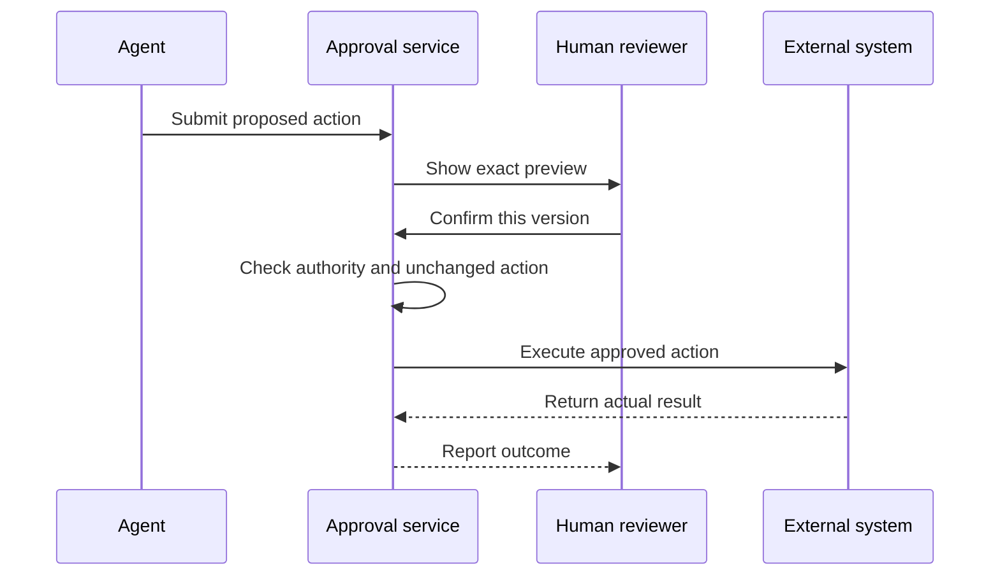

Source: http://localhost:1313/learn/advanced-agents/human-in-the-loop.html

An assistant can prepare a payment request without being allowed to transfer money. It can draft a sensitive reply without being allowed to send it. That separation is the foundation of **human-in-the-loop** work: a person participates at a defined decision point rather than watching every word the agent produces. The goal is useful autonomy within clear limits, not either total independence or constant interruption.

Imagine a new employee preparing a supplier payment. The employee gathers the invoice, checks the details and presents it to an authorised reviewer. The reviewer sees the amount and recipient before deciding. An agent should follow an equally concrete process. A vague “Shall I continue?” is not meaningful approval if the person cannot tell whether continuing means reading a document or spending money.

## Choose approval points by consequence

**Approval** is an explicit decision by an authorised person to permit a particular proposed action. A task request provides some authority, but not necessarily every authority the agent might find useful. Asking for a supplier comparison does not automatically permit placing an order. Asking for help with a complaint does not necessarily authorise a public apology on behalf of the company.

Assess the impact, reversibility and visibility of the action. Payments change financial position. Deletions can remove information that cannot be recovered. External messages can disclose information or create expectations even if the application later offers a delete button. For these actions, require approval unless a narrow, explicit organisational policy has already authorised the exact class of action under defined conditions.

- **Prepare and inspect** — Summarise an authorised document or draft an unsent reply. These actions usually need fewer interruptions, but access and privacy rules still apply.

- **Bounded internal change** — Update a reversible internal record under an explicit policy. Check ownership, permitted fields and recovery options before allowing automatic execution.

- **Consequential action** — Pay, delete, publish or send information externally. Present the exact effect and obtain approval from someone with the required authority.

These are design categories, not universal legal rules. Reading a sensitive medical record can be high risk even though nothing changes, while an agreed routine reminder may already have permission to be sent. Decide the policy with the people responsible for the process. Avoid letting the model invent a lower-risk category simply because a task would be easier without review.

Technical access and approval are different checks. A service account may be capable of sending e-mails while the agent is still required to ask before sending this one. Conversely, a user pressing Confirm should not grant access to another department's records. [Authentication and permissions](http://localhost:1313/learn/tools-and-integrations/authentication-and-permissions.md) explains the identity and access side of this boundary.

## Make the preview match the action

An **approval preview** is a readable description of the exact proposed change. For an e-mail, show the sender identity, recipients, subject, body and attachments. For deletion, identify the records and recovery consequences. For payment, show the recipient, amount, currency and purpose. Include important uncertainty before the decision, not in a receipt afterwards.

1. **Prepare without executing**

The agent gathers the necessary facts and creates the proposed action. It remains a draft with no external effect.

2. **Show the complete preview**

Explain the target, content, consequence and any unresolved issue. Offer clear Confirm, Edit and Cancel choices.

3. **Check the approver's authority**

The application verifies that the person may approve this action. It records their decision against this specific proposal.

4. **Execute the approved version**

Recheck that the proposal is unchanged and still permitted. A changed recipient, amount or attachment requires a fresh decision.

5. **Report the actual outcome**

Show success only after the external system confirms it. Otherwise report a failure or an uncertain result without silently repeating the action.

The approval should be tied to a specific version of the proposal. A person who approved one recipient has not approved a new recipient added later. Set an expiry appropriate to the process, because old prices, account details or permissions may no longer be valid. Do not treat silence, a closed window or an ambiguous response as consent.

The application should enforce this boundary before the external action, even if the model asks to skip it. A prompt saying “always ask first” is helpful but insufficient by itself. Also prevent repeated clicks or repeated agent requests from executing the same approval again. A confirmation authorises the intended action once; it is not a reusable pass for future attempts.

## Ask a question a person can answer

Approval fatigue happens when people face so many low-value confirmations that they stop reading them. Asking about every harmless formatting change can make a genuinely important payment prompt easier to overlook. Reduce unnecessary prompts by allowing clearly bounded preparation work, then place a deliberate pause at the meaningful action boundary.

**Unclear approval**

“Everything is ready. Continue?”

The person cannot see the recipient, attachment or whether continuing will send the message.

**Reviewable approval**

“Send this draft to the supplier contact shown below, with the quotation request attached? No order will be placed.”

The full draft and attachment are available to inspect, with separate Send, Edit and Cancel choices.

Give the person enough context to judge, but do not bury the decision under a long internal transcript. A useful summary says what the agent checked, what remains uncertain and what will happen if approved. Highlight material differences from a previously reviewed proposal. The reviewer should not have to compare two long drafts unaided to discover that an attachment changed.

## Approval is not the same as escalation

**Escalation** transfers a problem to a human who can investigate or take responsibility. It is appropriate when the agent lacks required judgement, authority or evidence, when the user asks for a person, or when the consequences exceed the automated process. An approval asks “May I do this defined action?” An escalation says “This case needs a person to decide what should happen.”

A good handover includes the user's request, relevant verified facts, actions already attempted, current status and the reason for escalation. Include only information the receiving person is authorised to see. Tell the user whether the case was actually transferred, where it went and how further contact will happen. Do not promise an immediate reply unless that service commitment exists.

Once a human takes ownership, the agent should not continue sending competing answers or changing the same case without an agreed coordination rule. The customer should not have to repeat information merely because responsibility changed. [Transparency and human escalation](http://localhost:1313/learn/safety/transparency-and-human-escalation.md) develops this customer-facing side of the process.

**What if the approver is unavailable?**

Keep the action pending or cancel it according to policy. Show the waiting state and an authorised alternative route if one exists. A deadline does not convert missing approval into permission, and the agent should not quietly choose a different person without checking their authority.

## Turn feedback into a controlled improvement

A **feedback loop** uses reviewed human responses to improve future behaviour. Record why a proposal was edited or rejected: an incorrect fact, missing context, unsuitable tone or a policy violation. These reasons are more useful than a bare thumbs-down. They reveal whether the solution is better knowledge, clearer instructions, a permission change or a different approval point.

Do not automatically promote one person's correction into a universal rule. A special exception for one customer may be inappropriate for everyone else. Group recurring issues, review the proposed change and test it on representative cases before applying it broadly. Keep approval records and feedback only as long as needed, with appropriate access controls, because they may contain sensitive business information.

**Related:** On AIVAX, [AI workers](http://localhost:1313/docs/inference/workers.md) let an external service influence gateway execution. They can support external policy checks, but a complete human approval experience still requires your application's preview, decision record and enforcement at the action boundary.

What's next: learn how to preserve those boundaries when systems fail in [Errors, retries and fallbacks](http://localhost:1313/learn/advanced-agents/errors-retries-and-fallbacks.md).

**Knowledge check.** A person approves an e-mail draft, but the agent later adds another recipient. What should happen before sending?

1. Execute because the person already approved the overall task
2. Ask for approval again because the proposed external action has materially changed
3. Send the original and changed versions so the person can choose later
4. Treat the change as approved unless the person objects

Answer: option 2. Approval applies to the reviewed action. Changing a recipient changes who receives the information, so the revised proposal needs a new authorised decision before sending.
