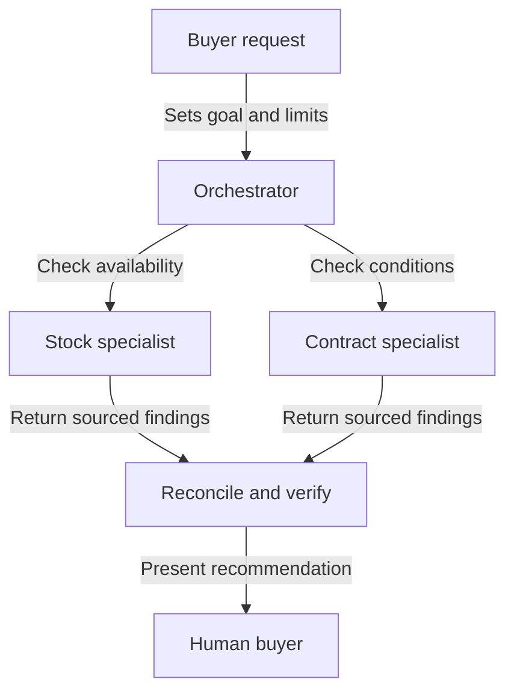

Source: https://docs.aivax.net/learn/advanced-agents/multi-agent-architectures.html

A business does not hire a separate employee for every sentence in a report. It divides work where different expertise, access or responsibilities justify the handover. The same principle applies to AI agents. Several agents can help with a complicated task, but their number is not a measure of quality. Coordination adds work of its own, and someone must remain responsible for the result.

A **multi-agent architecture** is a design in which more than one configured agent contributes to a task. **Orchestration** means arranging their work: deciding who receives which assignment, in what order, with what information, and who checks the outcome. These arrangements can be implemented partly with ordinary software rules. An AI model does not need to make every scheduling decision.

## Start with one capable agent

Before splitting a task, give a single agent a clear goal, relevant information and a limited set of useful tools. A support assistant that looks up an order, reads the returns policy and explains the next step may not need three separate agents. Those actions often share the same context and follow an uncomplicated sequence.

Adding specialists becomes useful when a real boundary exists. A contract reviewer and a stock analyst need different sources and evaluation criteria. Separate access can also matter: the agent checking public supplier information does not need access to private customer records. Separation reduces accidental exposure only when permissions are enforced by the application, not merely described in different role prompts.

**Single well-equipped agent**

One owner keeps the conversation and relevant evidence together. This is simpler to inspect and often avoids repeated context. Choose it when the task fits one role and a manageable tool set.

**Coordinated agents**

Distinct workers can investigate independent questions or apply different checks. This adds handovers, shared-state management and review costs. Choose it when those boundaries solve a demonstrated problem.

The fair comparison is the same task, judged against the same acceptance criteria. Do not compare a carefully designed multi-agent system with a deliberately under-equipped single agent. Check evidence quality, completion time, total spending and how often a person must repair the result. A more elaborate design should earn its complexity through observed improvement.

## Four useful patterns

A **pattern** is a recurring arrangement you can adapt rather than a product you must buy. These patterns can coexist, but combining all of them at once usually makes a first implementation harder to understand. Start with the smallest arrangement that matches how the work actually depends on earlier results.

- **Orchestrator and specialists** — A coordinator assigns bounded pieces, collects evidence and produces the final result. Specialists return findings rather than independently deciding what to tell the customer.

- **Router or triage** — A first step identifies the request type and directs it to the appropriate agent. Most requests follow one route instead of consulting every specialist.

- **Pipeline** — Work passes through ordered stages, such as extract, check and draft. Each stage has a defined input and output that the next stage can use.

- **Debate or critic** — One worker proposes an answer and another challenges it against evidence or explicit criteria. The reviewer must be allowed to find no supported conclusion.

An **orchestrator** is like a project coordinator, not a manager with unlimited discretion. For a purchasing brief, it can ask one specialist to compare availability and another to check contract conditions. It then reconciles the findings into a recommendation. The specialists can work at the same time only if neither needs the other's unfinished result. Parallel work means simultaneous work; it is not automatically independent work.

A **router**, also called a triage step, resembles a reception desk. It sends a delivery question to support and a quotation request to sales. Routing should have a path for ambiguous requests. If a customer combines a complaint with a purchase question, asking for clarification may be better than repeatedly passing the conversation between agents.

A **pipeline** resembles an assembly line. The extraction stage turns a document into fields, the checking stage identifies missing information, and the drafting stage creates a response. A failed extraction should not be disguised as an empty but valid record. Each handover needs a clear success or failure status so later stages do not confidently build on missing facts.

A **critic** checks a proposal rather than merely rewriting its tone. Give it criteria such as “every quoted total must include delivery” and access to the evidence. Two agents agreeing does not establish truth: they may use the same mistaken source or repeat the same unsupported assumption. Debate is useful only when disagreement can be resolved through better evidence or a human decision.

**Orchestrator**

Use this when distinct investigations contribute to one decision, such as comparing stock and contract terms. Decide who reconciles conflicting findings before creating the specialist assignments.

**Router**

Use this when requests belong to different service areas, such as support and sales. Define what happens when the category is unclear or a request spans both areas.

**Pipeline**

Use this when later work requires a checked earlier result, such as drafting a reply from extracted invoice details. Specify what each stage must provide before the next stage can continue.

**Critic**

Use this when a proposal needs a separate evidence-based challenge. Identify the independent checks the reviewer can perform and who resolves a disagreement that the evidence does not settle.

## Share a work record, not every conversation

**Shared state** is the current task record available to the workers who need it. Think of a shared project folder containing the goal, accepted facts, sources, pending questions and progress. It should distinguish an observation from a proposed interpretation. “The catalogue says available” and “delivery will meet the deadline” are not interchangeable statements.

A useful handover includes the assigned question, scope, source references, finding, uncertainty and completion status. It does not require dumping every conversation into every agent. Excess information increases cost and can expose data unnecessarily. Give a worker enough context to do its job and no additional authority just because another worker has broader access.

Decide who may update each part of the record. If the stock agent and contract agent both overwrite the final recommendation, the outcome can depend on who finishes last. A simpler arrangement lets specialists append findings and reserves the final decision for the coordinator. Preserve earlier evidence when a conclusion changes so that a reviewer can understand the correction.

The handover rules are as important as the role descriptions. See [Agent-to-agent communication](https://docs.aivax.net/learn/agents/agent-to-agent-communication.md) for how requests and results cross agent boundaries. A message saying “completed” should refer to an observable deliverable, not merely indicate that the worker has stopped generating text.

## Prevent coordination from becoming the task

A common failure is a delegation loop: agent A asks agent B, which hands the same problem back to A. Another is duplicate investigation, where several workers search the same sources without adding a distinct check. Use explicit assignments, a record of completed work and a limit on delegation depth. The coordinator should stop when no new evidence is being produced.

Inconsistent answers require a reconciliation rule. If one agent reports stock available and another reports unavailable, compare source dates, product variants and whether either result was cached, meaning reused from an earlier lookup. Do not average two incompatible facts. If the conflict cannot be resolved within the allowed budget, present it as unresolved and identify the decision it blocks.

Cost also spreads across the system. Each specialist may read repeated instructions, call tools, retry failures and return a long report. Working in parallel can reduce waiting time while still increasing total spending. Apply an overall task budget as well as worker limits. Otherwise, a coordinator can appear economical while its delegated work consumes the resources.

Finally, appoint one owner for external actions and one owner for the final response. Independent workers should not all send customer messages or modify the same record. The owner verifies the evidence and checks permissions before taking action. This keeps a multi-agent design understandable: many contributors can investigate, but responsibility for a consequential outcome remains explicit.

**Related:** On AIVAX, an [AI gateway](https://docs.aivax.net/docs/inference/ai-gateway.md) stores a reusable agent configuration. Separate configurations can support distinct roles, but creating several gateways does not by itself provide shared state, scheduling or a complete orchestration design.

What's next: decide when that owner should pause for a person in [Human-in-the-loop and approvals](https://docs.aivax.net/learn/advanced-agents/human-in-the-loop.md).

**Knowledge check.** Which design best keeps a multi-agent supplier review accountable?

1. Add more agents until their answers agree
2. Let every specialist send its own recommendation directly to the customer
3. Use clear specialist assignments, preserve evidence and make one coordinator reconcile the result
4. Give every agent access to every system so handovers are unnecessary

Answer: option 3. Explicit assignments and a single accountable coordinator reduce duplication and conflicting outcomes. Agreement alone is not evidence, and more access is not a substitute for a handover contract.
