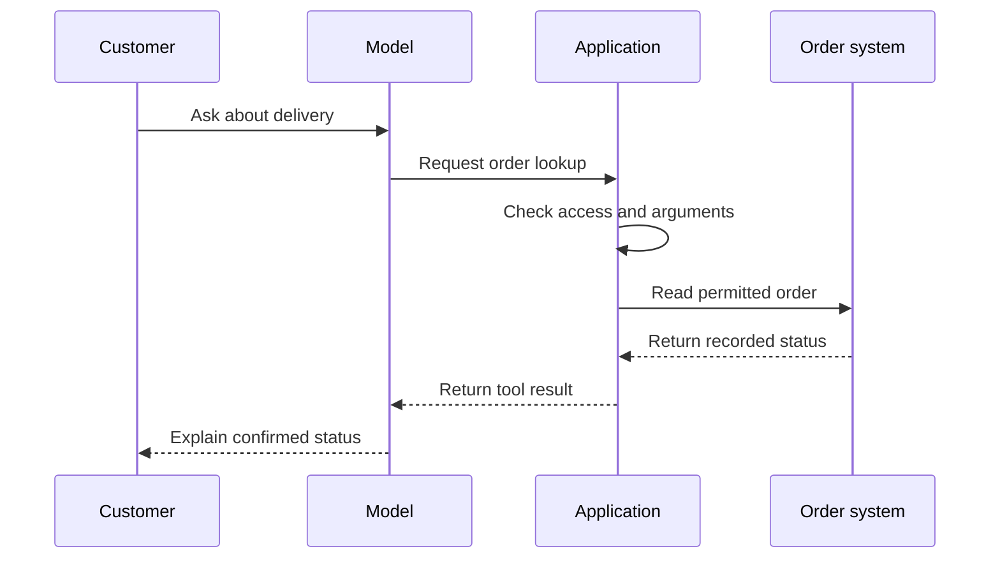

Source: https://docs.aivax.net/learn/agents/adding-tools.html

A language model can write “I have created a support ticket” without creating anything. Text generation and changes to a business system are separate activities. A **tool** is an operation that the agent can request through the surrounding application, such as looking up an order, creating a ticket or sending an e-mail. Tools give the assistant a controlled connection to work beyond its answer text.

Think of a receptionist who can ask a booking system to find appointments. Knowing how to discuss appointments is not the same as having access to the calendar. The available operations, required details and permissions determine what the receptionist can actually accomplish. An agent needs the same separation between language ability and operational authority.

## A tool is a defined capability

A tool normally has a name, a description and a definition of the information it accepts. That information is called its **arguments**. An order lookup might need a reference identifying the order; a ticket-creation operation might need a subject and a description. The definition of the accepted fields and their types is often called a **schema**.

A clear description helps the model decide when a tool is appropriate. “Look up the delivery status of an order the user is authorised to access” is more useful than “Manage orders.” The narrower description makes the expected result and limits easier to understand. It also makes it easier for the application to reject requests that do not fit the operation.

- **Look up information** — Read an order status or search an approved catalogue. The operation should not change the record, but it still needs access controls.

- **Prepare work** — Create a draft reply or prepare a ticket for review. Make clear whether the result is only a draft or already visible to another person.

- **Change the world** — Send an e-mail, confirm a booking or update a record. These actions can have consequences beyond the conversation and need suitable safeguards.

**Read-only** means an operation is intended to retrieve information without modifying it. It does not mean harmless: reading the wrong customer's records can still disclose private data. A **write operation** changes something. Separating these categories helps you decide which tools to expose first and which need additional checks or human confirmation.

## The model requests; the platform executes

In the tool-calling pattern described here, the model never executes the requested code itself. It produces a request that identifies the operation and its arguments. The platform or application receives that request, checks it, runs the appropriate software and returns a result. If a code-running tool is provided, the code runs in that tool's execution environment, not inside the language model's text generation.

This division is important because the model can make mistakes. It might select the wrong operation, omit a required field or confuse a customer-provided reference with a verified one. The application must treat the request as proposed input to validate, not as an instruction that automatically overrides access rules.

1. **Decide whether an action is needed**

The customer asks where an order is. The model recognises that a live lookup is needed rather than answering from general shipping knowledge.

2. **Request the tool**

The model supplies the requested operation and its arguments. If necessary details are missing, it should ask a focused question instead of inventing them.

3. **Validate and execute**

The application checks the arguments and the current user's access. Only an allowed request reaches the business system.

4. **Return the outcome**

The tool reports success, failure or an uncertain outcome. The model uses that evidence to answer, ask another question or stop.

The result becomes part of the next context available to the model. It may contain a status, a limited set of record details or an explanation that the operation could not complete. The assistant should base claims about the action on that result. A request to create a ticket is not proof that a ticket was created.

The diagram shows the successful path. If the permission check fails, the application should not contact the order system for an unauthorised read. If the order system is unavailable, the assistant should explain that it could not verify the status. Failure paths belong in the design, not only in an error message discovered after launch.

## Read the conversation as evidence

> **Interactive demo: Inspect the difference between a request and a result.** This interactive demo is available on the web page. This is an illustrative, prepared conversation. The tool role carries the lookup result; the assistant's earlier intention to check would not be enough to support the final claim. No live customer record is accessed by this demo.

Now imagine the tool instead returns “Service unavailable.” A sound reply would say that the status could not be checked, not that the parcel is probably on its way. If the system returns “Submission pending,” the reply should preserve that state. Users rely on these distinctions when deciding whether they still need to act.

## Permissions belong outside the conversation

**Authentication** establishes who is making a request. **Authorisation** determines what that identity is allowed to do. The tool executor needs both where the operation depends on access to an account or record. A user typing “I am the manager” is not an authentication mechanism, and an instruction saying “Only help authorised users” does not implement authorisation.

For a delivery assistant, the application can limit lookups to orders belonging to the verified session. It can expose a request-for-review operation without exposing unrestricted refund approval. This follows **least privilege**: provide only the access needed for the job. The model should not receive broad powers merely because a narrow operation is inconvenient to design.

Before a consequential action, clarify exactly what the user wants and what will change. A message asking for information is not permission to send an e-mail or cancel an order. Human confirmation should identify the action and target, while the application still enforces access and validity. [Authentication and permissions](https://docs.aivax.net/learn/tools-and-integrations/authentication-and-permissions.md) develops these controls in more detail.

## Handle failures without making them worse

A slow response can leave the outcome uncertain. If an e-mail send times out, it may already have been sent. Automatically repeating a write operation can therefore create duplicate messages or records. The surrounding software needs a way to check status or recognise a repeated request before retrying. The model should not infer that silence means nothing happened.

Start with a small set of well-defined tools and test missing fields, rejected access, unavailable services and incomplete results. A tool catalogue is not a measure of agent quality. Overlapping or vague operations create more opportunities for the model to choose incorrectly. Add a capability when it solves a specific task and its failure behaviour is understood.

**Related:** [Function calling](https://docs.aivax.net/learn/tools-and-integrations/function-calling.md) explains the structured exchange behind tool requests. On AIVAX, [built-in tools](https://docs.aivax.net/docs/tools/builtin-tools.md) provide maintained capabilities, while [protocol functions](https://docs.aivax.net/docs/tools/protocol-functions.md) connect model-requested actions to callbacks you provide.

**What's next:** Tools provide actions; [Adding skills](https://docs.aivax.net/learn/agents/adding-skills.md) explains how to package the method for using them well.

**Knowledge check.** What should support the assistant's claim that it created a ticket?

1. The model's sentence saying the ticket was created
2. The presence of a ticket-creation tool in the catalogue
3. A successful result from the authorised ticket operation
4. The customer's wish to receive a ticket

Answer: option 3. A tool's existence and the model's intention do not establish completion. The application must execute an authorised request and return a successful result before the assistant confirms it.
