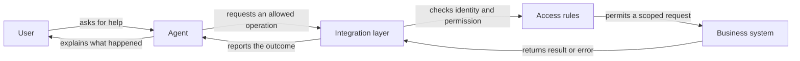

Source: http://localhost:1313/learn/agents/connecting-to-existing-systems.html

An agent can explain your refund policy from a document, yet still be unable to tell whether a refund has been issued. That fact lives in another system. To become useful in daily operations, the agent may need a controlled connection to the software where work actually happens.

Common examples include a **CRM**, or customer relationship management system, which records customer interactions; an **ERP**, or enterprise resource planning system, which coordinates operations such as orders and stock; and a **ticketing system**, which tracks requests and their resolution. Other teams use databases, which store organised records, or spreadsheets. The connection should follow the business task, not the popularity of the software.

## An API is a service counter

An **API**, short for application programming interface, is a defined way for one program to ask another program for information or an action. Imagine a service counter with a menu. You can ask for an order's status by providing the required reference. The clerk returns an agreed kind of answer. You cannot reach behind the counter and rearrange the filing system merely because you can make a request.

The menu specifies what can be requested, which details must accompany the request, and what comes back. A request might mean “show the delivery status,” “create a support ticket,” or “update this contact's preferred language.” An API does not necessarily give access to every feature in the application. Its available operations and permission rules define the boundary.

This makes an API different from an agent simply reading text on a screen. A page might say that an order is complete without exposing how to look up another order reliably. A defined interface gives the connecting software a more explicit agreement about inputs, outputs, and errors. Your IT team still needs to verify what the particular system supports.

## Put an integration layer in the middle

The **integration layer** is the ordinary software that translates between the agent's requested task and the business system's API. It is like a trained clerk who understands both the customer's wording and the office's forms. The model proposes a request; the integration checks it, calls the appropriate system, and returns a usable result.

The layer may check that an order belongs to the signed-in customer, reject an incomplete update, or translate a technical error into a clear result. Those checks must not depend solely on the model remembering a rule. A customer saying “I am the account owner” is not sufficient proof, and a convincing request cannot override the system's permission checks.

This arrangement also separates responsibility. Business owners decide which outcomes the agent is allowed to pursue. IT implements access, validation, and connections. The agent interprets the user's request and explains results. Giving each part a clear job makes problems easier to diagnose than letting the model improvise unrestricted access.

## Read access and write access have different consequences

**Read access** permits retrieving information without changing the underlying record. **Write access** permits creating, updating, or deleting information. Neither is automatically harmless: reading the wrong customer's address is a privacy breach, while changing the wrong address can also misdirect a delivery.

Start with the smallest set of operations that makes the task useful. An assistant answering delivery questions may need order status but not payment details or permission to cancel orders. A ticket-drafting assistant may prepare a description without submitting it until a person confirms. This approach is called **least privilege**: provide only the authority needed for the job.

- **Read a scoped record** — Return only the authorised record and fields. A status question rarely requires the full customer history.

- **Prepare a change** — Let the agent draft an update and show what would change before anything is saved.

- **Execute an approved change** — Check permission and required confirmation immediately before writing. Record the actual result rather than assuming success.

Read-only access is often a useful first stage because it tests identification, relevance, and error handling without allowing record changes. It is not a universal final design. Some tasks genuinely require actions, but those actions should be named and bounded: “add a note to an authorised ticket” is clearer than “manage the support system.”

## What a bounded connection looks like

The following examples describe possible designs, not features automatically present in every CRM or database. The same business intention can be implemented differently depending on the application's public interfaces and your organisation's policies.

**CRM**

A sales assistant reads the authorised customer's company name and account stage to prepare a meeting brief. It drafts a follow-up note for review. Updating the account owner remains a separate operation with its own permission check.

**Ticketing**

A support assistant searches the user's existing tickets before drafting another. Before submission, it confirms the issue description and destination queue. The returned ticket reference proves creation; a drafted message does not.

**Database**

An internal assistant requests a predefined sales summary for an allowed reporting period. It does not receive unrestricted access to run arbitrary database commands or expose every underlying customer record.

Spreadsheets deserve the same care. A sheet may look informal, yet changing a row could affect payroll, purchasing, or a report used for decisions. Define which sheet, rows, and columns are in scope. Decide what should happen if someone edits the record between the agent reading it and proposing a change.

## What IT and the business need to prepare

A useful integration request describes a complete scenario: who is asking, which record is relevant, what information is needed, and what counts as success. “Connect the agent to the ERP” is too broad. “Let signed-in support staff read delivery status for orders they are permitted to handle” provides a testable starting point.

1. **Define operations and ownership**

Name each allowed read or change, its business owner, and the system that remains authoritative. Specify operations the agent must never perform.

2. **Prepare identity and permissions**

Decide how the calling user is identified and how their permitted records are determined. Store access credentials outside prompts and source documents.

3. **Agree on inputs and results**

Document required fields, valid choices, success evidence, and useful errors. Provide a safe testing environment with synthetic records.

4. **Test failure and approval paths**

Try missing records, denied access, ambiguous names, unavailable systems, and interrupted requests. Confirm that rejected or uncertain actions are not presented as completed.

A connection must also handle an awkward case: the request times out after the external system may already have completed a change. Repeating it blindly could create a duplicate ticket or order. The implementation needs a way to check whether the operation succeeded or safely prevent duplicates. From the user's perspective, “I cannot yet confirm the outcome” is more honest than either promising completion or immediately trying again.

Keep a record of important operations: what was requested, which authorised actor requested it, and what the system returned. This is an **audit trail**, a history used to investigate actions. It should contain enough evidence to explain the result without unnecessarily copying sensitive information into logs.

## Two connection patterns you will meet

[Function calling](http://localhost:1313/learn/tools-and-integrations/function-calling.md) lets a model request a named operation with defined inputs; ordinary software executes it. [Model Context Protocol](http://localhost:1313/learn/tools-and-integrations/model-context-protocol.md), or MCP, is a shared protocol for exposing capabilities to compatible AI applications. Neither pattern eliminates the need for [authentication and permissions](http://localhost:1313/learn/tools-and-integrations/authentication-and-permissions.md): proving who is calling and deciding what they may do.

On AIVAX, [protocol functions](http://localhost:1313/docs/tools/protocol-functions.md) and [MCP connections](http://localhost:1313/docs/tools/mcp.md) provide documented ways to connect tools. Choose an approach based on the existing system and operational requirements, not because one name sounds more autonomous.

What's next: explore [agent-to-agent communication](http://localhost:1313/learn/agents/agent-to-agent-communication.md) and decide when another specialist is useful instead of another software connection.

**Knowledge check.** What is the safest useful starting point for connecting a support agent to customer records?

1. Give the model unrestricted database access so it can discover useful actions
2. Define a narrow operation, enforce the user's permissions, and verify the returned result
3. Put an administrator password into the agent's instructions

Answer: option 2. A useful integration exposes specific business operations and enforces access outside the model. Broad access and credentials in prompts create unnecessary risk.
