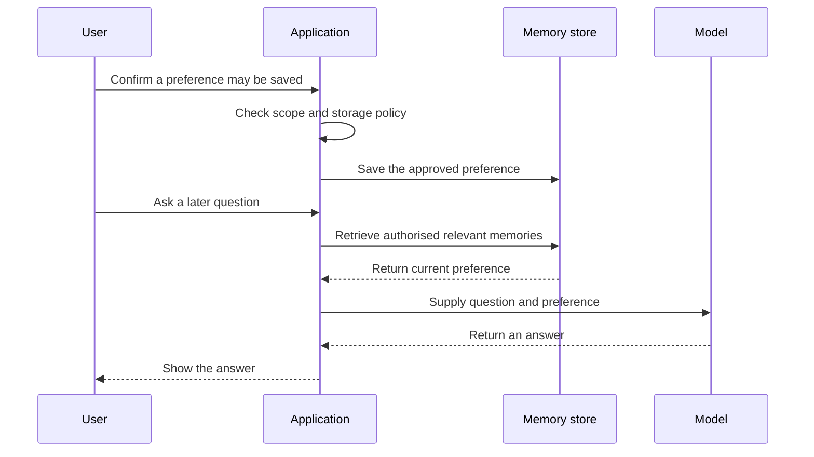

Source: https://docs.aivax.net/learn/prompt-engineering/memory.html

A customer asks an assistant to use short bullet points. Later in the same chat, the assistant keeps using that style. On another day, it might remember the preference again, or it might start with long paragraphs. Those outcomes depend on how the surrounding application manages information, not on whether the model has developed a personal recollection of the customer.

In an AI application, **memory** is a design for retaining information and making it available when it is useful. The language model still answers from the input it receives on the current request. Memory changes how that input is assembled. It is closer to a colleague reading meeting notes than a person remembering an experience.

## Two kinds of remembering

**Short-term memory** usually means the conversation history and working context currently available inside the model's context window. **Long-term memory** means selected information stored outside that window and retrieved for later requests. The difference is not simply a duration measured in minutes: it is where the information lives and how it becomes available again.

- **Short-term: the working desk** — Recent messages, relevant results and current decisions help the assistant understand this task. They are useful only while included in the request context.

- **Long-term: the labelled notebook** — Selected facts or preferences are stored separately. The application finds appropriate records and adds them to a later briefing.

- **Knowledge base: the shared manual** — Approved documents explain products, policies or procedures. They describe the organisation's knowledge rather than one person's conversation preferences.

Short-term context makes follow-ups possible. If the assistant has just drafted two messages and the user says “Make the second one warmer,” the relevant draft and instruction need to remain available. If they have been removed to make room, the assistant should ask which text to revise rather than guessing.

A saved transcript is not automatically usable long-term memory. It may remain in a database without ever being searched or supplied to the model. Conversely, a short preference record can influence many later conversations if the application deliberately retrieves it. Storing and recalling are two separate operations, each needing a clear purpose.

Long-term memory does not retrain the model. It adds selected information to a later request in much the same way that an application can add a document excerpt. This makes correction possible: change or remove the record, and future requests can use the corrected state. Existing transcripts and logs may have separate retention rules that also need attention.

## Store useful facts, not everything

Start with a concrete benefit. A preference for concise answers may improve future interactions. A temporary instruction such as “Make this one response formal” should probably remain local to the task. An inferred health condition, a payment credential or a speculative judgement about a customer's personality should not become a casual memory record.

Ask whether the detail is useful later, appropriate to retain, sufficiently reliable and likely to remain true. Prefer a narrow statement supported by what the user actually said. “Prefers bullet-point project updates” is more defensible than “Dislikes detail,” which generalises a formatting request into a personality claim.

**A transcript copied into memory**

Save the whole exchange, including unrelated customer details, tentative comments and the assistant's guesses. Reuse it whenever the same user appears.

There is no clear purpose, confidence boundary or plan for expiry.

**A scoped, reviewable record**

With the appropriate permission, retain: “For project updates, prefers concise bullet points.” Record its source, scope and review or expiry policy.

Let the person see, correct or remove that preference, and use it only when relevant.

**Scope** means where a memory applies: to one task, one person, a project or an organisation. A project-specific preference must not silently become a company-wide rule. Similarly, sharing a device or browser does not establish that the next person is entitled to the previous user's memories. The application needs reliable identity and access controls before retrieval.

Some facts belong in an authoritative business system instead. A delivery address, subscription status or refund approval should come from the system responsible for that record, with its own verification and permissions. A conversational note is not an appropriate substitute merely because it is easy for the model to read.

## Write and recall deliberately

A useful memory process includes a decision before writing and another before reuse. It also keeps the distinction between the user's confirmed preference and the assistant's interpretation visible. A model may propose a memory, but the application should control what can be saved and under whose identity.

1. **Identify a candidate**

The user states a durable preference or asks the assistant to remember something. Determine the benefit, intended scope and whether storage is necessary.

2. **Check permission and content**

Apply the privacy policy, obtain consent where appropriate, reject prohibited data and confirm ambiguous wording. Do not treat a model's inference as a confirmed fact.

3. **Store with context**

Save the minimum useful statement with its owner, source, scope and retention information. Preserve the distinction between confirmed and uncertain information.

4. **Retrieve for a later task**

Search only records that the current user is authorised to access. Select memories relevant to the request and check that they are still valid.

5. **Apply, correct or retire**

Include the selected record in the model's context as a preference or fact, not a superior instruction. Accept corrections and remove records when their purpose or retention period ends.

The sequence below shows the division of responsibility. The store is simply the software that persists records. The model does not secretly retain a preference between the two requests; the application supplies the retrieved preference when asking for the later answer.

Retrieval can fail or return nothing. The appropriate fallback is usually a normal answer without personalisation, or a clarifying question if the information is necessary. Do not invent a remembered preference to make the experience appear seamless. Also avoid saying “I saved that” until the storage operation has actually succeeded.

## Make privacy and expiry part of the feature

**Retention** is how long information is kept; **expiry** is the point after which it should no longer be used or stored according to the policy. A shipping-related note may have a short useful life. A writing preference may remain useful longer, but should still be editable and removable. “Long-term” does not mean “forever.”

Explain what is retained, why, who can access it and how the person can manage it. Consent is not a universal shortcut: the applicable legal basis and obligations depend on the data and use case. For personal information, involve the people responsible for privacy and read [Privacy, LGPD and GDPR](https://docs.aivax.net/learn/safety/privacy-lgpd-gdpr.md) before deciding the storage policy.

Related: on AIVAX, memory is available among the [built-in tools](https://docs.aivax.net/docs/tools/builtin-tools.md). Its documented capabilities include user-associated memory operations and retention. Enabling a tool is not a complete privacy design; the application still needs appropriate identity, access, review and deletion controls.

**What if a new statement contradicts an old memory?**

Treat a clear user correction as a reason to review the stored record, not as another fact to pile alongside it. Check whether the correction concerns the same scope. Someone can prefer concise status updates and detailed technical reports without contradiction.

**Can a document tell the assistant to save a memory?**

A document can contain text that looks like an instruction. That does not give it permission to write user preferences or organisational rules. Memory writes need the same source and authority checks as other actions; otherwise hostile content can contaminate future conversations.

**Does deleting a memory delete every copy?**

Not necessarily. Conversation history, audit logs and backups may be managed separately. Define deletion behaviour across the relevant stores and communicate the actual policy instead of promising immediate disappearance from every system.

## Keep memory separate from shared knowledge

A knowledge base answers “What is the approved refund policy?” A personal memory answers “How does this user prefer that policy explained?” **Retrieval-augmented generation**, or RAG, supplies relevant stored material to help the model answer; [What is a RAG?](https://docs.aivax.net/learn/teaching-agents/what-is-a-rag.md) explains that process. Memory and knowledge retrieval may use similar search methods, but their ownership and authority differ.

A saved customer statement that “returns are always free” must not override the current approved policy. Keep the statement as a claim only if there is a justified reason to retain it, and verify the policy from its authoritative source. Good memory reduces repeated effort without allowing yesterday's conversation to rewrite today's rules.

**What's next:** Review [common prompt mistakes and fixes](https://docs.aivax.net/learn/prompt-engineering/common-prompt-mistakes.md), including how to handle missing knowledge and uncertainty.

**Knowledge check.** Which approach makes long-term memory useful without treating conversation history as unquestionable truth?

1. Save every message permanently so nothing can be forgotten
2. Store a confirmed, useful preference with appropriate permission and scope, then retrieve it when relevant
3. Treat any stored customer claim as company policy
4. Assume the model remembers a preference without receiving it again

Answer: option 2. Long-term memory is selected information stored and recalled by the application. Purpose, permission, scope, freshness and correction matter as much as the storage operation itself.
