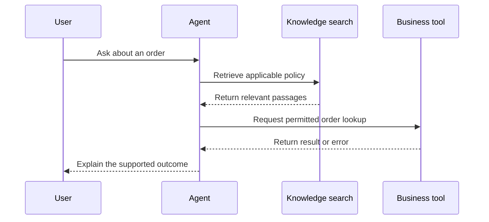

Source: https://docs.aivax.net/learn/quality/logs-traces-and-monitoring.html

A customer reports that an agent promised to update a delivery address, but nothing changed. Reading the final answer tells you what the agent said. It does not tell you whether the agent checked permission, contacted the order system or received an error. **Monitoring** means watching the system's behaviour over time so that these problems can be detected and investigated instead of remaining isolated complaints.

Think of a restaurant. The customer sees a meal arrive, but the restaurant needs to know when the order was taken, when the kitchen received it and whether an ingredient was unavailable. An agent also has several stages between request and result. Useful monitoring connects those stages without turning the restaurant's notebook into an unnecessary copy of every customer's private life.

## A log line records an event; a trace connects the journey

A **log** is a record of events. One **log line**, or event record, might say that a document search completed, a tool failed or a response was delivered. Good events record when something happened, which stage produced it and whether it succeeded. A tool is a connected function the agent can request, such as an order lookup. “Tool call completed” needs a clear meaning: receiving a reply is not necessarily completing the business action.

A **trace** groups related events and timings for one request so you can follow the whole journey. Each timed part is often called a **span**. A shared request reference connects the parts even when different systems handle them. It should be an opaque reference, not an e-mail address or other personal detail. A trace explains the sequence and where time went; it still needs interpretation to explain why the outcome was wrong.

Question received → Retrieve knowledge → Ask the model → Call a tool if needed → Deliver the answer

**Retrieval** means finding relevant material, such as a policy paragraph, to help the agent answer. A model is the system that interprets the request and produces language or requests actions. Some questions need no retrieval or tool call; others involve several rounds. The flow is a teaching example, not a rule that every agent follows in exactly that order.

Suppose the policy search succeeded and the model requested the correct tool, but the business system rejected the action. That evidence points somewhere different from an agent that never requested the tool. If the tool succeeded but the agent reported failure, the final interpretation may be the problem. Without connected records, teams often rewrite prompts to address faults that belong to a permission setting or an unavailable service.

## Decide what to record before you need it

Record enough to answer practical questions: what was requested, which version handled it, which stages ran, how long they took, what outcomes they reported and what the user ultimately received. A **version** identifies a particular configuration of instructions, model, knowledge and tools. Without it, an old failure may be impossible to reproduce after the configuration changes.

- **Timing and status** — Capture stage start and finish times, completion state, timeouts and retries. These explain waiting and availability problems.

- **Configuration and evidence** — Record the relevant configuration version and safe document references. These help distinguish changing behaviour from changing knowledge.

- **Actions and outcomes** — Record the type of action requested and its confirmed result. Avoid copying secrets or unnecessary tool inputs into the record.

- **User-visible result** — Link authorised conversation samples to feedback, escalation and task completion. A technically successful request can still fail the person.

Prefer structured fields, meaning named entries such as stage, duration and outcome, over a different free-form sentence for every event. Consistency makes it possible to group failures and compare periods. Keep error categories understandable: a permission refusal, missing record and temporary service outage need different responses. Do not collapse all of them into “unknown error” if the originating system provides a safe, useful distinction.

You rarely need a model's private internal reasoning to diagnose a business process. Record observable inputs, retrieved evidence, requested actions and confirmed outputs within your privacy policy. When an explanation is useful, ask for a concise user-facing rationale grounded in evidence. It should not be treated as a complete or authoritative account of how the model produced its answer.

## Treat monitoring data as sensitive

Conversation text can contain personal information even when your form did not request it. Tool results may reveal account details, and document passages may contain confidential business material. **Data minimisation** means collecting only what you need for a stated purpose. Decide whether event metadata is sufficient before storing full content. Metadata describes an event, such as its duration or category, rather than reproducing its message.

Use **redaction**, the removal or masking of sensitive fields, before records reach a broadly accessible logging system. Removing names alone does not make a conversation anonymous: a distinctive combination of dates, roles and events may identify someone. Restrict access, set retention periods and ensure deletion procedures cover copied records. Retention is the length of time data is kept. See [Privacy: LGPD and GDPR](https://docs.aivax.net/learn/safety/privacy-lgpd-gdpr.md) for the broader responsibilities.

Production evidence and training examples are different uses of data. Permission to investigate an incident does not automatically permit sharing its transcript with every developer or using it to improve a model. Keep reusable test cases free of unnecessary personal details and review any transfer to another service. Document who may approve access and which records must never include credentials or secrets.

## Turn signals into action

An **alert** is a notification that a condition needs attention. Useful alerts describe an actionable problem, such as a sustained increase in failed order lookups or requests that stop completing. They name an owner and link to a short response procedure. Alerting on every unusual sentence creates noise and can train people to ignore the signal that matters.

1. **Notice a meaningful change**

Use a defined measurement window and enough observations. Treat a single severe safety incident differently from a small movement in average speed.

2. **Open representative traces**

Compare affected requests with successful requests from the same period. Check the stage where their paths diverge.

3. **Contain the impact**

Route work to a human, disable the affected action or return to a known working configuration when the evidence warrants it.

4. **Record the cause and follow-up**

Document what happened, the evidence and the owner of the correction. Add a safe regression case once the failure is understood.

Review conversations as well as system errors. Sample successful-looking sessions, abandoned sessions, escalations and negative feedback. Read enough surrounding messages to understand the user's goal; one isolated answer can look wrong when it was a reasonable follow-up question. Use the same review checklist across reviewers and distinguish an unsupported answer from a justified refusal. The former needs correction; the latter may indicate that expectations or escalation routes need clarification.

**Should we store every conversation forever to simplify debugging?**

No. Unlimited retention increases exposure and makes useful evidence harder to manage. Choose records, access rights and retention based on the purpose and applicable obligations. Prefer aggregated measurements for long-term trends, and retain detailed samples only where justified. Test that your investigation process still works with those limits.

**Related on AIVAX:** An [AI gateway](https://docs.aivax.net/docs/inference/ai-gateway.md) stores the agent configuration, so identify which configuration a reviewed interaction used. The [Data Collecting](https://docs.aivax.net/docs/data-collecting.md) guide describes a separate, optional programme for eligible semantic search and reranking data. It is not a request-logging switch, and enabling it does not by itself include unrelated conversations or tool calls. Review its terms independently of your monitoring design.

**What's next:** Turn the evidence into controlled changes in [Continuous improvement from real conversations](https://docs.aivax.net/learn/quality/continuous-improvement.md).

**Knowledge check.** An agent claimed an update succeeded, but the business record did not change. What is the most useful monitoring approach?

1. Keep only the final response text
2. Connect stage events and outcomes in a trace while limiting sensitive content
3. Copy every secret into the log so nothing is missing
4. Change the prompt before checking the tool result

Answer: option 2. A trace connects the stages needed to investigate the failure. Useful evidence can be collected without indiscriminately storing private content or credentials.
