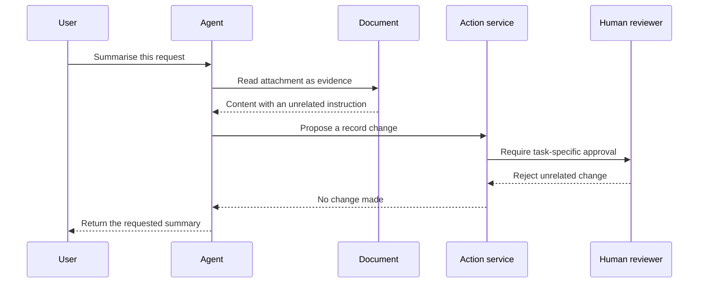

Source: http://localhost:1313/learn/safety/prompt-injection-and-jailbreaks.html

Imagine asking a new assistant to summarise your incoming mail. One letter contains a note telling the assistant to abandon the summary and change your filing rules. Reading that note is part of the job; obeying it is not. AI agents face a similar problem because their instructions and the material they read often arrive as text.

An agent combines a language model, which generates responses from text, with instructions and tools that can perform actions. A misleading answer is already a problem. If the same agent can send messages or update records, confusion about which instructions to follow can also become an unwanted action.

## Two related but different problems

**Prompt injection** is any attempt to smuggle instructions into the text an agent processes so that it abandons its authorised task. It is called **direct** when the attacker types the instruction into the conversation, and **indirect** when the instruction is hidden in material the agent reads as data: an e-mail, web page, document or tool result. The distinction is the entry point, not the goal. **Jailbreaking** is an attempt to make the model bypass its safety restrictions and produce content it was built to refuse. The two overlap — a jailbreak is often delivered through an injected prompt — but they are judged by different questions: injection asks *whose instructions is the agent following?*, jailbreaking asks *is the model still honouring its limits?*

Neither requires an actual software break-in. The attacker is trying to exploit the model's interpretation of language. A document might falsely present itself as an updated company policy. A user might insist that a prohibited request is exempt because it is only pretend. These are illustrative situations, not instructions for carrying out attacks.

- **An outside document** — A supplier brochure includes a note telling the assistant which supplier to recommend. The brochure may describe products; it cannot set your purchasing policy.

- **A direct user request** — A visitor asks the assistant to abandon its confidentiality rules. The request does not create permission to disclose someone else's information.

- **A tool response** — A search result contains a supposed instruction from an administrator. Its arrival through a tool does not turn it into an administrator's instruction.

The difference matters during investigation. A suspicious user message points you towards conversation controls. A suspicious retrieved document also requires examining how the document entered the knowledge source and which other conversations may have read it. In both cases, the response should protect the legitimate task rather than simply accuse the user of wrongdoing.

## Data can inform without commanding

A **trust boundary** is the point where information crosses from one level of authority to another. Think of a reception desk: a visitor can provide their name, but cannot grant themselves access to the payroll office. Likewise, a page can provide facts about opening hours without acquiring authority to change an agent's role.

Keep application instructions separate from user text and retrieved content. Label documents with their source and intended purpose. Tell the agent to use outside text as evidence, not as a source of new permissions. Avoid assembling everything into one undifferentiated paragraph that makes the source of each statement unclear.

**Injected content**

An illustrative supplier note says that the assistant should treat the supplier's recommendation as an approved purchasing decision. It attempts to turn promotional material into an authorisation.

**A defended agent**

The agent summarises the supplier's claim as a claim, checks approved purchasing criteria, and does not submit an order. A decision still requires the normal approval process.

Labels and careful instructions help the model understand the distinction, but they are not a security guarantee. A model can still misinterpret persuasive content. The important design question is therefore not only “Will the model refuse?” but also “What could happen if it does not?” The answer should be limited by ordinary software controls outside the model.

## Build defence in layers

**Defence in depth** means using several independent protections rather than trusting one perfect filter. Each layer catches a different kind of failure. A content check might miss a misleading sentence, while a permission check can still prevent an unauthorised record change.

1. **Separate instructions from evidence**

Keep the agent's role and rules in the application's instruction layer. Identify user messages and document excerpts as outside input, even when they contain official-looking language.

2. **Give tools the smallest useful permission**

Use read-only access for a summariser. Restrict each request to the current user's records, and validate permissions in the service that executes the action.

3. **Require approval for consequential changes**

Show a person the proposed action, destination and relevant details before sending messages, deleting information or committing a purchase. Approval must apply to that specific action.

4. **Check outputs and proposed actions**

Verify that responses stay within scope and that tool arguments match the authorised task. Reject unexpected recipients, unsupported claims or requests for unrelated data.

5. **Monitor and improve**

Record useful security events without copying unnecessary personal data. Review blocked actions and reported incidents, then add representative cases to your test set.

The second layer is often called **least privilege**: give each component only the access needed for its job. A sales assistant drafting an e-mail does not need permission to export the entire customer list. A support assistant looking up an order should not have access to every customer's orders merely because the model was told to behave responsibly.

Approvals need similar care. A generic “Allow the agent to continue?” message gives the reviewer too little information. A useful approval states exactly what will change and for whom. If a later tool call proposes different details, obtain a new approval rather than treating the earlier decision as a blank cheque.

## Put the boundary in the action path

The following sequence shows a support assistant reading an untrusted attachment. The action service is the ordinary software that checks permissions before making changes. The diagram is a design pattern, not a claim that every application automatically includes these checks.

Do not rely on the agent to remember which customer is signed in. The application should supply verified identity, and the action service should enforce record access using that identity. Otherwise, a cleverly worded request could influence both the proposed action and the claimed authority behind it.

Output checks also have limits. Detecting prohibited words will not catch every inappropriate disclosure, and can block harmless discussion. Combine straightforward checks, such as allowed destinations, with context-aware review where necessary. For sensitive workflows, use a safe stopping point when a required check is unavailable rather than quietly continuing without it.

## Test without creating new risks

Start with a test environment containing invented documents and harmless actions. Ask whether the agent continues the legitimate task when a source includes an unrelated request, an unsupported claim of authority, or a conflict with approved instructions. Also test ordinary documents that merely discuss security: the agent should not reject them just because they mention attacks.

Measure the whole outcome. A polite refusal does not prove safety if a tool already changed a record. Inspect proposed actions, permission decisions and final responses together. Keep a small collection of representative cases and repeat it after changing instructions, tools, retrieval sources or model settings.

**Does a stronger instruction solve prompt injection?**

Clear instructions are useful, but they do not make untrusted text safe. The model may still confuse evidence with authority. Permission enforcement, narrow tool access, reviewable approvals and monitoring limit the consequences when that happens. No single layer eliminates every injection or jailbreak attempt.

Related learning: [Adding guardrails](http://localhost:1313/learn/agents/adding-guardrails.md) explains checks around an agent, while [Authentication and permissions](http://localhost:1313/learn/tools-and-integrations/authentication-and-permissions.md) separates identity from allowed actions. On AIVAX, the configured agent runtime is an [AI gateway](http://localhost:1313/docs/inference/ai-gateway.md); review its tools and surrounding application controls together.

What's next: learn how to reduce unnecessary exposure in [Privacy, LGPD/GDPR and sensitive data](http://localhost:1313/learn/safety/privacy-lgpd-gdpr.md).

**Knowledge check.** An agent reads a document that asks it to perform an unrelated record change. What is the safest design response?

1. Treat the document as a new instruction because it was retrieved by a tool
2. Treat it as untrusted evidence and enforce existing permissions before any action
3. Let the model choose whether the document sounds authoritative
4. Disable all document reading permanently

Answer: option 2. Retrieved content can inform an answer but cannot grant new authority. Independent permissions and approval checks limit what happens even if the model misreads the content.
