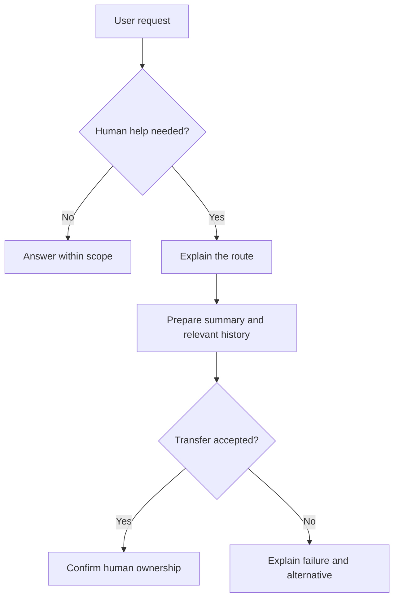

Source: http://localhost:1313/learn/safety/transparency-and-human-escalation.html

A customer explains a billing problem, tries the assistant's suggestion, and reports that it did not work. The assistant offers the same suggestion again. By the time a person joins, the customer has repeated the story several times and is more frustrated than when they arrived. A transfer button exists, but the service has not delivered a useful transfer.

**Transparency** means making relevant facts about the service understandable to the user: who or what is responding, what it can do, what evidence supports its answer, and where its limits are. **Escalation** means moving a case to someone with appropriate authority or expertise. A **handover** is the transfer of information and responsibility that makes that move work.

## Be clear that the assistant is AI

Introduce the assistant in plain language at the start of the interaction. “I'm an AI assistant for delivery questions. I can explain options and help you contact the team” gives a useful picture of its role. Avoid pretending to be a human employee or using a human-looking identity to imply professional qualifications the service does not have.

Disclosure should be easy to notice, not hidden in a long terms page. It does not need to interrupt every message. Repeat or clarify it when the context changes, such as when a human takes over or the user asks whether the answer is automated. Users should not have to guess who is currently responsible for the conversation.

Describe capabilities accurately. An agent that can draft a refund request should not claim it can issue a refund. An agent that can create a support case should not promise an immediate reply from a person. Distinguish an intention, a submitted request and a confirmed result in the wording users see.

**Unclear and overconfident**

“I've fixed everything. Our expert will reply immediately.” The agent has only drafted a request and has no confirmed response time.

**Clear and verifiable**

“I'm an AI assistant. I can prepare the billing issue for our team, but I can't approve the adjustment. Would you like me to submit it? I'll confirm when the support system accepts it.”

Honesty also means describing uncertainty in a way that helps the next decision. “I could not find a current policy for this exception” is more useful than a vague “I may be wrong.” Say what evidence is missing, avoid inventing the answer, and explain the available next step.

## Make evidence inspectable

A **citation** is a reference to a source supporting a statement. For an internal policy answer, link the actual policy and identify the relevant section or effective date when available. For an account action, refer to the verified result from the business system rather than presenting a model-generated sentence as proof.

Citations do not automatically make an answer correct. The linked source might be outdated or say something narrower than the answer claims. Check that the source supports the statement and that the user is permitted to access it. Do not expose a private document title or link simply to make the answer look well sourced.

If sources conflict, say so and route the unresolved decision to its owner. A user should be able to tell the difference between an official policy, a retrieved claim and the assistant's suggested interpretation. This distinction is especially important when the answer could influence a person's rights, health or money.

## Define escalation triggers before launch

A **trigger** is a condition that starts a predefined response. Good triggers are observable enough to test, such as a direct request for a human or repeated failed attempts. Do not wait until a conversation becomes extreme before allowing the user another route.

- **The user asks** — Respect a clear request for a person. Do not require the user to fail more automated steps just to justify the transfer.

- **Frustration or repeated failure** — Notice when the same problem remains unresolved or the user says the proposed steps did not help. Offer a different route rather than repeating the script.

- **Professional judgement** — Legal, medical and financial questions can exceed the agent's approved scope. Route consequential advice or decisions to an appropriately qualified person.

- **Insufficient authority or evidence** — Exceptions, disputed records and unsupported policy claims need someone who can investigate and decide. Confidence in wording is not authority.

Not every mention of a regulated topic requires an emergency response. A clinic's opening hours differ from a request for diagnosis. Define the boundary with relevant specialists. For urgent safety situations, use a separately reviewed process suited to the location and service; an ordinary support queue is not a substitute for emergency help.

Frustration detection is imperfect. Direct statements such as “I want to speak to someone” should carry more weight than a model's guess about emotional tone. Avoid treating regional expressions, disability-related communication differences or concise writing as evidence of hostility. Give users a visible way to request help without relying on automated emotion detection.

## Transfer the case, not just the chat window

1. **Recognise the boundary**

Identify the trigger and stop repeating unsuccessful advice. Explain the relevant limitation briefly without blaming the user.

2. **Offer the available route**

Say what team can help, how the transfer works and what timing is actually known. Obtain any confirmation required before sending the handover.

3. **Prepare the handover package**

Summarise the goal, established facts, attempted steps, outcomes and unresolved question. Include relevant history through an authorised channel, not an unnecessary copy to everyone.

4. **Confirm acceptance**

Check that the support system or receiving person accepted the case. Tell the user the true status and provide the available reference or follow-up route.

5. **Keep ownership visible**

Make clear who is now responding and prevent competing automated replies. If the transfer fails, explain the failure and offer a usable alternative.

A useful handover package resembles a colleague's short case note. It records what the user wants, what has been verified, what remains uncertain, and what the next person needs to decide. Separate the user's statements from system-confirmed facts. “The customer reports a duplicate charge” is not the same as “Two charges were verified.”

Include previous attempts and their results so the person does not recommend the same failed step. Preserve access to relevant conversation history when authorised, because summaries can omit details. Limit sensitive information to what the receiving team needs, and follow retention and access rules for both the summary and the history.

Let the user correct important facts where practical, especially before a consequential referral. Do not require them to approve every internal note when that would create unnecessary friction. The aim is an accurate, accountable transfer that reduces repetition while preserving the user's control and privacy.

## Measure whether escalation helps

The **escalation rate** is the proportion of conversations transferred or referred to a person under a defined counting rule. It is not automatically a failure rate. A medical administration assistant that reliably routes clinical questions may have more escalations precisely because it respects its boundary.

### An illustrative review sample

- **100** — illustrative conversations reviewed

- **20** — illustrative human escalations

- **20%** — illustrative escalation rate

These invented figures teach the calculation, not a target or service benchmark. Define whether repeated transfers count once per conversation, whether abandoned chats are included, and how you distinguish requested transfers from completed handovers. A dashboard that mixes these states can look healthy while customers wait without an owner.

Review reasons for escalation, time to human acceptance, repeated explanations, unresolved cases and feedback after handover. Also inspect cases that should have escalated but did not. Lowering the escalation rate by making the human route difficult is not an improvement. The useful outcome is appropriate help with less avoidable effort and fewer unsafe decisions.

Use findings to improve either side of the boundary. Repeated transfers caused by missing opening hours may call for better knowledge. Repeated requests for discretionary exceptions may confirm that a human approval route is necessary. Some work should remain with people rather than being forced into automation.

Related learning: [Human in the loop](http://localhost:1313/learn/advanced-agents/human-in-the-loop.md) develops approval and review patterns, while [Metrics](http://localhost:1313/learn/quality/metrics.md) explains how to choose measures that reflect actual outcomes.

What's next: balance operating costs with useful service in [Cost optimization and caching](http://localhost:1313/learn/production/cost-optimization-and-caching.md).

**Knowledge check.** Which action best turns an escalation request into a reliable handover?

1. Announce that a person has joined as soon as a transfer is attempted
2. Transfer the full history to every team so someone will notice
3. Prepare a relevant summary, confirm acceptance and explain who owns the case
4. Keep trying the same automated answer until the user leaves

Answer: option 3. A good handover transfers both context and responsibility. It confirms the actual state, limits unnecessary data sharing and prevents the user from being stranded between the agent and a human team.
