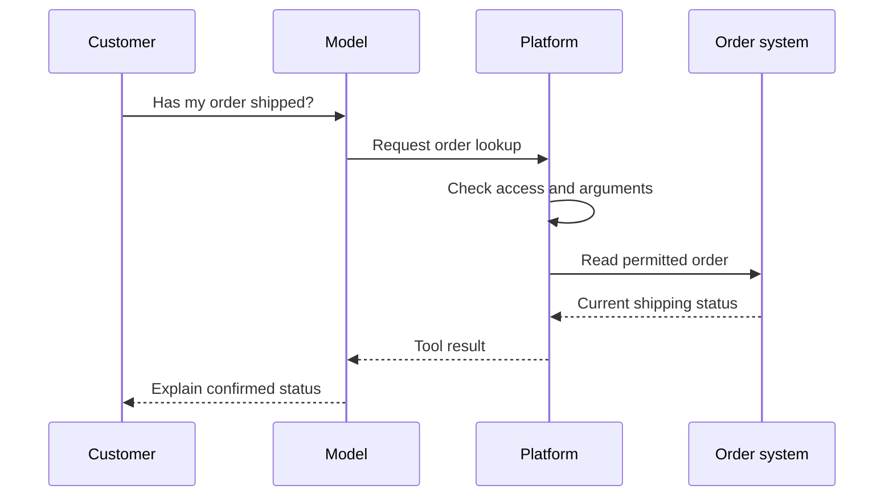

Source: http://localhost:1313/learn/tools-and-integrations/function-calling.html

A customer asks a support assistant, “Has my order left the warehouse?” A language model can write a convincing shipping update, but its training does not contain this customer's current order. The assistant needs a way to ask the order system. **Function calling**, also called tool calling, gives the model a structured way to request that operation rather than inventing an answer.

Think of the model as a receptionist with a set of request forms. It chooses a form and fills in the required boxes. Another part of the business checks the form, performs the work and returns a receipt. The receptionist explains the receipt to the customer. Choosing an action, executing it and explaining its result are separate responsibilities.

## A tool is a clearly labelled request form

A **function** is a named operation that software can perform. A tool exposes such an operation to an agent, for example finding an order, calculating a quote or drafting a ticket. Its definition tells the model what it may request. It does not give the model unrestricted access to the system behind it.

The **name** is a short label, such as `lookup_order`. A specific name helps distinguish it from `cancel_order`: both involve orders, but their consequences are very different. The **description** explains what the operation does, when to use it and what it cannot do. The **parameters** are the fields the caller must supply, such as an order reference. The actual values supplied in a particular call are called **arguments**.

A **schema** is the formal description of those fields: their names, accepted kinds of value, and which are required. It is like the instructions printed beside a form. An order reference might be required text; an optional field might select whether delivery details are included. Avoid asking the model to fill fields that the application already knows securely, such as the authenticated account. The application should supply and verify that information itself.

A valid form is not necessarily a valid business request. A reference can have the correct text format but belong to another customer. The executing software must check both the arguments and the user's permission. A model selecting a tool does not prove that the user is allowed to use it.

## Follow one request all the way through

The **platform** here means the application software surrounding the model. Depending on the integration, that could be an agent service or your own application. It supplies tool definitions, checks requests, runs approved operations and returns results to the model.

1. **Offer the available tools**

The platform gives the model the conversation and the definition of `lookup_order`. Only tools appropriate for this user and task should be offered.

2. **Request an operation**

The model emits a structured request: the tool name and an order reference. This is a request to execute, not evidence that anything has happened.

3. **Check and execute**

The platform checks the arguments and permissions, then asks the order system for the current status. If the reference is missing, the assistant should ask the customer rather than guess.

4. **Return the result**

The platform sends the result back as a tool message associated with that request. A useful result states what was found, or why the lookup failed.

5. **Answer from the evidence**

The model reads the result and explains it in ordinary language. It should distinguish a confirmed dispatch from an estimated delivery date.

This separation matters whenever an action has consequences. “I have cancelled the order” is a factual claim about the business system. The assistant should make that claim only after receiving a successful cancellation result. A well-written sentence is not a substitute for that result, and an attempted operation is not the same as a completed operation.

> **Interactive demo: Inspect the evidence behind the answer.** This interactive demo is available on the web page. Notice what the final answer leaves out. The tool confirms dispatch, but supplies no delivery date. This is a teaching demonstration, not a live lookup.

## Descriptions guide decisions

Models use tool descriptions to decide which operation fits the request. Descriptions therefore need to explain meaning, not merely repeat the tool name. Imagine giving instructions to a colleague who has never used the system: what would help them choose the right form without opening every application?

**Vague description**

“Handles orders. Use when needed.”

This leaves the model guessing whether the tool searches, edits or cancels an order, and whether it needs a reference.

**Useful description**

“Read the current shipping status of one order using its order reference. Use for dispatch and delivery-status questions. This tool does not change orders or guarantee a delivery date.”

The purpose, required input and boundary are explicit.

Good descriptions also clarify confusing neighbours. A tool that searches product information should not sound like one that checks live stock. Their results answer different questions. Where a parameter has a business-specific meaning, explain it: “requested arrival date” is not interchangeable with “dispatch date”. Include a short example only when it removes a real ambiguity.

Do not turn descriptions into a substitute for enforcement. Saying “never refund more than the authorised amount” is useful guidance, but the payment system must reject an excessive refund independently. Clear language improves tool selection; reliable software controls determine what can actually happen.

## Several calls can serve one answer

Some questions require **multiple calls**, meaning more than one tool request during the same task. To answer “Can I exchange this item?”, an assistant might retrieve the order, inspect the item's return policy and check replacement availability. It then combines the results, preserving any disagreement or missing information rather than hiding it.

Calls are **dependent** when one needs another's result. The assistant cannot reliably check stock for a replacement until it knows which product the customer bought. These calls should run in order. **Parallel calls** run at the same time when neither needs the other's result: looking up a known store's opening hours and its parking information is a simple example.

Parallel execution can reduce waiting, but it is not automatically supported by every model or platform. It is also not automatically safe. Two operations that change the same booking could conflict even if their arguments are already known. Start with independent read operations, and let the application decide which actions may overlap. Keep each result associated with its original request so the model does not confuse them.

## Plan for incomplete results

An order service might be unavailable, an order reference might be wrong, or a lookup might return no matching record. These are different outcomes. “No order found” should not be used to disguise “the system could not be reached”. The first calls for checking the reference; the second calls for retrying safely or offering another support route.

Return only the information needed for the question. A shipping-status tool usually does not need to expose the customer's full profile. Treat free text in results as information to evaluate, not as instructions that can overrule the assistant's rules. For actions that change records, preserve a clear distinction between pending, failed and confirmed outcomes.

Before enabling a tool for customers, try a small set of realistic requests. Include a clear request, a missing reference, a request for someone else's record and an unavailable service. Inspect the requested arguments and the actual business outcome, not just the final sentence. An answer can sound correct while referring to the wrong record. Also test whether the assistant asks a useful question when it lacks required information. If two tools have similar names, give the assistant questions that should select each one and check the distinction. These examples reveal whether the definition explains the job well enough and whether the execution layer protects the boundaries the description promises.

**Related:** On AIVAX, ready-made operations are [built-in tools](http://localhost:1313/docs/tools/builtin-tools.md), while custom server-side callbacks are [protocol functions](http://localhost:1313/docs/tools/protocol-functions.md). [Structured responses](http://localhost:1313/docs/inference/structured-responses.md) shape the final output for another program; they do not, by themselves, execute a tool.

What's next: discover how [MCP and tool standards](http://localhost:1313/learn/tools-and-integrations/model-context-protocol.md) make integrations reusable across compatible agents.

**Knowledge check.** Which sequence correctly describes function calling?

1. The model writes a sentence claiming the action succeeded
2. The model requests a tool, the platform checks and executes it, and the model uses the returned result
3. A tool description gives the model unrestricted access to the business system

Answer: option 2. Function calling separates the requested action from execution. Only the returned result provides evidence about what actually happened, and the executing system must enforce access rules.
