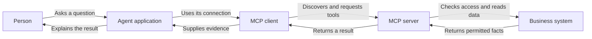

Source: http://localhost:1313/learn/tools-and-integrations/model-context-protocol.html

Imagine buying a new printer and discovering that every writing application needs a different cable to use it. You would spend more time connecting software than printing documents. Agent tools can face a similar problem: a customer database might need a different connection for every assistant that wants to search it.

A **protocol** is an agreed set of rules for communication. **Model Context Protocol**, or **MCP**, defines a shared way for compatible agent applications to discover and use capabilities offered by other software. The useful analogy is a universal socket. It standardises how the pieces connect, not what every device is allowed to do once connected.

## Why shared rules matter

Without a common protocol, each integration team must agree how to list operations, describe their inputs, send requests and report results. Building one connection may be manageable. Maintaining many connections becomes harder when a tool changes and each assistant needs a separate update. A standard lets teams reuse much of that connection work.

“Plug any tool into any agent” describes the ambition, not a guarantee. Both sides must support compatible protocol features and a compatible connection method. The agent still needs the right credentials, sensible instructions and a model capable of choosing the operation. A standard connector cannot make an unavailable service work or turn a risky business operation into a safe one.

**Bespoke integration**

Each agent application gets its own connection to the support system. This can be simple for a small, specific need, but changes may need repeating across several applications.

**Standard integration**

The support system exposes an MCP server. Compatible clients can discover the same tool definitions through shared communication rules, while each deployment still controls access.

Neither approach is always better. A single fixed connection may be easier to maintain as an ordinary application programming interface, or **API**: a defined way for one program to request work from another. MCP becomes useful when discovery and reuse across several agent applications solve a real problem. Adopting it solely because it is fashionable can add a layer nobody needs.

## Meet the server and the client

A **server** is the software offering capabilities. An **MCP client** is the part of an agent application that connects to that server. The person using the assistant does not normally see this exchange. They ask a question; the application handles the connection and makes available tools visible to the model.

- **Server** — Offers a catalogue of capabilities, such as searching approved documents or reading a ticket. It executes requested operations within its own access controls.

- **Client** — Connects, discovers supported capabilities and sends requests. It helps the agent application present available tools to the model.

- **Tools** — Named operations with described inputs and results. A search is a tool call; changing a ticket owner is a different tool with different consequences.

- **Resources** — Information made available for a client to read, such as document content. Resource support and how it appears to users depend on the client and server.

The distinction between tools and resources helps avoid a common misunderstanding. MCP is broader than a list of actions, but a particular product may implement only the parts it needs. A server offering resources does not mean that every connected assistant will automatically read them. Check the capabilities of the actual products, rather than assuming that the protocol name promises every feature.

For example, an internal assistant can discover a tool that searches the employee handbook. The model requests a search for the travel policy; the client passes the request to the server; the server retrieves permitted information. The assistant then explains the result. The server, not the model's confidence, determines which documents the current user may access.

## How this approach emerged

Agent integration did not arrive in one step. The broad progression below is an orientation, not a precise release history. The approaches overlap and remain useful together: protocols often carry operations that a model selects through function calling.

- **Early 2020s, approximately — Application-specific plugins**: Assistants gain extensions built for a particular host application. An integration can be useful, but reuse elsewhere often requires new connection work.

- **Around 2023 onwards — Structured function calling**: Models increasingly request named operations with structured arguments instead of merely describing actions in prose. Applications remain responsible for execution.

- **Late 2024 onwards — Shared agent protocols**: MCP offers common discovery and communication rules. Compatible applications can reuse servers rather than designing each connection from scratch.

The practical change is a shift in where integration work lives. Tool authors can concentrate on reliable business operations and clear descriptions. Client authors can concentrate on helping people use discovered tools safely. However, a shared standard does not remove ownership: someone still needs to maintain the server, manage changes and answer when a dependency fails.

## A standard socket is not a trust certificate

Connecting a third-party server creates a relationship with whoever runs it. That operator may receive search terms, record references or other arguments sent to its tools. Its results may include text from untrusted sources. Before connecting it, ask who operates it, what information it receives, where that information goes and how access can be withdrawn.

**Prompt injection** is an attempt to hide instructions inside content the agent reads, so it treats those instructions as authority. A search result or tool description could attempt to redirect the assistant toward another action. Standard formatting does not make that content trustworthy. Restrict available actions, separate external content from trusted instructions and require independent permission checks. See [prompt injection and jailbreaks](http://localhost:1313/learn/safety/prompt-injection-and-jailbreaks.md).

The smallest useful catalogue is often easier to manage than a very large one. If a support assistant only needs ticket search, do not expose unrelated financial administration tools. Clear choices reduce accidental selection, and narrow access limits the damage if the assistant makes a mistake. Review newly added tools before enabling them; an existing connection may change what it exposes over time.

**Does an MCP server need to run on the public internet?**

No. Servers can be used in different deployment arrangements, including local and remote environments, when the client supports the required connection method. “Server” describes a role, not a promise that the service is public. The deployment still needs an appropriate security boundary.

**Can I trust a server because its tools appear in the catalogue?**

Discovery only tells you what the server advertises. It does not certify its operator, verify every description or approve every action. Evaluate the operator and requested access, test the tools, and provide a way to disable the connection.

## Choose a connection you can operate

Before a trial, name the intended task and the owner of the connection. Try a permitted request, a missing record, an unavailable service and a request the user should not be allowed to make. Check that failures remain visible rather than becoming invented answers. These tests tell you more about readiness than merely seeing a tool listed.

Keep an inventory of connected servers, their purpose and the permissions granted to each. Decide who approves updates and who responds if a server disappears or changes behaviour. Reusability is valuable only when the shared connection remains understandable. One undocumented integration reused everywhere can spread a failure just as efficiently as it spreads a useful feature.

Review the result format as well as the connection. If a ticket search returns a complete customer profile when the assistant only needs a ticket status, the integration exposes more information than the task requires. Ask for a smaller response or place an appropriate filtering step before the result reaches the model. Also distinguish an empty result from a failed search. A reusable connection should make those outcomes understandable across its clients; otherwise each agent may invent its own interpretation. Document these expectations with a few representative examples so a later server update can be checked against the same business behaviour, not merely against whether the connection still opens.

**Related:** On AIVAX, [MCP support](http://localhost:1313/docs/tools/mcp.md) lets a gateway act as a client for external tools. In the other direction, [Inference MCP](http://localhost:1313/docs/mcp-utilities/inference-mcp.md) exposes a model or gateway to compatible clients. [Collections MCP](http://localhost:1313/docs/mcp-utilities/collections-mcp.md) provides knowledge searches, and [Web utilities MCP](http://localhost:1313/docs/mcp-utilities/web-utilities-mcp.md) provides web retrieval tools. These are different capabilities sharing a connection standard, not interchangeable access grants.

What's next: set the boundaries of that connection with [authentication and permissions for tools](http://localhost:1313/learn/tools-and-integrations/authentication-and-permissions.md).

**Knowledge check.** What does adopting MCP actually change?

1. MCP guarantees that every server and its content are trustworthy
2. MCP standardises discovery and communication, while access and trust still need separate controls
3. MCP removes the need to test a business integration
4. Every MCP client automatically supports every resource and tool feature

Answer: option 2. The protocol reduces connection differences. It does not certify servers, grant business permissions or guarantee that every client implements every capability.
