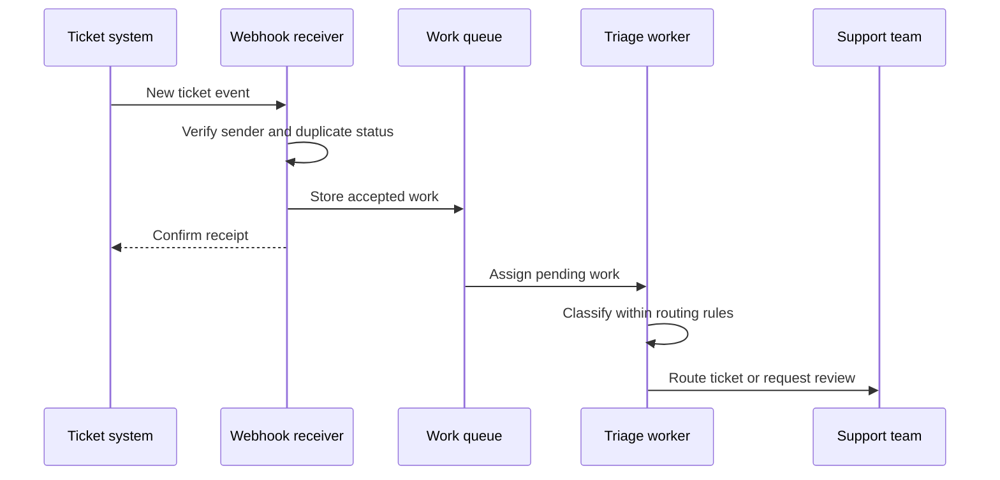

Source: https://docs.aivax.net/learn/tools-and-integrations/webhooks-events-and-automations.html

An assistant does not have to wait for someone to open a chat. A new support ticket can trigger classification, a shipped order can trigger a customer notification, and a schedule can trigger a morning report. These are **automations**: work started and coordinated by software according to an agreed rule.

The useful question is not “Where can we add an agent?” but “What happened, what should happen next, and who is responsible if it does not?” Many steps need ordinary software rules rather than model judgement. An agent is most useful where interpreting varied text or choosing among permitted options would otherwise require a person.

## Conversation versus event

An **event** is a record that something happened: a ticket was created, an order changed status or a document arrived. An **event-driven** workflow starts in response to that occurrence. A **workflow** is the ordered set of steps used to complete a task. In a conversational workflow, a person's message usually starts the work and the answer returns to that conversation.

**Conversational work**

A customer asks, “Where is my order?” The assistant checks the order and replies in the same conversation. The customer is present and can clarify an ambiguous request.

**Event-driven work**

The shipping system reports that an order was dispatched. A workflow checks notification rules and sends an update to the permitted destination. No customer message is needed to start it.

The same business tools can serve both patterns, but the surrounding controls differ. An event-driven task may have nobody waiting to answer a question. It needs a defined destination for success, failure and uncertainty. If the system cannot determine which customer to notify, it should stop or route the case for review rather than guessing from the event's free text.

Events should also be treated as reports, not universal truth about the present. An “order dispatched” event may arrive after a later cancellation or correction. For consequential work, check the current business state when needed instead of assuming the arriving event is the latest fact.

## A webhook is a callback address

A **webhook** lets one system notify another by sending a request to an agreed receiving address when something happens. It is like leaving a telephone number with a repair shop: instead of calling repeatedly to ask whether the repair is complete, the shop calls you when there is news. The sending system initiates the contact.

The message usually contains an event type, a reference to the affected record and information needed to interpret it. This content is the **payload**: the data carried in the request. The receiving application checks the sender and content, then decides what work to start. A webhook is the notification mechanism, not the whole automation.

A **queue** is a waiting list of work items. For a notification that starts longer processing, the receiver can safely store accepted work in a queue and acknowledge receipt promptly. A **worker** in this general pattern is the process that later takes an item and performs the task. This keeps a slow model or external service from holding the initial delivery request open.

Not every callback permits this arrangement. Some hooks require an immediate decision before another operation can continue. Their contract may require a synchronous response, meaning the caller waits for the result. Understand whether the caller needs “message received” or “decision completed”; treating these as equivalent can break the workflow.

## Design one small automation

Consider incoming support tickets. The ticket system already knows when a ticket is created; the model's useful contribution is interpreting a customer's description. The surrounding application should handle delivery, permissions and routing constraints deterministically, meaning according to fixed rules rather than a model's judgement.

1. **Define the trigger and intended outcome**

Start when a new ticket is accepted. The intended outcome is an assigned team or an explicit review state, not merely a generated category label.

2. **Verify and minimise the input**

Check the source of the event and load only the ticket fields required for triage. Keep private attachments out of the model input unless they are needed and permitted.

3. **Ask for bounded judgement**

Have the model choose among approved categories and explain uncertainty briefly. Customer text is evidence about the issue, not authority to change routing rules.

4. **Apply rules and handle uncertainty**

Validate the category against the allowed list. Route sensitive cases and unclear requests to the designated human queue instead of inventing a new destination.

5. **Record and verify the outcome**

Confirm that the ticket system accepted the assignment. Record failures separately so an operator can distinguish pending work from completed work.

A shipping notification may require even less model involvement. If the message consists of a status and an approved tracking link, a fixed template can be clearer and more predictable than a generated paragraph. Use a model when varied language adds value, not to restate a fact that ordinary software can already communicate accurately.

- **New ticket → triage → route** — Use language interpretation to identify the issue, then fixed rules to choose an allowed destination. Keep a review route for ambiguous or sensitive cases.

- **Order shipped → check → notify** — Confirm current status, communication permission and destination before sending. Do not invent delivery promises that the shipping record does not support.

- **Schedule → gather → report** — Start at a planned time, gather the defined inputs and produce a report for an agreed audience. Record the covered period so a repeated run is recognisable.

## Expect retries and duplicates

A **retry** is another attempt after an earlier attempt failed or its outcome is uncertain. Suppose the receiver accepts a webhook, but the confirmation is lost on the network. The sender cannot know whether the receiver accepted it, so it may send the event again. Duplicate delivery is a normal possibility, not necessarily a sender defect.

**Idempotency** means that repeating the same intended operation does not create an additional business effect. Pressing a lift's call button repeatedly should not request several separate lifts. For a notification workflow, processing the same shipping event again should not send another identical customer message merely because delivery was retried.

Use a stable operation reference and a durable record of processing to recognise repeats. The check and the claim to process the operation need to work safely even if two copies arrive at once. Keep the reference tied to the intended operation: a genuinely different shipment or a newly approved action is not a duplicate just because it concerns the same customer.

A recorded event alone does not guarantee that every downstream effect is protected. The process can stop after a message is sent but before it records success. Where possible, the destination should also support duplicate protection. Otherwise, an uncertain outcome may require checking the destination or human review before retrying. Do not promise “exactly once” merely because a duplicate check exists.

**Should every error be retried?**

No. A temporary connection failure may justify a limited retry with a growing delay between attempts. Invalid input or missing permission usually needs correction instead. Repeating the same rejected request can waste resources and hide the real problem. Set a stopping point and a visible route for failures.

**How do I know a webhook really came from the expected sender?**

Use the sender's documented authentication or signature-verification method. A signature is evidence calculated from the message using a secret or other cryptographic mechanism. Validate it as specified, protect the receiving address and reject malformed requests. A familiar-looking event name is not authentication.

## Scheduled work needs an owner too

A **scheduled task** starts according to a clock or calendar rather than a newly received business event. Specify the time zone, the period covered and what to do if a previous run is still working. A daily report should not silently run twice because the clock changed or processing resumed after an outage.

Decide how missed runs are handled: catch up, skip or ask an operator. Keep a way to pause the automation without deleting its history. The owner should be able to see what is pending, what failed and what completed. For recovery patterns, continue with [errors, retries and fallbacks](https://docs.aivax.net/learn/advanced-agents/errors-retries-and-fallbacks.md) and [long-running and asynchronous agents](https://docs.aivax.net/learn/advanced-agents/long-running-and-asynchronous-agents.md).

**Related:** On AIVAX, [AI workers](https://docs.aivax.net/docs/inference/workers.md) are gateway hooks that can control execution and require timely responses; they are not interchangeable with a background queue. [Batch](https://docs.aivax.net/docs/features/batch.md) processes independent items in the background, while [processing pipelines](https://docs.aivax.net/docs/inference/pipelines.md) describe steps around inference. Choose the feature whose execution contract matches the workflow.

What's next: learn how agents coordinate their own steps in [planning and reasoning loops](https://docs.aivax.net/learn/advanced-agents/planning-and-reasoning-loops.md).

**Knowledge check.** What should happen when the same shipping notification event is delivered again?

1. Always execute the action again because every delivery is a new request
2. Recognise the same operation, check its recorded outcome and prevent an additional business effect
3. Ask the model whether the event looks familiar
4. Ignore all future events about the same customer

Answer: option 2. A repeated delivery can represent the same intended operation. Idempotency uses durable operation tracking and appropriate downstream protection, not the model's memory or a blanket ban on later work.
