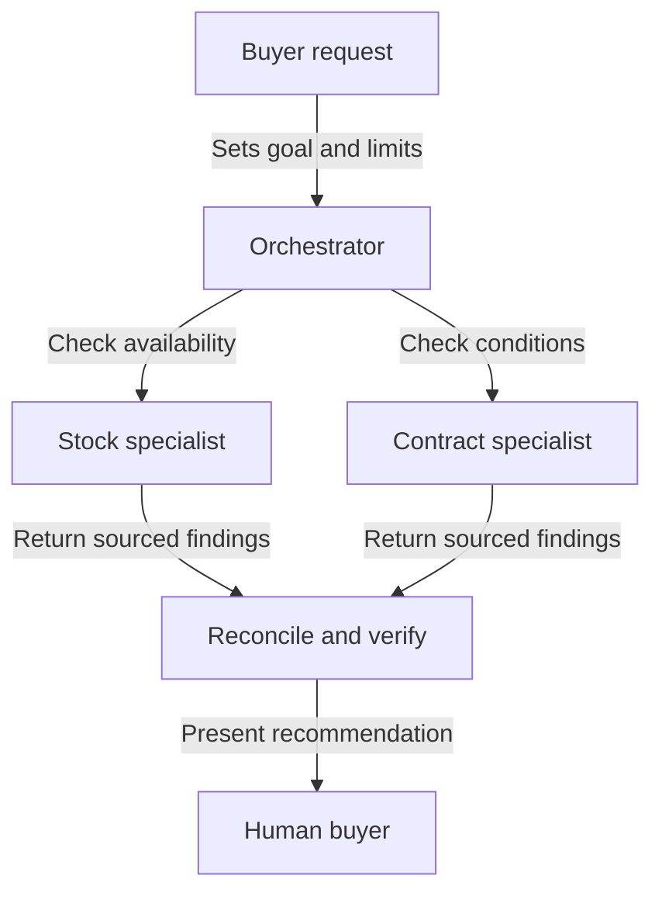

Source: https://docs.aivax.net/pt-br/learn/advanced-agents/multi-agent-architectures.html

Uma empresa não contrata um empregado separado para cada frase de um relatório. Ela divide o trabalho onde diferentes especializações, acessos ou responsabilidades justificam a transferência. O mesmo princípio se aplica aos agentes de IA. Vários agentes podem ajudar em uma tarefa complicada, mas seu número não é medida de qualidade. A coordenação gera trabalho próprio, e alguém deve permanecer responsável pelo resultado.

## Comece com um agente capaz

Antes de dividir uma tarefa, dê a um único agente um objetivo claro, informações relevantes e um conjunto limitado de ferramentas úteis. Um assistente de suporte que consulta um pedido, lê a política de devolução e explica o próximo passo pode não precisar de três agentes separados. Essas ações costumam compartilhar o mesmo contexto e seguir uma sequência simples.

Adicionar especialistas torna‑se útil quando existe um limite real. Um revisor de contratos e um analista de estoque precisam de fontes e critérios de avaliação diferentes. O acesso separado também pode importar: o agente que verifica informações públicas de fornecedores não precisa de acesso a registros privados de clientes. A separação reduz a exposição acidental apenas quando as permissões são impostas pela aplicação, não apenas descritas em prompts de papéis diferentes.

**Agente bem equipado**

Um proprietário mantém a conversa e as evidências relevantes juntas. Isso é mais simples de inspecionar e costuma evitar contexto repetido. Escolha quando a tarefa se encaixa em um papel e um conjunto de ferramentas gerenciável.

**Agentes coordenados**

Trabalhadores distintos podem investigar questões independentes ou aplicar verificações diferentes. Isso adiciona transferências, gerenciamento de estado compartilhado e custos de revisão. Escolha quando esses limites resolvem um problema demonstrado.

A comparação justa é a mesma tarefa, julgada pelos mesmos critérios de aceitação. Não compare um sistema multi‑agente cuidadosamente projetado com um único agente deliberadamente sub‑equipado. Verifique a qualidade das evidências, o tempo de conclusão, o gasto total e a frequência com que uma pessoa precisa corrigir o resultado. Um design mais elaborado deve ganhar sua complexidade por meio de melhoria observada.

## Quatro padrões úteis

Um **padrão** é um arranjo recorrente que você pode adaptar, não um produto que precisa comprar. Esses padrões podem coexistir, mas combiná‑los todos de uma vez geralmente torna a primeira implementação mais difícil de entender. Comece com o menor arranjo que corresponda a como o trabalho realmente depende de resultados anteriores.

- **Orquestrador e especialistas** — Um coordenador atribui peças limitadas, coleta evidências e produz o resultado final. Especialistas retornam descobertas ao invés de decidir independentemente o que dizer ao cliente.

- **Roteador ou triagem** — Um primeiro passo identifica o tipo de solicitação e a direciona ao agente adequado. A maioria das solicitações segue uma rota ao invés de consultar todos os especialistas.

- **Pipeline** — O trabalho passa por estágios ordenados, como extrair, checar e rascunhar. Cada estágio tem uma entrada e saída definidas que o próximo estágio pode usar.

- **Debate ou crítico** — Um trabalhador propõe uma resposta e outro a desafia com base em evidências ou critérios explícitos. O revisor deve poder concluir que não há conclusão suportada.

Um **orquestrador** é como um coordenador de projeto, não um gerente com discrição ilimitada. Para um briefing de compra, ele pode solicitar a um especialista que compare disponibilidade e a outro que verifique condições contratuais. Em seguida, reconcilia as descobertas em uma recomendação. Os especialistas podem trabalhar ao mesmo tempo somente se nenhum precisar do resultado inacabado do outro. Trabalho paralelo significa trabalho simultâneo; não é automaticamente trabalho independente.

Um **roteador**, também chamado de passo de triagem, assemelha‑se a uma recepção. Ele envia uma pergunta de entrega ao suporte e uma solicitação de cotação às vendas. O roteamento deve ter um caminho para solicitações ambíguas. Se um cliente combina uma reclamação com uma pergunta de compra, pedir esclarecimento pode ser melhor do que passar repetidamente a conversa entre agentes.

Um **pipeline** assemelha‑se a uma linha de montagem. O estágio de extração transforma um documento em campos, o estágio de checagem identifica informações ausentes e o estágio de rascunho cria uma resposta. Uma extração falha não deve ser mascarada como um registro vazio mas válido. Cada transferência precisa de um status claro de sucesso ou falha para que estágios posteriores não construam confiantemente sobre fatos ausentes.

Um **crítico** verifica uma proposta ao invés de apenas reescrever seu tom. Dê a ele critérios como “todo total citado deve incluir entrega” e acesso às evidências. Dois agentes concordando não estabelece verdade: eles podem usar a mesma fonte errada ou repetir a mesma suposição não suportada. O debate é útil somente quando o desacordo pode ser resolvido por meio de melhor evidência ou decisão humana.

**Orquestrador**

Use isso quando investigações distintas contribuem para uma decisão, como comparar estoque e termos contratuais. Decida quem reconcilia descobertas conflitantes antes de criar as atribuições de especialistas.

**Roteador**

Use isso quando as solicitações pertencem a áreas de serviço diferentes, como suporte e vendas. Defina o que acontece quando a categoria está indefinida ou uma solicitação abrange ambas as áreas.

**Pipeline**

Use isso quando trabalhos posteriores requerem um resultado anterior verificado, como redigir uma resposta a partir de detalhes de nota fiscal extraídos. Especifique o que cada estágio deve fornecer antes que o próximo possa continuar.

**Crítico**

Use isso quando uma proposta precisa de um desafio baseado em evidências separado. Identifique as verificações independentes que o revisor pode executar e quem resolve um desacordo que a evidência não resolve.

## Compartilhe um registro de trabalho, não toda a conversa

**Estado compartilhado** é o registro de tarefa atual disponível para os trabalhadores que dele precisam. Pense em uma pasta de projeto compartilhada contendo o objetivo, fatos aceitos, fontes, perguntas pendentes e progresso. Deve distinguir uma observação de uma interpretação proposta. “O catálogo indica disponibilidade” e “a entrega cumprirá o prazo” não são declarações intercambiáveis.

Uma transferência útil inclui a pergunta atribuída, escopo, referências de fonte, descoberta, incerteza e status de conclusão. Não requer despejar toda a conversa em cada agente. Informação excessiva aumenta custos e pode expor dados desnecessariamente. Dê ao trabalhador contexto suficiente para fazer seu trabalho e nenhuma autoridade adicional apenas porque outro trabalhador tem acesso mais amplo.

Decida quem pode atualizar cada parte do registro. Se o agente de estoque e o de contrato sobrescreverem a recomendação final, o resultado pode depender de quem terminar por último. Um arranjo mais simples permite que especialistas adicionem descobertas e reserva a decisão final ao coordenador. Preserve evidências anteriores quando uma conclusão mudar, para que um revisor possa entender a correção.

As regras de transferência são tão importantes quanto as descrições de papéis. Veja [Comunicação entre agentes](https://docs.aivax.net/pt-br/learn/agents/agent-to-agent-communication.md) para saber como solicitações e resultados atravessam limites de agentes. Uma mensagem dizendo “concluído” deve referir‑se a um entregável observável, não apenas indicar que o trabalhador parou de gerar texto.

## Impedir que a coordenação se torne a tarefa

Uma falha comum é um loop de delegação: o agente A pede ao agente B, que devolve o mesmo problema ao A. Outro problema é a investigação duplicada, onde vários trabalhadores pesquisam as mesmas fontes sem acrescentar uma verificação distinta. Use atribuições explícitas, um registro de trabalho concluído e um limite de profundidade de delegação. O coordenador deve parar quando não houver produção de novas evidências.

Respostas inconsistentes exigem uma regra de reconciliação. Se um agente relata estoque disponível e outro indisponível, compare datas das fontes, variantes do produto e se algum resultado foi armazenado em cache, ou seja, reutilizado de uma consulta anterior. Não faça média de dois fatos incompatíveis. Se o conflito não puder ser resolvido dentro do orçamento permitido, apresente‑o como não resolvido e identifique a decisão que ele bloqueia.

O custo também se espalha pelo sistema. Cada especialista pode ler instruções repetidas, chamar ferramentas, tentar novamente falhas e devolver um relatório extenso. Trabalhar em paralelo pode reduzir o tempo de espera, ainda aumentando o gasto total. Aplique um orçamento geral da tarefa, bem como limites por trabalhador. Caso contrário, um coordenador pode parecer econômico enquanto seu trabalho delegado consome os recursos.

Por fim, designe um responsável por ações externas e outro pela resposta final. Trabalhadores independentes não devem todos enviar mensagens ao cliente ou modificar o mesmo registro. O responsável verifica as evidências e checa permissões antes de agir. Isso mantém o design multi‑agente compreensível: muitos contribuintes podem investigar, mas a responsabilidade por um resultado consequente permanece explícita.

**Relacionado:** No AIVAX, um [gateway de IA](https://docs.aivax.net/pt-br/docs/inference/ai-gateway.md) armazena uma configuração de agente reutilizável. Configurações separadas podem suportar papéis distintos, mas criar vários gateways não fornece, por si só estado compartilhado, agendamento ou um design completo de orquestração.

Próximo passo: decida quando esse responsável deve pausar para uma pessoa em [Human-in-the-loop and approvals](https://docs.aivax.net/pt-br/learn/advanced-agents/human-in-the-loop.md).

**Verifique seu conhecimento.** Qual design melhor mantém a revisão de fornecedor multi‑agente responsável?

1. Adicionar mais agentes até que suas respostas concordem
2. Deixar cada especialista enviar sua própria recomendação diretamente ao cliente
3. Usar atribuições claras de especialistas, preservar evidências e fazer um único coordenador reconciliar o resultado
4. Dar a cada agente acesso a todo o sistema para que as transferências sejam desnecessárias

Answer: option 3. Atribuições explícitas e um único coordenador responsável reduzem duplicação e resultados conflitantes. Concordância isolada não é evidência, e mais acesso não substitui um contrato de transferência.
