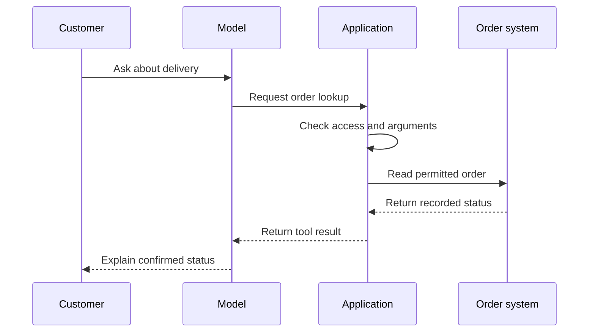

Source: http://localhost:1313/pt-br/learn/agents/adding-tools.html

Um modelo de linguagem pode escrever “Eu criei um ticket de suporte” sem criar nada. A geração de texto e as alterações em um sistema de negócio são atividades separadas. Uma **ferramenta** é uma operação que o agente pode solicitar através da aplicação circundante, como consultar um pedido, criar um ticket ou enviar um e‑mail. Ferramentas dão ao assistente uma conexão controlada para trabalhar além do texto da resposta.

Pense em um recepcionista que pode pedir ao sistema de reservas que encontre compromissos. Saber como discutir compromissos não é o mesmo que ter acesso ao calendário. As operações disponíveis, os detalhes necessários e as permissões determinam o que o recepcionista pode realmente realizar. Um agente precisa da mesma separação entre a capacidade de linguagem e a autoridade operacional.

## A tool is a defined capability

Uma ferramenta normalmente tem um nome, uma descrição e uma definição das informações que aceita. Essa informação é chamada de **argumentos**. Uma consulta de pedido pode precisar de uma referência que identifique o pedido; uma operação de criação de ticket pode precisar de um assunto e uma descrição. A definição dos campos aceitos e seus tipos costuma ser chamada de **esquema**.

Uma descrição clara ajuda o modelo a decidir quando uma ferramenta é apropriada. “Consultar o status de entrega de um pedido ao qual o usuário tem permissão de acesso” é mais útil do que “Gerenciar pedidos”. A descrição mais restrita facilita a compreensão do resultado esperado e dos limites. Também facilita para a aplicação rejeitar solicitações que não se encaixam na operação.

- **Consultar informações** — Leia o status de um pedido ou pesquise um catálogo aprovado. A operação não deve alterar o registro, mas ainda requer controles de acesso.

- **Preparar trabalho** — Crie uma resposta rascunho ou prepare um ticket para revisão. Deixe claro se o resultado é apenas um rascunho ou já está visível para outra pessoa.

- **Mudar o mundo** — Envie um e‑mail, confirme uma reserva ou atualize um registro. Essas ações podem ter consequências além da conversa e precisam de salvaguardas adequadas.

**Read-only** significa que uma operação tem a intenção de recuperar informações sem modificá‑las. Não significa inofensivo: ler os registros do cliente errado ainda pode divulgar dados privados. Uma **write operation** altera algo. Separar essas categorias ajuda a decidir quais ferramentas expor primeiro e quais precisam de verificações adicionais ou confirmação humana.

## The model requests; the platform executes

No padrão de chamada de ferramenta descrito aqui, o modelo nunca executa o código solicitado. Ele gera uma solicitação que identifica a operação e seus argumentos. A plataforma ou aplicação recebe essa solicitação, verifica‑a, executa o software adequado e devolve um resultado. Se uma ferramenta que executa código for fornecida, o código roda no ambiente de execução dessa ferramenta, não dentro da geração de texto do modelo de linguagem.

Essa divisão é importante porque o modelo pode cometer erros. Ele pode selecionar a operação errada, omitir um campo obrigatório ou confundir uma referência fornecida pelo cliente com uma verificada. A aplicação deve tratar a solicitação como entrada proposta para validação, não como uma instrução que sobrescreve automaticamente as regras de acesso.

1. **Decidir se uma ação é necessária**

O cliente pergunta onde está um pedido. O modelo reconhece que uma consulta em tempo real é necessária ao invés de responder com base no conhecimento geral de envio.

2. **Solicitar a ferramenta**

O modelo fornece a operação solicitada e seus argumentos. Se detalhes necessários estiverem ausentes, ele deve fazer uma pergunta focada ao invés de inventá‑los.

3. **Validar e executar**

A aplicação verifica os argumentos e o acesso do usuário atual. Apenas uma solicitação permitida chega ao sistema de negócio.

4. **Retornar o resultado**

A ferramenta relata sucesso, falha ou um resultado incerto. O modelo usa essa evidência para responder, fazer outra pergunta ou parar.

O diagrama mostra o caminho bem‑sucedido. Se a verificação de permissão falhar, a aplicação não deve contatar o sistema de pedidos para uma leitura não autorizada. Se o sistema de pedidos estiver indisponível, o assistente deve explicar que não pôde verificar o status. Caminhos de falha pertencem ao design, não apenas a uma mensagem de erro descoberta após o lançamento.

## Read the conversation as evidence

> **Demonstração interativa: Inspecionar a diferença entre uma solicitação e um resultado.** Esta demonstração interativa está disponível na página web. Esta é uma conversa ilustrativa e preparada. O papel da ferramenta carrega o resultado da consulta; a intenção anterior do assistente de verificar não seria suficiente para sustentar a afirmação final. Nenhum registro de cliente em tempo real é acessado por esta demonstração.

Agora imagine que a ferramenta retorne “Serviço indisponível”. Uma resposta adequada diria que o status não pôde ser verificado, não que a encomenda provavelmente está a caminho. Se o sistema retornar “Submissão pendente”, a resposta deve preservar esse estado. Os usuários confiam nessas distinções ao decidir se ainda precisam agir.

## Permissions belong outside the conversation

**Authentication** estabelece quem está fazendo a solicitação. **Authorisation** determina o que essa identidade tem permissão para fazer. O executor da ferramenta precisa de ambos quando a operação depende de acesso a uma conta ou registro. Um usuário digitando “Eu sou o gerente” não é um mecanismo de autenticação, e uma instrução dizendo “Ajudar apenas usuários autorizados” não implementa autorização.

Para um assistente de entregas, a aplicação pode limitar as consultas a pedidos pertencentes à sessão verificada. Ela pode expor uma operação de revisão sem expor aprovação ilimitada de reembolso. Isso segue o princípio de **least privilege**: fornecer apenas o acesso necessário para o trabalho. O modelo não deve receber poderes amplos apenas porque uma operação restrita é inconveniente de projetar.

Antes de uma ação consequente, esclareça exatamente o que o usuário deseja e o que será alterado. Uma mensagem pedindo informação não é permissão para enviar um e‑mail ou cancelar um pedido. A confirmação humana deve identificar a ação e o alvo, enquanto a aplicação ainda impõe acesso e validade. [Authentication and permissions](http://localhost:1313/pt-br/learn/tools-and-integrations/authentication-and-permissions.md) desenvolve esses controles com mais detalhes.

## Handle failures without making them worse

Uma resposta lenta pode deixar o resultado incerto. Se o envio de um e‑mail expirar, ele pode já ter sido enviado. Repetir automaticamente uma operação de escrita pode, portanto, criar mensagens ou registros duplicados. O software circundante precisa de um meio de verificar o status ou reconhecer uma solicitação repetida antes de tentar novamente. O modelo não deve inferir que silêncio significa que nada aconteceu.

Comece com um pequeno conjunto de ferramentas bem definidas e teste campos ausentes, acesso rejeitado, serviços indisponíveis e resultados incompletos. Um catálogo de ferramentas não é medida da qualidade do agente. Operações sobrepostas ou vagas criam mais oportunidades para o modelo escolher incorretamente. Adicione uma capacidade quando ela resolver uma tarefa específica e seu comportamento de falha for compreendido.

**Related:** [Function calling](http://localhost:1313/pt-br/learn/tools-and-integrations/function-calling.md) explica a troca estruturada por trás das solicitações de ferramenta. No AIVAX, [built-in tools](http://localhost:1313/pt-br/docs/tools/builtin-tools.md) fornecem capacidades mantidas, enquanto [protocol functions](http://localhost:1313/pt-br/docs/tools/protocol-functions.md) conectam ações solicitadas pelo modelo a callbacks que você fornece.

**What's next:** Ferramentas fornecem ações; [Adding skills](http://localhost:1313/pt-br/learn/agents/adding-skills.md) explica como empacotar o método para usá‑las bem.

**Verifique seu conhecimento.** O que deve apoiar a afirmação do assistente de que ele criou um ticket?

1. A frase do modelo dizendo que o ticket foi criado
2. A presença de uma ferramenta de criação de ticket no catálogo
3. Um resultado bem‑sucedido da operação de ticket autorizada
4. O desejo do cliente de receber um ticket

Answer: option 3. A existência de uma ferramenta e a intenção do modelo não estabelecem a conclusão. A aplicação deve executar a solicitação autorizada e retornar um resultado bem‑sucedido antes que o assistente o confirme.
