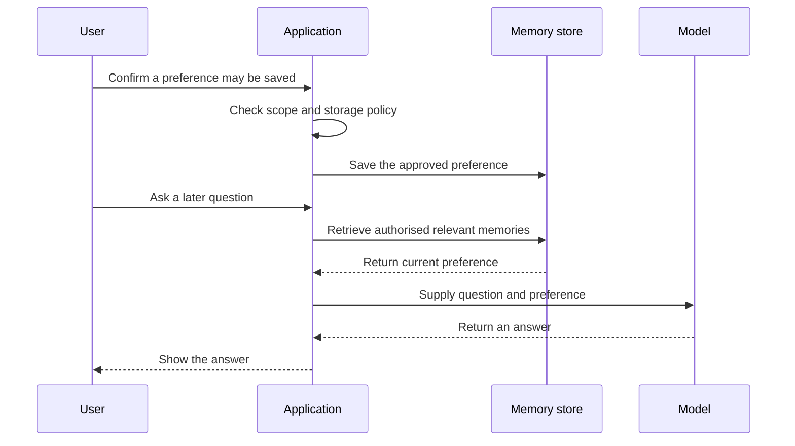

Source: https://docs.aivax.net/pt-br/learn/prompt-engineering/memory.html

A cliente pede ao assistente para usar pontos curtos. Mais tarde, na mesma conversa, o assistente continua usando esse estilo. Em outro dia, pode lembrar da preferência novamente, ou pode começar com parágrafos longos. Esses resultados dependem de como a aplicação ao redor gerencia as informações, não de o modelo desenvolveu uma lembrança pessoal do cliente.

Em uma aplicação de IA, **memória** é um design para reter informações e torná‑las disponíveis quando são úteis. O modelo de linguagem ainda responde a partir da entrada que recebe na requisição atual. A memória altera como essa entrada é montada. É mais próximo de um colega lendo notas de reunião do que de uma pessoa lembrando de uma experiência.

## Dois tipos de memória

**Memória de curto prazo** normalmente significa o histórico de conversa e o contexto de trabalho atualmente disponível dentro da janela de contexto do modelo. **Memória de longo prazo** significa informações selecionadas armazenadas fora dessa janela e recuperadas para requisições posteriores. A diferença não é simplesmente uma duração medida em minutos: é onde a informação reside e como ela se torna disponível novamente.

- **Curto prazo: a mesa de trabalho** — Mensagens recentes, resultados relevantes e decisões atuais ajudam o assistente a entender esta tarefa. Elas são úteis apenas enquanto incluídas no contexto da requisição.

- **Longo prazo: o caderno rotulado** — Fatos ou preferências selecionados são armazenados separadamente. A aplicação encontra registros adequados e os adiciona a um briefing posterior.

- **Base de conhecimento: o manual compartilhado** — Documentos aprovados explicam produtos, políticas ou procedimentos. Eles descrevem o conhecimento da organização ao invés das preferências de conversa de uma pessoa.

O contexto de curto prazo torna os seguimentos possíveis. Se o assistente acabou de rascunhar duas mensagens e o usuário diz “Faça a segunda mais quente,” o rascunho e a instrução relevantes precisam permanecer disponíveis. Se foram removidos para abrir espaço, o assistente deve perguntar qual texto revisar em vez de adivinhar.

Um transcript salvo não se torna automaticamente memória de longo prazo utilizável. Ele pode permanecer em um banco de dados sem nunca ser pesquisado ou fornecido ao modelo. Por outro lado, um registro de preferência curta pode influenciar muitas conversas posteriores se a aplicação o recuperar deliberadamente. Armazenar e recuperar são duas operações separadas, cada uma necessitando de um propósito claro.

## Armazene fatos úteis, não tudo

Comece com um benefício concreto. Uma preferência por respostas concisas pode melhorar interações futuras. Uma instrução temporária como “Faça esta resposta formal” provavelmente deve permanecer local à tarefa. Uma condição de saúde inferida, uma credencial de pagamento ou um julgamento especulativo sobre a personalidade do cliente não devem se tornar um registro de memória casual.

Pergunte se o detalhe é útil posteriormente, adequado para reter, suficientemente confiável e provável de permanecer verdadeiro. Prefira uma afirmação restrita sustentada pelo que o usuário realmente disse. “Prefere atualizações de projeto em tópicos” é mais defensável que “Não gosta de detalhes,” que generaliza um pedido de formatação para uma afirmação de personalidade.

**Um transcript copiado para a memória**

Salve toda a troca, incluindo detalhes não relacionados do cliente, comentários provisórios e suposições do assistente. Reuse-a sempre que o mesmo usuário aparecer.

Não há propósito claro, limite de confiança ou plano de expiração.

**Um registro delimitado e revisável**

Com a permissão adequada, retenha: “Para atualizações de projeto, prefere tópicos concisos.” Registre sua origem, escopo e política de revisão ou expiração.

Permita que a pessoa veja, corrija ou remova essa preferência e use‑a apenas quando relevante.

**Escopo** significa onde uma memória se aplica: a uma tarefa, a uma pessoa, a um projeto ou a uma organização. Uma preferência específica de projeto não deve se tornar silenciosamente uma regra de toda a empresa. Da mesma forma, compartilhar um dispositivo ou navegador não estabelece que a próxima pessoa tem direito às memórias do usuário anterior. A aplicação precisa de identidade confiável e controles de acesso antes da recuperação.

Alguns fatos pertencem a um sistema empresarial autoritativo. Endereço de entrega, status de assinatura ou aprovação de reembolso devem vir do sistema responsável por esse registro, com sua própria verificação e permissões. Uma nota de conversa não é um substituto adequado apenas porque é fácil para o modelo ler.

## Escreva e recupere deliberadamente

Um processo de memória útil inclui uma decisão antes de escrever e outra antes de reutilizar. Também mantém a distinção entre a preferência confirmada do usuário e a interpretação do assistente visível. Um modelo pode propor uma memória, mas a aplicação deve controlar o que pode ser salvo e sob qual identidade.

1. **Identificar um candidato**

O usuário declara uma preferência durável ou pede ao assistente para lembrar de algo. Determine o benefício, o escopo pretendido e se o armazenamento é necessário.

2. **Verificar permissão e conteúdo**

Aplique a política de privacidade, obtenha consentimento quando apropriado, rejeite dados proibidos e confirme a formulação ambígua. Não trate a inferência de um modelo como um fato confirmado.

3. **Armazenar com contexto**

Salve a declaração mínima útil com seu proprietário, origem, escopo e informações de retenção. Preserve a distinção entre informação confirmada e incerta.

4. **Recuperar para uma tarefa posterior**

Pesquise apenas registros que o usuário atual está autorizado a acessar. Selecione memórias relevantes para a solicitação e verifique se ainda são válidas.

5. **Aplicar, corrigir ou retirar**

Inclua o registro selecionado no contexto do modelo como uma preferência ou fato, não como uma instrução superior. Aceite correções e remova registros quando seu propósito ou período de retenção terminar.

A recuperação pode falhar ou não retornar nada. O fallback adequado costuma ser uma resposta normal sem personalização, ou uma pergunta de esclarecimento se a informação for necessária. Não invente uma preferência lembrada para que a experiência pareça fluida. Também evite dizer “Eu salvei isso” até que a operação de armazenamento tenha realmente sucedido.

## Torne privacidade e expiração parte da funcionalidade

**Retenção** é por quanto tempo a informação é mantida; **expiração** é o ponto após o qual ela não deve mais ser usada ou armazenada de acordo com a política. Uma nota relacionada a envio pode ter uma vida útil curta. Uma preferência de escrita pode permanecer útil por mais tempo, mas ainda deve ser editável e removível. “Longo prazo” não significa “para sempre.”

Explique o que é retido, por quê, quem pode acessá‑lo e como a pessoa pode gerenciá‑lo. Consentimento não é um atalho universal: a base legal aplicável e as obrigações dependem dos dados e do caso de uso. Para informações pessoais, envolva as pessoas responsáveis pela privacidade e leia [Privacy, LGPD and GDPR](https://docs.aivax.net/pt-br/learn/safety/privacy-lgpd-gdpr.md) antes de decidir a política de armazenamento.

Relacionado: no AIVAX, a memória está disponível entre as [ferramentas embutidas](https://docs.aivax.net/pt-br/docs/tools/builtin-tools.md). Suas capacidades documentadas incluem operações de memória associadas ao usuário e retenção. Habilitar uma ferramenta não é um design completo de privacidade; a aplicação ainda precisa de identidade, acesso, revisão e controles de exclusão adequados.

**E se uma nova declaração contradizer uma memória antiga?**

Trate uma correção clara do usuário como motivo para revisar o registro armazenado, não como outro fato para empilhar ao lado. Verifique se a correção diz respeito ao mesmo escopo. Alguém pode preferir atualizações de status concisas e relatórios técnicos detalhados sem contradição.

**Um documento pode dizer ao assistente para salvar uma memória?**

Um documento pode conter texto que parece uma instrução. Isso não lhe dá permissão para escrever preferências de usuário ou regras organizacionais. Escritas de memória precisam das mesmas verificações de origem e autoridade que outras ações; caso contrário, conteúdo hostil pode contaminar conversas futuras.

**Excluir uma memória exclui todas as cópias?**

Não necessariamente. O histórico de conversa, logs de auditoria e backups podem ser gerenciados separadamente. Defina o comportamento de exclusão nos armazenamentos relevantes e comunique a política real em vez de prometer desaparecimento imediato de todo o sistema.

## Mantenha a memória separada do conhecimento compartilhado

Uma base de conhecimento responde “Qual é a política de reembolso aprovada?” Uma memória pessoal responde “Como este usuário prefere que a política seja explicada?” **Geração aumentada por recuperação**, ou RAG, fornece material armazenado relevante para ajudar o modelo a responder; [What is a RAG?](https://docs.aivax.net/pt-br/learn/teaching-agents/what-is-a-rag.md) explica esse processo. Memória e recuperação de conhecimento podem usar métodos de busca semelhantes, mas sua propriedade e autoridade diferem.

Uma declaração de cliente salva que “devoluções são sempre gratuitas” não deve substituir a política aprovada atual. Mantenha a declaração como uma alegação apenas se houver um motivo justificado para retê‑la, e verifique a política em sua fonte autoritária. Boa memória reduz esforço repetido sem permitir que a conversa de ontem reescreva as regras de hoje.

**Próximo passo:** Revise [erros comuns de prompt e correções](https://docs.aivax.net/pt-br/learn/prompt-engineering/common-prompt-mistakes.md), incluindo como lidar com conhecimento ausente e incerteza.

**Verifique seu conhecimento.** Qual abordagem torna a memória de longo prazo útil sem tratar o histórico de conversa como verdade indiscutível?

1. Salvar cada mensagem permanentemente para que nada seja esquecido
2. Armazenar uma preferência confirmada e útil com permissão e escopo adequados, depois recuperá‑la quando relevante
3. Tratar qualquer reivindicação armazenada do cliente como política da empresa
4. Assumir que o modelo lembra de uma preferência sem recebê‑la novamente

Answer: option 2. Memória de longo prazo são informações selecionadas armazenadas e recuperadas pela aplicação. Propósito, permissão, escopo, atualidade e correção são tão importantes quanto a própria operação de armazenamento.
