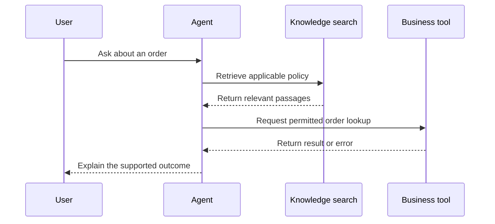

Source: http://localhost:1313/pt-br/learn/quality/logs-traces-and-monitoring.html

Um cliente relata que um agente prometeu atualizar o endereço de entrega, mas nada mudou. Ler a resposta final informa o que o agente disse. Não informa se o agente verificou permissão, contatou o sistema de pedidos ou recebeu um erro. **Monitoramento** significa observar o comportamento do sistema ao longo do tempo para que esses problemas possam ser detectados e investigados em vez de permanecerem como reclamações isoladas.

Pense em um restaurante. O cliente vê a refeição chegar, mas o restaurante precisa saber quando o pedido foi feito, quando a cozinha o recebeu e se um ingrediente estava indisponível. Um agente também tem várias etapas entre a solicitação e o resultado. Um monitoramento útil conecta essas etapas sem transformar o caderno do restaurante em uma cópia desnecessária da vida privada de cada cliente.

## Uma linha de log registra um evento; um rastreamento conecta a jornada

Um **log** é um registro de eventos. Uma **linha de log**, ou registro de evento, pode dizer que uma busca de documento foi concluída, que uma ferramenta falhou ou que uma resposta foi entregue. Bons eventos registram quando algo aconteceu, qual etapa o produziu e se teve sucesso. Uma ferramenta é uma função conectada que o agente pode solicitar, como uma consulta de pedido. “Chamada de ferramenta concluída” precisa ter um significado claro: receber uma resposta não significa necessariamente concluir a ação de negócio.

Um **rastreamento** agrupa eventos e tempos relacionados para uma solicitação, permitindo seguir toda a jornada. Cada parte crada é frequentemente chamada de **span**. Uma referência de solicitação compartilhada conecta as partes mesmo quando sistemas diferentes as manipulam. Ela deve ser uma referência opaca, não um endereço de e‑mail ou outro detalhe pessoal. Um rastreamento explica a sequência e onde o tempo foi gasto; ainda precisa de interpretação para explicar por que o resultado foi errado.

Pergunta recebida → Recuperar conhecimento → Perguntar ao modelo → Chamar uma ferramenta se necessário → Entregar a resposta

**Recuperação** significa encontrar material relevante, como um parágrafo de política, para ajudar o agente a responder. Um modelo é o sistema que interpreta a solicitação e produz linguagem ou solicita ações. Algumas perguntas não precisam de recuperação ou chamada de ferramenta; outras envolvem várias rodadas. O fluxo é um exemplo de ensino, não uma regra que todo agente segue exatamente nessa ordem.

Suponha que a busca na política tenha sido bem‑sucedida e o modelo tenha solicitado a ferramenta correta, mas o sistema de negócio tenha rejeitado a ação. Essa evidência aponta para um lugar diferente de um agente que nunca solicitou a ferramenta. Se a ferramenta teve sucesso mas o agente relatou falha, a interpretação final pode ser o problema. Sem registros conectados, as equipes costumam reescrever prompts para corrigir falhas que pertencem a uma configuração de permissão ou a um serviço indisponível.

## Decida o que registrar antes de precisar

Registre o suficiente para responder a perguntas práticas: o que foi solicitado, qual versão o processou, quais etapas foram executadas, quanto tempo levaram, quais resultados foram relatados e o que o usuário recebeu ao final. Uma **versão** identifica uma configuração específica de instruções, modelo, conhecimento e ferramentas. Sem ela, uma falha antiga pode ser impossível de reproduzir após mudanças na configuração.

- **Tempo e status** — Capture os horários de início e término da etapa, estado de conclusão, timeouts e tentativas. Isso explica problemas de espera e disponibilidade.

- **Configuração e evidência** — Registre a versão de configuração relevante e referências seguras de documentos. Isso ajuda a distinguir comportamento em mudança de conhecimento em mudança.

- **Ações e resultados** — Registre o tipo de ação solicitada e seu resultado confirmado. Evite copiar segredos ou entradas de ferramenta desnecessárias no registro.

- **Resultado visível ao usuário** — Vincule amostras de conversas autorizadas a feedback, escalonamento e conclusão de tarefa. Uma solicitação tecnicamente bem‑sucedida ainda pode falhar para a pessoa.

Prefira campos estruturados, ou seja, entradas nomeadas como etapa, duração e resultado, em vez de uma frase livre diferente para cada evento. A consistência torna possível agrupar falhas e comparar períodos. Mantenha as categorias de erro compreensíveis: uma recusa de permissão, registro ausente e interrupção temporária de serviço exigem respostas diferentes. Não agrupe tudo em “erro desconhecido” se o sistema de origem fornecer uma distinção segura e útil.

Raramente é necessário acessar o raciocínio interno privado de um modelo para diagnosticar um processo de negócio. Registre entradas observáveis, evidências recuperadas, ações solicitadas e saídas confirmadas dentro da sua política de privacidade. Quando uma explicação for útil, peça um raciocínio conciso voltado ao usuário, baseado em evidências. Isso não deve ser tratado como um relato completo ou autoritário de como o modelo produziu sua resposta.

## Trate os dados de monitoramento como sensíveis

O texto de uma conversa pode conter informações pessoais mesmo quando seu formulário não as solicitou. Resultados de ferramentas podem revelar detalhes de conta, e trechos de documentos podem conter material confidencial de negócio. **Minimização de dados** significa coletar apenas o que é necessário para um propósito declarado. Decida se os metadados do evento são suficientes antes de armazenar o conteúdo completo. Metadados descrevem um evento, como sua duração ou categoria, em vez de reproduzir sua mensagem.

Use **redação**, a remoção ou mascaramento de campos sensíveis, antes que os registros cheguem a um sistema de log amplamente acessível. Remover apenas nomes não torna uma conversa anônima: uma combinação distinta de datas, papéis e eventos pode identificar alguém. Restrinja o acesso, defina períodos de retenção e garanta que os procedimentos de exclusão cubram registros copiados. Retenção é o tempo que os dados são mantidos. Veja [Privacy: LGPD and GDPR](http://localhost:1313/pt-br/learn/safety/privacy-lgpd-gdpr.md) para as responsabilidades mais amplas.

Evidências de produção e exemplos de treinamento são usos diferentes dos dados. Permissão para investigar um incidente não autoriza automaticamente compartilhar sua transcrição com todos os desenvolvedores ou usá‑la para melhorar um modelo. Mantenha casos de teste reutilizáveis livres de detalhes pessoais desnecessários e revise qualquer transferência para outro serviço. Documente quem pode aprovar o acesso e quais registros nunca devem incluir credenciais ou segredos.

## Transforme sinais em ação

Um **alerta** é uma notificação de que uma condição requer atenção. Alertas úteis descrevem um problema acionável, como um aumento sustentado em buscas de pedidos falhas ou solicitações que deixam de ser concluídas. Eles nomeiam um responsável e vinculam a um procedimento de resposta curto. Alertar a cada frase incomum cria ruído e pode treinar as pessoas a ignorar o sinal que realmente importa.

1. **Observe uma mudança significativa**

Use uma janela de medição definida e observações suficientes. Trate um único incidente grave de segurança de forma diferente de um pequeno movimento na velocidade média.

2. **Abra rastreamentos representativos**

Compare solicitações afetadas com solicitações bem‑sucedidas do mesmo período. Verifique a etapa onde seus caminhos divergem.

3. **Conter o impacto**

Direcione o trabalho para um humano, desative a ação afetada ou retorne a uma configuração conhecida quando a evidência assim o exigir.

4. **Registre a causa e o acompanhamento**

Documente o que aconteceu, a evidência e o responsável pela correção. Adicione um caso de regressão seguro assim que a falha for compreendida.

Revise conversas assim como erros do sistema. Amostre sessões que parecem bem‑sucedidas, sessões abandonadas, escalonamentos e feedback negativo. Leia mensagens circundantes suficientes para entender o objetivo do usuário; uma resposta isolada pode parecer errada quando era uma pergunta de acompanhamento razoável. Use a mesma lista de verificação de revisão entre revisores e distinga uma resposta não suportada de uma recusa justificada. O primeiro precisa de correção; o segundo pode indicar que expectativas ou rotas de escalonamento precisam de esclarecimento.

**Devemos armazenar todas as conversas para simplificar a depuração?**

Não. Retenção ilimitada aumenta a exposição e torna mais difícil gerenciar evidências úteis. Escolha registros, direitos de acesso e retenção com base no propósito e nas obrigações aplicáveis. Prefira medições agregadas para tendências de longo prazo e retenha amostras detalhadas apenas onde for justificado. Teste se seu processo de investigação ainda funciona com esses limites.

**Relacionado no AIVAX:** Um [AI gateway](http://localhost:1313/pt-br/docs/inference/ai-gateway.md) armazena a configuração do agente, portanto identifique qual configuração foi usada na interação revisada. O guia [Data Collecting](http://localhost:1313/pt-br/docs/data-collecting.md) descreve um programa separado e opcional para dados elegíveis de busca semântica e reranking. Não é um interruptor de registro de solicitações, e habilitá‑lo não inclui por si só conversas ou chamadas de ferramenta não relacionadas. Revise seus termos independentemente do seu design de monitoramento.

**Próximos passos:** Transforme a evidência em mudanças controladas em [Continuous improvement from real conversations](http://localhost:1313/pt-br/learn/quality/continuous-improvement.md).

**Verifique seu conhecimento.** Um agente afirmou que a atualização teve sucesso, mas o registro de negócio não mudou. Qual é a abordagem de monitoramento mais útil?

1. Manter apenas o texto da resposta final
2. Conectar eventos e resultados das etapas em um rastreamento limitando o conteúdo sensível
3. Copiar todo segredo no log para que nada falte
4. Alterar o prompt antes de verificar o resultado da ferramenta

Answer: option 2. Um rastreamento conecta as etapas necessárias para investigar a falha. Evidências úteis podem ser coletadas sem armazenar indiscriminadamente conteúdo privado ou credenciais.
