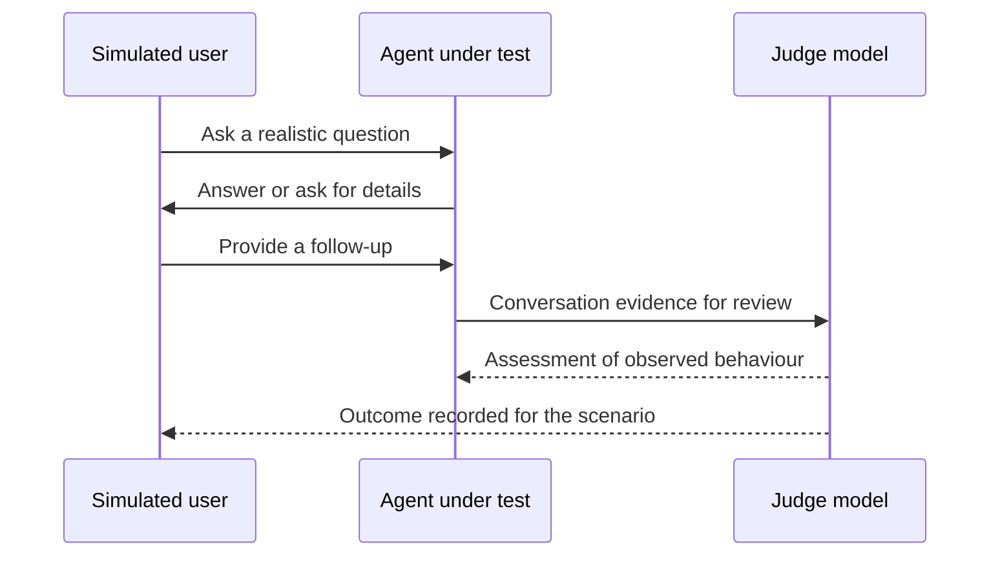

Source: https://docs.aivax.net/pt-br/learn/quality/testing-and-evaluating-agents.html

Uma demonstração convincente mostra que um agente pode ter sucesso uma vez. Ela não mostra com que frequência ele tem sucesso, o que acontece quando falta informação ou se a melhoria de ontem que outra tarefa. **Avaliação**, frequentemente abreviada para **eval**, significa verificar o comportamento contra uma expectativa declarada usando um método repetível. Pense em inspecionar o trabalho de um novo funcionário ao longo de uma semana normal de trabalho, em vez de julgar sua capacidade a partir de uma entrevista ensaiada.

Um agente de suporte pode responder perfeitamente a uma pergunta simples de reembolso, mas inventar uma exceção quando o cliente está irritado. Um agente de vendas pode recomendar um serviço adequado e ainda prometer um desconto indisponível. Ambos parecem úteis. Nenhum atende ao requisito de negócio. Os testes tornam esses requisitos visíveis antes que o cliente descubra a lacuna e fornecem evidência que a equipe pode comparar ao longo do tempo.

## Comece com o trabalho que as pessoas realmente trazem

Um **conjunto de teste** é uma coleção de situações que você usará para verificar o agente. Construa‑o a partir de perguntas recebidas pelos times de suporte, vendas e internos, usando registros autorizados com informações pessoais desnecessárias removidas. Preserve a dificuldade da pergunta, não a identidade da pessoa que a fez. Reescreva detalhes privados em circunstâncias claramente fictícias quando necessário e revise o caso reescrito para mudanças acidentais em seu significado.

Inclua solicitações comuns porque elas representam grande parte da carga de trabalho. Também inclua situações incomuns porém consequentes: um registro de conta indisponível, documentos de política conflitantes, uma solicitação fora da autoridade do agente ou uma ferramenta que não pode concluir uma ação. Um **ferramenta** é uma função conectada que o agente pode solicitar para executar trabalho, como buscar um pedido. Uma resposta fluente não substitui a verificação de que aquele trabalho realmente aconteceu.

- **Trabalho rotineiro** — Um cliente pergunta sobre uma política de devolução publicada. Verifique se a resposta está correta e utilizável.

- **Informação ausente** — Um funcionário pede um procedimento sem nomear seu departamento. Verifique se o agente faz uma pergunta de acompanhamento útil.

- **Limites e falhas** — Um usuário solicita uma ação não autorizada ou uma busca falha. Verifique se o agente recusa ou escalona sem fingir que teve sucesso.

Não deixe o conjunto de teste se tornar uma coleção de perguntas fáceis escritas pela pessoa que escreveu as instruções. Peça a colegas que entendem o trabalho para contribuir com casos. Inclua diferentes formulações, frases incompletas e conversas que mudam de direção. Mantenha um grupo separado de casos fora da edição diária de prompts. Esse **conjunto reservado** oferece uma verificação menos tendenciosa de se uma mudança se generaliza além dos exemplos que seu autor já conhece.

## Defina o sucesso antes de executar o teste

Um **resultado esperado** descreve comportamento observável, não uma frase exata que o agente deve copiar. Para uma solicitação de devolução, pode exigir explicar a política aplicável, solicitar informações de compra ausentes e não prometer aprovação antes de verificar a elegibilidade. Registre as informações disponíveis ao agente e a fonte que sustenta a resposta esperada. Se os revisores discordarem da política, resolva essa discordância antes de pedir ao modelo que a avalie.

Separe fatos necessários, ações necessárias e ações proibidas. Alguns requisitos permitem julgamento: uma resposta deve ser compreensível. Outros podem ser verificados diretamente: uma reserva não deve ser criada sem confirmação. Um agente dizendo “Eu arei” não é evidência de uma reserva. Para ações, inspecione um sistema de teste seguro ou um registro independente do que ocorreu, não apenas a transcrição da conversa.

**Difícil de avaliar**

“O assistente deve fornecer suporte excelente e deixar o cliente satisfeito.” Revisores diferentes podem dar notas opostas para a mesma resposta.

**Expectativa observável**

“O assistente explica a política, identifica informações ausentes e oferece o caminho de escalonamento aprovado sem prometer uma exceção.” Cada requisito pode ser verificado.

Uma **rubrica** é a lista de verificação usada para fazer esses julgamentos de forma consistente. Dê aos revisores exemplos de aprovação, falha e caso borderline. Acompanhe requisitos importantes separadamente em vez de escondê‑los dentro de uma pontuação média. Um tom amigável não deve cancelar uma violação de privacidade. A unidade sobre [medição de aderência e alucinação](https://docs.aivax.net/pt-br/learn/teaching-agents/measuring-adherence-and-hallucination.md) desenvolve verificações para seguir instruções e evitar alegações não suportadas.

## Use a simulação sem confundí‑la com a realidade

Um **usuário simulado** é outro modelo que atua como cliente ou funcionário em uma conversa de teste. Dê a ele um objetivo realista e as informações que essa pessoa saberia. Ele pode fazer perguntas de acompanhamento e responder às escolhas do agente, tornando‑se útil para testar jornadas em vez de respostas isoladas. Ainda é uma imitação: pessoas reais podem ser menos pacientes, mais confusas ou mais criativas que a simulação.

Um **modelo de juiz** lê a conversa e a avalia contra a rubrica. Isso pode reduzir o trabalho de revisão repetitivo, mas o juiz pode interpretar mal a política, recompensar linguagem confiante ou perder uma falha de ferramenta. Compare suas decisões com revisões humanas, especialmente em casos borderline e de alto impacto. Peça razões vinculadas a evidências na conversa, depois inspecione discordâncias. A pontuação numérica do juiz é uma avaliação, não uma probabilidade de que o agente seja seguro.

O diagrama mostra os papéis conceituais, não uma rota de mensagem de produto obrigatória. O sistema de teste fornece ao juiz evidências; o feedback não precisa entrar na conversa ao vivo do agente. Mantenha critérios apenas do juiz fora das instruções do usuário simulado quando eles fariam o usuário conduzir o agente à resposta. Os testes devem revelar a habilidade, não fornecer a solução indiretamente.

## Torne a avaliação uma verificação de lançamento repetível

Uma **regressão** é um comportamento que funcionava antes, mas deixa de funcionar após uma mudança. Uma nova instrução pode substituir uma antiga; um documento de substituição pode remover uma exceção útil. Mantenha a configuração do agente, os casos de teste e as regras de julgamento identificáveis para que a comparação reflita uma mudança real e não uma mistura desconhecida de alterações.

1. **Registrar uma linha de base**

Execute a versão atual e mantenha os resultados, definições de caso e configuração. Este é o ponto de referência para comparações posteriores.

2. **Alterar uma coisa significativa**

Atualize o prompt, conhecimento ou comportamento da ferramenta com uma razão declarada. Anote quais casos você espera melhorar.

3. **Reexecutar o conjunto relevante**

Verifique o caso reparado, casos relacionados e casos críticos de segurança. Execute o conjunto de regressão mais amplo antes do lançamento.

4. **Revisar e decidir**

Inspecione falhas e julgamentos alterados. Lance apenas quando os requisitos acordados forem mantidos e retenha a versão anterior para recuperação.

As respostas do modelo podem variar entre execuções mesmo quando a pergunta permanece a mesma. Repita cenários consequentes ou inconsistentes e relate a variação em vez de selecionar a melhor tentativa. Se um teste falhar porque um sistema conectado estava indisponível, registre essa causa; não apague silenciosamente o resultado. A disponibilidade faz parte da experiência, embora diagnosticá‑la separadamente ajude a equipe correta a responder.

Use contas de teste e ferramentas controladas para que a avaliação não envie mensagens reais, gaste dinheiro ou altere registros de clientes inesperadamente. Concorde com um orçamento de execução antes de rodar simulações grandes. Mais casos e conversas repetidas fornecem evidência, mas também consomem recursos. Comece com um conjunto representativo manejável, depois expanda quando incidentes reais revelarem cobertura ausente.

**Passar no conjunto de testes prova que o agente nunca falhará?**

Não. Os testes cobrem condições selecionadas, e tanto o mundo quanto as dependências do agente podem mudar. Passar é evidência para uma versão particular sob condições particulares. Continue monitorando o uso real, adicionando casos de falha recém‑descobertos e revisando resultados graves com pessoas que entendem o trabalho.

**Relacionado ao AIVAX:** [Agentic Tests](https://docs.aivax.net/pt-br/docs/inference/agentic-tests.md) usa um usuário simulado e um juiz para avaliar conversas com um gateway de IA configurado. Definições de teste reutilizáveis produzem execuções separadas. Consulte o guia do produto para metas, critérios de validação apenas do juiz e interpretação de resultados; não presuma que uma pontuação de teste verifica ações de negócio externas por si só.

**Próximos passos:** Escolha as medições que tornam esses resultados úteis em [Metrics: accuracy, latency, cost, satisfaction](https://docs.aivax.net/pt-br/learn/quality/metrics.md).

**Verifique seu conhecimento.** Qual resultado fornece a evidência mais forte para liberar um agente de suporte alterado?

1. Respondeu à pergunta de demonstração de forma convincente
2. Passou em um conjunto de testes representativo com expectativas observáveis e sem regressões inaceitáveis
3. Suas respostas ficaram mais longas e mais confiantes
4. O juiz gostou do seu tom

Answer: option 2. Uma avaliação representativa e repetível fornece evidência sobre resultados e regressões. Uma demonstração, escrita confiante ou uma única pontuação subjetiva não estabelecem comportamento confiável.
