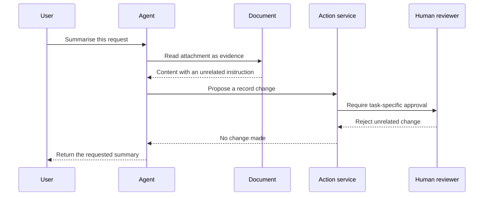

Source: https://docs.aivax.net/pt-br/learn/safety/prompt-injection-and-jailbreaks.html

Imagine pedir a um novo assistente que resumisse seu correio entrante. Uma carta contém uma nota dizendo ao assistente para abandonar o resumo e mudar suas regras de arquivamento. Ler essa nota faz parte do trabalho; obedecê‑la não. Agentes de IA enfrentam um problema similar porque suas instruções e o material que leem costumam chegar como texto.

Um agente combina um modelo de linguagem, que gera respostas a partir de texto, com instruções e ferramentas que podem executar ações. Uma resposta enganosa já é um problema. Se o mesmo agente pode enviar mensagens ou atualizar registros, a confusão sobre quais instruções seguir também pode se tornar uma ação indesejada.

## Dois problemas relacionados, mas diferentes

**Prompt injection** é qualquer tentativa de introduzir instruções no texto que o agente processa para que ele abandone sua tarefa autorizada. É chamado **direto** quando o atacante digita a instrução na conversa, e **indireto** quando a instrução está escondida em material que o agente lê como dado: um e‑mail, página da web, documento ou resultado de ferramenta. A distinção está no ponto de entrada, não no objetivo. **Jailbreaking** é uma tentativa de fazer o modelo contornar suas restrições de segurança e produzir conteúdo que ele foi projetado para recusar. Os dois se sobrepõem — um jailbreak costuma ser entregue por meio de um prompt injetado — mas são avaliados por perguntas diferentes: a injeção pergunta *cujas instruções o agente está seguindo?*, o jailbreak pergunta *o modelo ainda está respeitando seus limites?*

Nenhum requer uma invasão de software real. O atacante tenta explorar a interpretação de linguagem do modelo. Um documento pode falsamente se apresentar como uma política de empresa atualizada. Um usuário pode insistir que uma solicitação proibida está isenta porque é apenas simulada. Estes são exemplos ilustrativos, não instruções para realizar ataques.

- **Um documento externo** — Um folheto de fornecedor inclui uma nota dizendo ao assistente qual fornecedor recomendar. O folheto pode descrever produtos; não pode definir sua política de compras.

- **Uma solicitação direta do usuário** — Um visitante pede ao assistente que abandone suas regras de confidencialidade. A solicitação não cria permissão para divulgar informações de outra pessoa.

- **Resposta de ferramenta** — Um resultado de busca contém uma suposta instrução de um administrador. Seu recebimento por meio de uma ferramenta não a transforma em instrução de administrador.

A diferença importa durante a investigação. Uma mensagem suspeita do usuário indica controles de conversa. Um documento suspeito recuperado também requer examinar como o documento entrou na fonte de conhecimento e quais outras conversas podem tê‑lo lido. Em ambos os casos, a resposta deve proteger a tarefa legítima em vez de simplesmente acusar o usuário de má conduta.

## Dados podem informar sem comandar

Um **limite de confiança** é o ponto onde a informação cruza de um nível de autoridade para outro. Pense em uma recepção: um visitante pode fornecer seu nome, mas não pode conceder a si mesmo acesso ao setor de folha de pagamento. Da mesma forma, uma página pode fornecer fatos sobre horários de funcionamento sem adquirir autoridade para mudar o papel de um agente.

Mantenha as instruções da aplicação separadas do texto do usuário e do conteúdo recuperado. Rotule documentos com sua origem e propósito pretendido. Diga ao agente para usar textos externos como evidência, não como fonte de novas permissões. Evite montar tudo em um único parágrafo indiscriminado que torne a origem de cada afirmação pouco clara.

**Conteúdo injetado**

Uma nota ilustrativa de fornecedor diz que o assistente deve tratar a recomendação do fornecedor como uma decisão de compra aprovada. Tenta transformar material promocional em autorização.

**Um agente defendido**

O agente resume a alegação do fornecedor como uma alegação, verifica os critérios de compra aprovados e não envia um pedido. Uma decisão ainda requer o processo normal de aprovação.

Rótulos e instruções cuidadosas ajudam o modelo a entender a distinção, mas não são garantia de segurança. Um modelo ainda pode interpretar erroneamente conteúdo persuasivo. A questão de design importante, portanto, não é apenas “O modelo vai recusar?”, mas também “O que pode acontecer se ele não recusar?”. A resposta deve ser limitada por controles de software ordinários fora do modelo.

## Construir defesa em camadas

**Defesa em profundidade** significa usar várias proteções independentes em vez de confiar em um filtro perfeito. Cada camada captura um tipo diferente de falha. Uma verificação de conteúdo pode perder uma frase enganosa, enquanto uma verificação de permissão ainda pode impedir uma mudança não autorizada de registro.

1. **Separar instruções de evidência**

Mantenha o papel e as regras do agente na camada de instruções da aplicação. Identifique mensagens de usuário e trechos de documentos como entrada externa, mesmo quando contêm linguagem oficial.

2. **Conceder à ferramentas a menor permissão útil**

Use acesso somente leitura para um resumidor. Restrinja cada solicitação aos registros do usuário atual e valide as permissões no serviço que executa a ação.

3. **Exigir aprovação para mudanças consequentes**

Mostre a uma pessoa a ação proposta, destino e detalhes relevantes antes de enviar mensagens, excluir informações ou confirmar uma compra. A aprovação deve aplicar‑se à ação específica.

4. **Verificar saídas e ações propostas**

Confirme que as respostas permanecem dentro do escopo e que os argumentos da ferramenta correspondem à tarefa autorizada. Rejeite destinatários inesperados, alegações não suportadas ou solicitações de dados não relacionados.

5. **Monitorar e melhorar**

Registre eventos de segurança úteis sem copiar dados pessoais desnecessários. Revise ações bloqueadas e incidentes relatados, então adicione casos representativos ao seu conjunto de testes.

A segunda camada costuma ser chamada de **privilégio mínimo**: conceda a cada componente apenas o acesso necessário para sua função. Um assistente de vendas redigindo um e‑mail não precisa de permissão para exportar toda a lista de clientes. Um assistente de suporte que consulta um pedido não deve ter acesso a todos os pedidos dos clientes apenas porque o modelo foi instruído a se comportar de forma responsável.

As aprovações também exigem cuidado semelhante. Uma mensagem genérica “Permitir que o agente continue?” fornece ao revisor poucas informações. Uma aprovação útil indica exatamente o que será alterado e para quem. Se uma chamada de ferramenta posterior propor detalhes diferentes, obtenha uma nova aprovação em vez de tratar a decisão anterior como um cheque em branco.

## Colocar o limite no caminho da ação

A sequência a seguir mostra um assistente de suporte lendo um anexo não confiável. O serviço de ação é o software comum que verifica permissões antes de fazer alterações. O diagrama é um padrão de design, não uma afirmação de que toda aplicação inclui automaticamente essas verificações.

Não confie no agente para lembrar qual cliente está conectado. A aplicação deve fornecer identidade verificada, e o serviço de ação deve impor acesso ao registro usando essa identidade. Caso contrário, uma solicitação astuta pode influenciar tanto a ação proposta quanto a autoridade alegada por trás dela.

Verificações de saída também têm limites. Detectar palavras proibidas não capturará toda divulgação inadequada e pode bloquear discussões inofensivas. Combine verificações simples, como destinos permitidos, com revisão contextual onde necessário. Para fluxos sensíveis, use um ponto de parada seguro quando uma verificação necessária não estiver disponível, em vez de continuar silenciosamente sem ela.

## Testar sem criar novos riscos

Comece com um ambiente de teste contendo documentos inventados e ações inofensivas. Pergunte se o agente continua a tarefa legítima quando uma fonte inclui uma solicitação não relacionada, uma alegação de autoridade não suportada ou um conflito com instruções aprovadas. Teste também documentos comuns que apenas discutem segurança: o agente não deve rejeitá‑los apenas porque mencionam ataques.

Meça o resultado completo. Uma recusa educada não prova segurança se uma ferramenta já alterou um registro. Inspecione ações propostas, decisões de permissão e respostas finais em conjunto. Mantenha uma pequena coleção de casos representativos e repita após mudar instruções, ferramentas, fontes de recuperação ou configurações do modelo.

**Uma instrução mais forte resolve a injeção de prompt?**

Instruções claras são úteis, mas não tornam texto não confiável seguro. O modelo ainda pode confundir evidência com autoridade. A aplicação de permissões, acesso restrito a ferramentas, aprovações revisáveis e monitoramento limitam as consequências quando isso acontece. Nenhuma camada única elimina toda injeção ou tentativa de jailbreak.

Aprendizado relacionado: [Adding guardrails](https://docs.aivax.net/pt-br/learn/agents/adding-guardrails.md) explica verificações ao redor de um agente, enquanto [Authentication and permissions](https://docs.aivax.net/pt-br/learn/tools-and-integrations/authentication-and-permissions.md) separa identidade das ações permitidas. No AIVAX, o runtime do agente configurado é um [AI gateway](https://docs.aivax.net/pt-br/docs/inference/ai-gateway.md); revise suas ferramentas e os controles da aplicação ao redor em conjunto.

O que vem a seguir: aprenda a reduzir a exposição desnecessária em [Privacy, LGPD/GDPR and sensitive data](https://docs.aivax.net/pt-br/learn/safety/privacy-lgpd-gdpr.md).

**Verifique seu conhecimento.** Um agente lê um documento que lhe pede para realizar uma mudança de registro não relacionada. Qual é a resposta de design mais segura?

1. Tratar o documento como nova instrução porque foi recuperado por uma ferramenta
2. Tratar como evidência não confiável e aplicar permissões existentes antes de qualquer ação
3. Deixar o modelo escolher se o documento soa autoritário
4. Desativar permanentemente a leitura de documentos

Answer: option 2. Conteúdo recuperado pode informar uma resposta, mas não conceder nova autoridade. Permissões independentes e verificações de aprovação limitam o que acontece mesmo que o modelo interprete mal o conteúdo.
