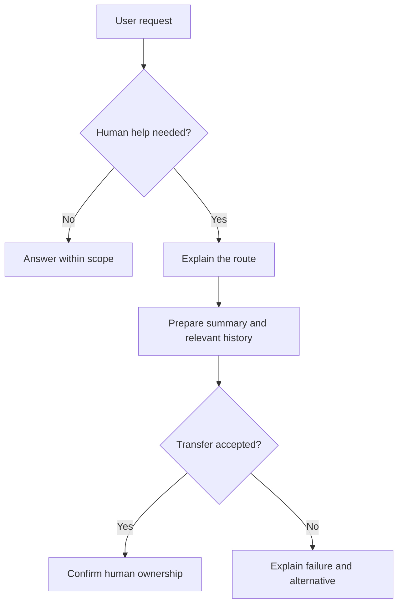

Source: https://docs.aivax.net/pt-br/learn/safety/transparency-and-human-escalation.html

Um cliente explica um problema de faturamento, tenta a sugestão do assistente e relata que não funcionou. O assistente oferece a mesma sugestão novamente. Quando uma pessoa entra na conversa, o cliente já repetiu a história várias vezes e está mais frustrado do que quando chegou. Existe um botão de transferência, mas o serviço não entregou uma transferência útil.

**Transparency** means making relevant facts about the service understandable to the user: who or what is responding, what it can do, what evidence supports its answer, and where its limits are. **Escalation** means moving a case to someone with appropriate authority or expertise. A **handover** is the transfer of information and responsibility that makes that move work.

## Seja claro de que o assistente é IA

Apresente o assistente em linguagem simples no início da interação. “Sou um assistente de IA para dúvidas de entrega. Posso explicar opções e ajudar a entrar em contato com a equipe” fornece uma visão útil do seu papel. Evite fingir ser um funcionário humano ou usar uma identidade que pareça humana para insinuar qualificações profissionais que o serviço não possui.

A divulgação deve ser fácil de notar, não escondida em uma página longa de termos. Não precisa interromper toda mensagem. Repita ou esclareça quando o contexto mudar, como quando um humano assumir ou o usuário perguntar se a resposta é automatizada. Os usuários não devem ter que adivinhar quem está responsável pela conversa no momento.

Descreva as capacidades com precisão. Um agente que pode rascunhar um pedido de reembolso não deve afirmar que pode emitir o reembolso. Um agente que pode criar um caso de suporte não deve prometer uma resposta imediata de uma pessoa. Distinga intenção, pedido submetido e resultado confirmado na redação que os usuários veem.

**Unclear and overconfident**

“I've fixed everything. Our expert will reply immediately.” The agent has only drafted a request and has no confirmed response time.

**Clear and verifiable**

“I'm an AI assistant. I can prepare the billing issue for our team, but I can't approve the adjustment. Would you like me to submit it? I'll confirm when the support system accepts it.”

A honestidade também significa descrever a incerteza de forma que ajude a próxima decisão. “Não consegui encontrar uma política atual para esta exceção” é mais útil que um vago “Posso estar errado.” Diga qual evidência está faltando, evite inventar a resposta e explique o próximo passo disponível.

## Torne a evidência inspecionável

Uma **citação** é uma referência a uma fonte que sustenta uma afirmação. Para uma resposta de política interna, linka a política real e identifique a seção relevante ou a data de vigência quando disponível. Para uma ação de conta, refira‑se ao resultado verificado do sistema de negócios ao invés de apresentar uma frase gerada por modelo como prova.

Citações não tornam automaticamente uma resposta correta. A fonte vinculada pode estar desatualizada ou dizer algo mais restrito do que a resposta afirma. Verifique se a fonte sustenta a afirmação e se o usuário tem permissão para acessá‑la. Não exponha o título ou link de um documento privado apenas para que a resposta pareça bem referenciada.

Se as fontes conflitam, informe isso e encaminhe a decisão não resolvida ao seu responsável. O usuário deve ser capaz de distinguir entre uma política oficial, uma alegação recuperada e a interpretação sugerida pelo assistente. Essa distinção é especialmente importante quando a resposta pode influenciar direitos, saúde ou dinheiro de uma pessoa.

## Defina gatilhos de escalonamento antes do lançamento

Um **gatilho** é uma condição que inicia uma resposta predefinida. Bons gatilhos são observáveis o suficiente para testar, como um pedido direto por um humano ou tentativas repetidas falhas. Não espere a conversa se tornar extrema antes de permitir outra rota ao usuário.

- **The user asks** — Respeite um pedido claro por uma pessoa. Não exija que o usuário falhe em mais etapas automatizadas apenas para justificar a transferência.

- **Frustration or repeated failure** — Observe quando o mesmo problema permanece não resolvido ou o usuário diz que as etapas propostas não ajudaram. Ofereça uma rota diferente ao invés de repetir o script.

- **Professional judgement** — Questões legais, médicas e financeiras podem exceder o escopo aprovado do agente. Encaminhe conselhos ou decisões consequentes a uma pessoa devidamente qualificada.

- **Insufficient authority or evidence** — Exceções, registros disputados e alegações de política não suportadas precisam de alguém que possa investigar e decidir. Confiança na redação não é autoridade.

Nem toda menção a um tópico regulamentado requer resposta de emergência. O horário de funcionamento de uma clínica difere de um pedido de diagnóstico. Defina o limite com especialistas relevantes. Para situações de segurança urgentes, use um processo revisado separadamente adequado ao local e ao serviço; uma fila de suporte comum não substitui ajuda de emergência.

A detecção de frustração é imperfeita. Declarações diretas como “Quero falar com alguém” devem ter mais peso do que a suposição do modelo sobre tom emocional. Evite tratar expressões regionais, diferenças de comunicação relacionadas a deficiência ou escrita concisa como evidência de hostilidade. Dê aos usuários um modo visível de solicitar ajuda sem depender de detecção automática de emoções.

## Transfira o caso, não apenas a janela de chat

1. **Recognise the boundary**

Identifique o gatilho e pare de repetir conselhos malsucedidos. Explique brevemente a limitação relevante sem culpar o usuário.

2. **Offer the available route**

Diga qual equipe pode ajudar, como funciona a transferência e qual o prazo realmente conhecido. Obtenha qualquer confirmação necessária antes de enviar a transferência.

3. **Prepare the handover package**

Resuma o objetivo, fatos estabelecidos, etapas tentadas, resultados e questão não resolvida. Inclua histórico relevante por um canal autorizado, não uma cópia desnecessária para todos.

4. **Confirm acceptance**

Verifique se o sistema de suporte ou a pessoa receptora aceitou o caso. Informe ao usuário o status verdadeiro e forneça a referência ou rota de acompanhamento disponível.

5. **Keep ownership visible**

Deixe claro quem está respondendo agora e evite respostas automatizadas concorrentes. Se a transferência falhar, explique o motivo e ofereça uma alternativa utilizável.

Um pacote de transferência útil se as a uma nota de caso curta de um colega. Ele registra o que o usuário deseja, o que foi verificado, o que permanece incerto e o que a próxima pessoa precisa decidir. Separe as declarações do usuário dos fatos confirmados pelo sistema. “O cliente relata uma cobrança duplicada” não é o mesmo que “Duas cobranças foram verificadas.”

Inclua tentativas anteriores e seus resultados para que a pessoa não recomende a mesma etapa falha. Preserve o acesso ao histórico de conversa relevante quando autorizado, pois resumos podem omitir detalhes. Limite informações sensíveis ao que a equipe receptora precisa e siga as regras de retenção e acesso tanto para o resumo quanto para o histórico.

Deixe o usuário corrigir fatos importantes quando prático, especialmente antes de um encaminhamento consequente. Não exija que ele aprove todas as notas internas quando isso gerar atrito desnecessário. O objetivo é uma transferência precisa e responsável que reduza repetições enquanto preserva o controle e a privacidade do usuário.

## Meça se a escalonamento ajuda

A **taxa de escalonamento** é a proporção de conversas transferidas ou encaminhadas a uma pessoa sob uma regra de contagem definida. Não é automaticamente uma taxa de falha. Um assistente de administração médica que encaminha perguntas clínicas de forma confiável pode ter mais escalonamentos precisamente porque respeita seu limite.

### Exemplo de amostra de revisão

- **100** — conversas ilustrativas revisadas

- **20** — escalonamentos humanos ilustrativos

- **20%** — taxa de escalonamento ilustrativa

Esses números inventados ensinam o cálculo, não um alvo ou referência de serviço. Defina se transferências repetidas contam uma vez por conversa, se chats abandonados são incluídos e como você distingue transferências solicitadas de handovers concluídos. Um painel que mistura esses estados pode parecer saudável enquanto os clientes aguardam sem um responsável.

Revise razões para escalonamento, tempo até aceitação humana, explicações repetidas, casos não resolvidos e feedback após a transferência. Também inspecione casos que deveriam ter sido escalonados mas não foram. Reduzir a taxa de escalonamento dificultando a rota humana não é uma melhoria. O resultado útil é ajuda apropriada com menos esforço evitável e menos decisões inseguras.

Use os achados para melhorar ambos os lados do limite. Transferências repetidas causadas por horário de funcionamento ausente podem demandar melhor conhecimento. Pedidos repetidos de exceções discricionárias podem confirmar que uma rota de aprovação humana é necessária. Parte do trabalho deve permanecer com pessoas ao invés de ser forçada à automação.

Aprendizado relacionado: [Human in the loop](https://docs.aivax.net/pt-br/learn/advanced-agents/human-in-the-loop.md) desenvolve padrões de aprovação e revisão, enquanto [Metrics](https://docs.aivax.net/pt-br/learn/quality/metrics.md) explica como escolher medidas que reflitam resultados reais.

Próximo passo: equilibrar custos operacionais com serviço útil em [Cost optimization and caching](https://docs.aivax.net/pt-br/learn/production/cost-optimization-and-caching.md).

**Verifique seu conhecimento.** Qual ação melhor transforma um pedido de escalonamento em uma transferência confiável?

1. Anuncie que uma pessoa entrou assim que a transferência for tentada
2. Transfira todo o histórico para cada equipe para que alguém perceba
3. Prepare um resumo relevante, confirme a aceitação e explique quem possui o caso
4. Continue tentando a mesma resposta automatizada até o usuário sair

Answer: option 3. Uma boa transferência entrega tanto contexto quanto responsabilidade. Ela confirma o estado real, limita compartilhamento desnecessário de dados e impede que o usuário fique à deriva entre o agente e a equipe humana.
