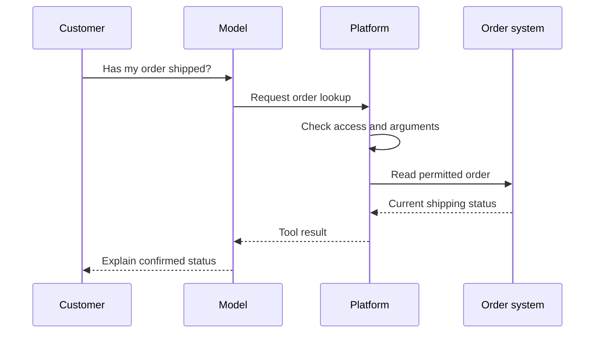

Source: https://docs.aivax.net/pt-br/learn/tools-and-integrations/function-calling.html

Um cliente pergunta ao assistente de suporte: “Meu pedido já saiu do armazém?” Um modelo de linguagem pode escrever uma atualização de envio convincente, mas seu treinamento não contém o pedido atual desse cliente. O assistente precisa de uma forma de consultar o sistema de pedidos. **Function calling**, também chamado de chamada de ferramenta, oferece ao modelo um modo estruturado de solicitar essa operação em vez de inventar uma resposta.

Pense no modelo como um recepcionista com um conjunto de formulários de solicitação. Ele escolhe um formulário e preenche as caixas obrigatórias. Outra parte do negócio verifica o formulário, executa o trabalho e devolve um recibo. O recepcionista explica o recibo ao cliente. Escolher uma ação, executá‑la e explicar seu resultado são responsabilidades separadas.

## A tool is a clearly labelled request form

Uma **function** é uma operação nomeada que o software pode executar. Uma ferramenta expõe essa operação a um agente, por exemplo encontrar um pedido, calcular um orçamento ou redigir um ticket. Sua definição informa ao modelo o que ele pode solicitar. Ela não dá ao modelo acesso irrestrito ao sistema por trás dela.

O **name** é um rótulo curto, como `lookup_order`. Um nome específico ajuda a distingui‑lo de `cancel_order`: ambos envolvem pedidos, mas suas consequências são muito diferentes. A **description** explica o que a operação faz, quando usá‑la e o que não pode fazer. Os **parameters** são os campos que o chamador deve fornecer, como uma referência de pedido. Os valores reais fornecidos em uma chamada específica são chamados **arguments**.

Um **schema** é a descrição formal desses campos: seus nomes, tipos de valor aceitos e quais são obrigatórios. É como as instruções impressas ao lado de um formulário. Uma referência de pedido pode ser texto obrigatório; um campo opcional pode selecionar se os detalhes da entrega são incluídos. Evite pedir ao modelo que preencha campos que a aplicação já conhece de forma segura, como a conta autenticada. A aplicação deve fornecer e verificar essas informações por conta própria.

Um formulário válido não é necessariamente uma solicitação de negócio válida. Uma referência pode ter o formato de texto correto, mas pertencer a outro cliente. O software que executa deve verificar tanto os argumentos quanto a permissão do usuário. O modelo selecionar uma ferramenta não prova que o usuário tem permissão para usá‑la.

## Follow one request all the way through

A **platform** aqui significa o software da aplicação que rodeia o modelo. Dependendo da integração, pode ser um serviço de agente ou sua própria aplicação. Ela fornece definições de ferramentas, verifica solicitações, executa operações aprovadas e devolve resultados ao modelo.

1. **Offer the available tools**

A plataforma entrega ao modelo a conversa e a definição de `lookup_order`. Apenas ferramentas adequadas para esse usuário e tarefa devem ser oferecidas.

2. **Request an operation**

O modelo emite uma solicitação estruturada: o nome da ferramenta e uma referência de pedido. Isso é uma solicitação de execução, não evidência de que algo aconteceu.

3. **Check and execute**

A plataforma verifica os argumentos e permissões, então consulta o sistema de pedidos pelo status atual. Se a referência estiver ausente, o assistente deve perguntar ao cliente em vez de adivinhar.

4. **Return the result**

A plataforma envia o resultado de volta como uma mensagem de ferramenta associada àquela solicitação. Um resultado útil indica o que foi encontrado ou por que a busca falhou.

5. **Answer from the evidence**

O modelo lê o resultado e o explica em linguagem comum. Deve diferenciar um despacho confirmado de uma data estimada de entrega.

Essa separação importa sempre que uma ação tem consequências. “Eu can o pedido” é uma afirmação factual sobre o sistema de negócios. O assistente deve fazer essa afirmação apenas depois de receber um resultado de cancelamento bem‑sucedido. Uma frase bem escrita não substitui esse resultado, e uma operação tentada não é o mesmo que uma operação concluída.

> **Demonstração interativa: Inspect the evidence behind the answer.** Esta demonstração interativa está disponível na página web. Observe o que a resposta final omite. A ferramenta confirma o despacho, mas não fornece data de entrega. Esta é uma demonstração didática, não uma consulta ao vivo.

## Descriptions guide decisions

Os modelos usam descrições de ferramentas para decidir qual operação se encaixa na solicitação. Portanto, as descrições precisam explicar o significado, não apenas repetir o nome da ferramenta. Imagine dar instruções a um colega que nunca usou o sistema: o que o ajudaria a escolher o formulário correto sem abrir cada aplicação?

**Vague description**

“Handles orders. Use when needed.”

**Useful description**

“Read the current shipping status of one order using its order reference. Use for dispatch and delivery-status questions. This tool does not change orders or guarantee a delivery date.”

Descrições boas também esclarecem vizinhos confusos. Uma ferramenta que busca informações de produto não deve soar como uma que verifica estoque em tempo real. Seus resultados respondem a perguntas diferentes. Quando um parâmetro tem significado específico de negócio, explique‑o: “requested arrival date” não é intercambiável com “dispatch date”. Inclua um exemplo curto apenas quando eliminar uma ambiguidade real.

Não transforme descrições em substituto da aplicação. Dizer “nunca reembolse mais do que o valor autorizado” é uma orientação útil, mas o sistema de pagamento deve rejeitar um reembolso excessivo independentemente. Linguagem clara melhora a seleção de ferramentas; controles de software confiáveis determinam o que realmente pode acontecer.

## Several calls can serve one answer

Algumas perguntas exigem **multiple calls**, ou seja, mais de uma solicitação de ferramenta durante a mesma tarefa. Para responder “Posso trocar este item?”, um assistente pode recuperar o pedido, inspecionar a política de devolução do item e verificar a disponibilidade de substituição. Em seguida, combina os resultados, preservando qualquer discordância ou informação ausente em vez de escondê‑las.

Chamadas são **dependent** quando uma precisa do resultado da outra. O assistente não pode verificar o estoque para uma substituição até saber qual produto o cliente comprou. Essas chamadas devem ser executadas em ordem. **Parallel calls** são executadas ao mesmo tempo quando nenhuma precisa do resultado da outra: buscar o horário de funcionamento de uma loja conhecida e sua informação de estacionamento é um exemplo simples.

A execução paralela pode reduzir a espera, mas não é suportada automaticamente por todo modelo ou plataforma. Também não é automaticamente segura. Duas operações que alteram a mesma reserva podem entrar em conflito mesmo que seus argumentos já sejam conhecidos. Comece com operações de leitura independentes e deixe a aplicação decidir quais ações podem se sobrepor. Mantenha cada resultado associado à sua solicitação original para que o modelo não os confunda.

## Plan for incomplete results

Um serviço de pedidos pode estar indisponível, uma referência de pedido pode estar errada ou uma busca pode não encontrar registro correspondente. Esses são resultados diferentes. “Nenhum pedido encontrado” não deve ser usado para disfarçar “o sistema não pôde ser alcançado”. A primeira chama para verificar a referência; a segunda chama para tentar novamente com segurança ou oferecer outra rota de suporte.

Retorne apenas a informação necessária para a pergunta. Uma ferramenta de status de envio geralmente não precisa expor o perfil completo do cliente. Trate texto livre nos resultados como informação a ser avaliada, não como instruções que podem sobrepor as regras do assistente. Para ações que alteram registros, preserve uma distinção clara entre resultados pendentes, falhados e confirmados.

Antes de habilitar uma ferramenta para clientes, teste um pequeno conjunto de solicitações realistas. Inclua uma solicitação clara, uma referência ausente, uma solicitação para o registro de outra pessoa e um serviço indisponível. Inspecione os argumentos solicitados e o resultado de negócio real, não apenas a frase final. Uma resposta pode soar correta ao referir‑se ao registro errado. Também teste se o assistente faz uma pergunta útil quando lhe falta informação obrigatória. Se duas ferramentas têm nomes semelhantes, dê ao assistente perguntas que deveriam selecionar cada uma e verifique a distinção. Esses exemplos revelam se a definição explica bem o trabalho e se a camada de execução protege os limites que a descrição promete.

**Related:** On AIVAX, ready-made operations are [built-in tools](https://docs.aivax.net/pt-br/docs/tools/builtin-tools.md), while custom server-side callbacks are [protocol functions](https://docs.aivax.net/pt-br/docs/tools/protocol-functions.md). [Structured responses](https://docs.aivax.net/pt-br/docs/inference/structured-responses.md) shape the final output for another program; they do not, by themselves, execute a tool.

What's next: discover how [MCP and tool standards](https://docs.aivax.net/pt-br/learn/tools-and-integrations/model-context-protocol.md) make integrations reusable across compatible agents.

**Verifique seu conhecimento.** Qual sequência descreve corretamente a chamada de função?

1. O modelo escreve uma frase alegando que a ação teve sucesso
2. O modelo solicita uma ferramenta, a plataforma verifica e executa, e o modelo usa o resultado retornado
3. Uma descrição de ferramenta dá ao modelo acesso irrestrito ao sistema de negócios

Answer: option 2. A chamada de função separa a ação solicitada da execução. Apenas o resultado retornado fornece evidência do que realmente aconteceu, e o sistema executor deve aplicar as regras de acesso.
