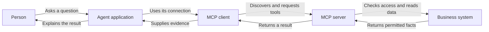

Source: http://localhost:1313/pt-br/learn/tools-and-integrations/model-context-protocol.html

Imagine comprar uma impressora nova e descobrir que cada aplicativo de escrita precisa de um cabo diferente para usá‑la. Você passaria mais tempo conectando softwares do que imprimindo documentos. Ferramentas de agente podem enfrentar um problema semelhante: um banco de dados de clientes pode exigir uma conexão diferente para cada assistente que deseje pesquisá‑lo.

Um **protocolo** é um conjunto acordado de regras para comunicação. O **Model Context Protocol**, ou **MCP**, define uma forma compartilhada para aplicações de agentes compatíveis descobrirem e utilizarem capacidades oferecidas por outros softwares. A analogia útil é um soquete universal. Ele padroniza como as peças se conectam, não o que cada dispositivo pode fazer depois de conectado.

## Por que regras compartilhadas importam

Sem um protocolo comum, cada equipe de integração deve concordar como listar operações, descrever suas entradas, enviar solicitações e relatar resultados. Construir uma conexão pode ser viável. Manter muitas conexões torna‑se mais difícil quando uma ferramenta muda e cada assistente precisa de uma atualização separada. Um padrão permite que as equipes reutilizem grande parte desse trabalho de conexão.

“Conectar qualquer ferramenta a qualquer agente” descreve a ambição, não uma garantia. Ambos os lados devem suportar recursos de protocolo compatíveis e um método de conexão compatível. O agente ainda precisa das credenciais corretas, instruções sensatas e um modelo capaz de escolher a operação. Um conector padrão não pode fazer um serviço indisponível funcionar ou transformar uma operação de negócio arriscada em segura.

**Bespoke integration**

Cada aplicação de agente obtém sua própria conexão com o sistema de suporte. Isso pode ser simples para uma necessidade pequena e específica, mas as mudanças podem precisar ser repetidas em várias aplicações.

**Standard integration**

O sistema de suporte expõe um servidor MCP. Clientes compatíveis podem descobrir as mesmas definições de ferramenta através de regras de comunicação compartilhadas, enquanto cada implantação ainda controla o acesso.

Nenhuma abordagem é sempre melhor. Uma única conexão fixa pode ser mais fácil de manter como uma interface de programação de aplicações ordinária, ou **API**: uma forma definida para um programa solicitar trabalho de outro. O MCP torna‑se útil quando a descoberta e reutilização entre várias aplicações de agente resolvem um problema real. Adotá‑lo apenas porque está na moda pode acrescentar uma camada desnecessária.

## Conheça o servidor e o cliente

Um **servidor** é o software que oferece capacidades. Um **cliente MCP** é a parte de uma aplicação de agente que se conecta a esse servidor. A pessoa que usa o assistente normalmente não vê essa troca. Ela faz uma pergunta; a aplicação trata a conexão e disponibiliza as ferramentas ao modelo.

- **Server** — Oferece um catálogo de capacidades, como pesquisar documentos aprovados ou ler um ticket. Executa as operações solicitadas dentro de seus próprios controles de acesso.

- **Client** — Conecta‑se, descobre capacidades suportadas e envia solicitações. Ajuda a aplicação de agente a apresentar as ferramentas disponíveis ao modelo.

- **Tools** — Operações nomeadas com entradas e resultados descritos. Uma pesquisa é uma chamada de ferramenta; mudar o proprietário de um ticket é uma ferramenta diferente com consequências distintas.

- **Resources** — Informações disponibilizadas para um cliente ler, como o conteúdo de um documento. O suporte a recursos e como eles aparecem aos usuários dependem do cliente e do servidor.

A distinção entre ferramentas e recursos ajuda a evitar um mal‑entendido comum. O MCP é mais amplo que uma lista de ações, mas um produto específico pode implementar apenas as partes que necessita. Um servidor que oferece recursos não significa que todo assistente conectado lerá automaticamente. Verifique as capacidades dos produtos reais, ao invés de assumir que o nome do protocolo promete todas as funcionalidades.

Por exemplo, um assistente interno pode descobrir uma ferramenta que pesquisa o manual do colaborador. O modelo solicita uma pesquisa sobre a política de viagens; o cliente encaminha a solicitação ao servidor; o servidor recupera as informações permitidas. O assistente então explica o resultado. O servidor, e não a confiança do modelo, determina quais documentos o usuário atual pode acessar.

## Como essa abordagem surgiu

A integração de agentes não chegou de uma só vez. A progressão abaixo é uma orientação, não um histórico preciso de lançamentos. As abordagens se sobrepõem e permanecem úteis juntas: protocolos frequentemente carregam operações que um modelo seleciona por meio de chamadas de função.

- **Early 2020s, approximately — Application-specific plugins**: Assistentes ganham extensões construídas para um aplicativo host específico. Uma integração pode ser útil, mas reutilizar em outro lugar costuma exigir novo trabalho de conexão.

- **Around 2023 onwards — Structured function calling**: Modelos solicitam cada nomeadas com argumentos estruturados ao invés de apenas descrever ações em prosa. As aplicações permanecem responsáveis pela execução.

- **Late 2024 onwards — Shared agent protocols**: O MCP oferece regras comuns de descoberta e comunicação. Aplicações compatíveis podem reutilizar servidores ao invés de projetar cada conexão do zero.

A mudança prática está em onde o trabalho de integração reside. Autores de ferramentas podem concentrar‑se em operações de negócio confiáveis e descrições claras. Autores de clientes podem concentrar‑se em ajudar as pessoas a usar ferramentas descobertas com segurança. Contudo, um padrão compartilhado não remove a propriedade: alguém ainda precisa manter o servidor, gerenciar mudanças e responder quando uma dependência falha.

## Um soquete padrão não é um certificado de confiança

Conectar‑se a um servidor de terceiros cria um relacionamento com quem o opera. Esse operador pode receber termos de pesquisa, referências ou outros argumentos enviados às suas ferramentas. Seus resultados podem incluir texto de fontes não confiáveis. Antes de conectar, pergunte quem o opera, quais informações recebe, para onde essas informações vão e como o acesso pode ser revogado.

**Prompt injection** é uma tentativa de ocultar instruções dentro do conteúdo que o agente lê, fazendo com que ele trate essas instruções como autoridade. Um resultado de pesquisa ou descrição de ferramenta pode tentar redirecionar o assistente para outra ação. Formatação padrão não torna esse conteúdo confiável. Restrinja ações disponíveis, separe conteúdo externo de instruções confiáveis e exija verificações de permissão independentes. Veja [injeção de prompt e vulnerabilidades](http://localhost:1313/pt-br/learn/safety/prompt-injection-and-jailbreaks.md).

O catálogo útil menor costuma ser mais fácil de gerenciar do que um muito grande. Se um assistente de suporte só precisa pesquisar tickets, não exponha ferramentas de administração financeira não relacionadas. Escolhas claras reduzem seleções acidentais, e acesso restrito limita o dano se o assistente cometer um erro. Revise ferramentas recém‑adicionadas antes de habilitá‑las; uma conexão existente pode mudar o que expõe ao longo do tempo.

**Does an MCP server need to run on the public internet?**

Não. Servidores podem ser usados em diferentes arranjos de implantação, incluindo ambientes locais e remotos, quando o cliente suporta o método de conexão necessário. “Servidor” descreve um papel, não uma promessa de que o serviço seja público. A implantação ainda precisa de uma fronteira de segurança adequada.

**Can I trust a server because its tools appear in the catalogue?**

A descoberta apenas informa o que o servidor anuncia. Ela não certifica o operador, verifica cada descrição ou aprova cada ação. Avalie o operador e o acesso solicitado, teste as ferramentas e forneça um meio de desativar a conexão.

## Escolha uma conexão que você possa operar

Antes de um teste, nomeie a tarefa pretendida e o responsável pela conexão. Experimente uma solicitação permitida, um registro ausente, um serviço indisponível e uma solicitação que o usuário não deveria poder fazer. Verifique se as falhas permanecem visíveis ao invés de se tornarem respostas inventadas. Esses testes revelam mais sobre a prontidão do que simplesmente ver uma ferramenta listada.

Mantenha um inventário de servidores conectados, seu propósito e as permissões concedidas a cada um. Decida quem aprova atualizações e quem responde se um servidor desaparecer ou mudar de comportamento. Reutilização é valiosa apenas quando a conexão compartilhada permanece compreensível. Uma integração não documentada reutilizada em todos os lugares pode espalhar uma falha tão eficientemente quanto espalha um recurso útil.

Revise o formato do resultado assim como a conexão. Se uma pesquisa de ticket devolve um perfil completo do cliente quando o assistente só precisa do status do ticket, a integração expõe mais informações do que a tarefa requer. Solicite uma resposta menor ou insira um passo de filtragem adequado antes que o resultado chegue ao modelo. Também diferencie um resultado vazio de uma pesquisa falhada. Uma conexão reutilizável deve tornar esses resultados compreensíveis em todos os clientes; caso contrário, cada agente pode inventar sua própria interpretação. Documente essas expectativas com alguns exemplos representativos para que uma atualização posterior do servidor possa ser verificada contra o mesmo comportamento de negócio, não apenas se a conexão ainda abre.

**Relacionado:** No AIVAX, [MCP support](http://localhost:1313/pt-br/docs/tools/mcp.md) permite que um gateway atue como cliente para ferramentas externas. Na outra direção, [Inference MCP](http://localhost:1313/pt-br/docs/mcp-utilities/inference-mcp.md) expõe um modelo ou gateway para clientes compatíveis. [Collections MCP](http://localhost:1313/pt-br/docs/mcp-utilities/collections-mcp.md) fornece buscas de conhecimento, e [Web utilities MCP](http://localhost:1313/pt-br/docs/mcp-utilities/web-utilities-mcp.md) oferece ferramentas de recuperação web. São capacidades diferentes que compartilham um padrão de conexão, não concessões de acesso intercambiáveis.

Próximo passo: defina os limites dessa conexão com [authentication and permissions for tools](http://localhost:1313/pt-br/learn/tools-and-integrations/authentication-and-permissions.md).

**Verifique seu conhecimento.** O que adotar o MCP realmente muda?

1. MCP garante que todo servidor e seu conteúdo são confiáveis
2. MCP padroniza descoberta e comunicação, enquanto acesso e confiança ainda precisam de controles separados
3. MCP elimina a necessidade de testar uma integração de negócio
4. Todo cliente MCP suporta automaticamente todos os recursos e funcionalidades de ferramenta

Answer: option 2. O protocolo reduz diferenças de conexão. Ele não certifica servidores, concede permissões de negócio nem garante que todo cliente implemente todas as capacidades.
