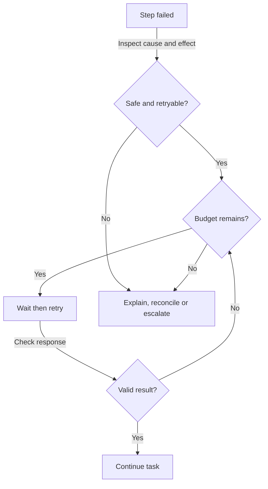

A support agent checks an order and receives no usable response from the order system. The customer still needs help, but the agent has reached a limit: it does not know the current status. A reliable agent recognises that limit, chooses a safe next step and tells the customer what happened. Reliability does not mean that nothing fails. It means failures remain understandable and do not quietly turn into false answers or duplicate actions.

Error handling starts before the first failure. Decide which operations may be repeated, which alternatives are acceptable and when a person should take over. The right recovery depends on both the cause and the effect of the attempted action. Repeating a product search and repeating a payment request are not equivalent decisions.

## Identify the failure before reacting

A **failure** occurs when a step cannot provide the result required by the task. Some failures are **transient**, meaning they may disappear shortly without changing the request. Others are persistent: missing permissions or an invalid order reference will not normally be fixed by waiting. A fluent but unsupported model answer is another failure, even if no technical error appears.



The system behind a tool is down or unreachable. A bounded retry may help if the operation is safe to repeat.


A service is receiving work faster than it permits. Slow down, respect its suggested wait and avoid adding more simultaneous requests.


The response is missing required fields, uses the wrong format or contradicts a business rule. Check it before another step relies on it.


The waiting period expired. The caller may not know whether the remote operation failed, completed or is still running.


The model supplied unsupported action parameters or guessed a record reference. Reject the request and obtain valid information instead of guessing again.



**Tool arguments** are the values supplied to a tool, such as which order to look up. Check their shape and their meaning before execution. An order reference can have the expected format but still belong to another customer. Permission checks and business rules must remain outside the model's discretion. An instruction to produce valid arguments is not a substitute for those checks.

Similarly, a valid-looking response may contain incorrect facts. **Validation** means checking a result against defined requirements, such as required fields, supported values and evidence. A format check can confirm that an amount is a number; it cannot establish that the amount matches the invoice. Choose checks that correspond to the real risk rather than treating neat formatting as correctness.

## Retry carefully, with breathing room

A **retry** repeats an operation after a failed attempt. **Backoff** means waiting longer between attempts instead of immediately asking again. Imagine a busy telephone line: redialling continuously adds pressure without making the recipient available sooner. If the service specifies when to try again, honour that guidance within your task's remaining time budget.

Some applications add **jitter**, a small random variation in the waiting period. It prevents many workers from retrying at exactly the same moment after a shared outage. The precise timing belongs in the application's policy, not in an improvised model decision. Keep a maximum attempt count, an overall deadline and a spending budget so temporary trouble cannot create indefinite work.



Record whether the service is unavailable, the request is invalid or the outcome is uncertain. Check whether the operation changes anything outside the conversation.


A read-only lookup can often be repeated. A payment or message send needs protection against duplicates or a confirmed status before another attempt.


Respect service guidance and apply increasing delays where appropriate. Count retries against the same task limits as ordinary work.


Validate the response rather than treating any reply as success. Continue only when the required evidence or confirmation exists.


When the retry budget is exhausted, switch to an allowed fallback or return a clear partial result and escalation route.



A timeout deserves particular care because it describes the caller's waiting, not necessarily the remote outcome. If the payment service accepted the transfer but its confirmation was lost, submitting a new transfer could pay twice. Query the status or use the service's duplicate-prevention mechanism before retrying. When neither is available, mark the outcome uncertain and request human reconciliation.

Do not retry a denied permission by changing credentials or choosing a less protected tool. Do not keep altering a guessed customer reference until something returns. These are access and information problems, not service availability problems. Ask for the missing authorised information or hand the case to someone who can resolve it.

## Fallbacks change the path, not the rules

A **fallback** is an alternative path used when the preferred path cannot complete. It might be another compatible model, a permitted source of equivalent information or a simpler service. Define and test the alternative beforehand. A fallback model must support the required tools, input types and output format, and must meet the same data-handling and permission requirements.

Switching models does not repair a broken order database. Nor does a model's general knowledge replace a live order lookup. Where an alternative has weaker capabilities, narrow the task rather than silently lowering the standard. A drafting-only fallback can help write a support ticket, but it cannot claim that a refund has been issued.

**Graceful degradation** means retaining useful, honest functionality when full functionality is unavailable. The agent might explain general return steps while making clear that it could not check this customer's order. Separate general policy from current case facts. If showing previously retrieved information is permitted, label when it was obtained and do not present it as a fresh check.



“Your order is on its way. Please wait.”

The lookup failed, so the status and advice are unsupported.


“I could not check your order right now because the order service is unavailable. I have not changed your order. You can try again later, or I can help prepare a request for the support team.”



Only offer a handover or later retry that the application can actually provide. State whether any change was made and whether an outcome remains uncertain. Avoid exposing technical secrets or blaming the customer for a service error. A clear failure message gives the person a next step without disguising missing evidence as reassurance.

## Stop calling a service that keeps failing

A **circuit breaker** is a protective pause after repeated failures. Like an electrical breaker, it prevents continued strain while a problem persists. During the pause, new requests receive an explicit unavailable outcome or an approved alternative instead of repeatedly calling the failing service. After a waiting period, a limited test checks whether service has recovered.

This is different from a retry delay for one request. A circuit breaker can protect many requests from wasting the same resources. Its policy needs clear opening, testing and recovery rules, plus monitoring so someone notices the outage. It must not become a silent permanent failure that nobody investigates.


A bounded correction attempt can help with a missing field or formatting mistake when the needed facts already exist. It cannot safely manufacture missing evidence. Explain the validation failure, preserve the original requirements and stop after the correction budget is exhausted. Repeated rewriting is not proof that the final result is true.


## Leave a record that explains the outcome

Log every failed attempt and recovery decision, not only the final failure. A **log** is a recorded event; a **trace** connects related events across the whole task. Record the step, failure category, elapsed time, attempt count, chosen fallback and eventual outcome. Protect logs with access controls, remove secrets and avoid copying full customer content when a short safe description is sufficient.

These records reveal whether apparent success hides repeated errors and growing costs. [Logs, traces and monitoring](../quality/logs-traces-and-monitoring.md) explains how to follow the evidence. Retry delays also affect how long users wait; connect the recovery policy to the expectations covered in [Performance and latency](../production/performance-and-latency.md).

What's next: extend recovery beyond one conversation in [Long-running and asynchronous agents](long-running-and-asynchronous-agents.md).


A payment request times out after it was sent. What is the safest next step?

