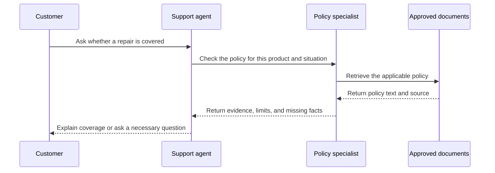

A customer asks a shop to explain a product fault and correct a billing mistake. In a human team, the receptionist might involve technical support and accounts rather than answer everything personally. Agents can divide work in a similar way, with different instructions, knowledge, and permissions for different responsibilities.

**Agent-to-agent communication** means one agent passes a request, information, or a result to another through software. It is not mind-reading. The receiving agent knows only what its own setup and the supplied context make available. A clear message and an explicit owner matter just as much as they do when colleagues exchange a case.

## Why split the work at all?

A **specialised agent** is an agent configured for a narrower task, such as troubleshooting equipment, checking policy, or drafting a sales proposal. Specialisation can help when those jobs require different source material or permissions. It can also keep the instructions for one role from becoming an enormous collection of unrelated rules.

For example, an intake agent may identify whether a request concerns product use or billing. That initial sorting is called **triage**. A product specialist can then consult the appropriate manual, while a billing specialist works with authorised account information. The intake agent does not need every capability simply to choose the next destination.

However, additional agents do not automatically improve quality. Two agents can share the same misunderstanding, repeat the same work, or disagree without evidence. Before splitting a task, identify a concrete benefit: a distinct permission boundary, a separate body of knowledge, independent review, or work that can proceed separately. If one agent with well-chosen tools can do the job clearly, keep that simpler design.



Often suitable when the task has one clear owner, a shared knowledge base, and a short sequence of actions. There are fewer messages to coordinate and fewer places to lose context.


Useful when responsibilities genuinely differ or independent pieces of work can run separately. The benefit must justify extra requests, waiting, context exchange, and coordination.



## Handoff, delegation, and orchestration

These terms describe different ways of sharing responsibility. Teams sometimes use the words loosely, so define what they mean in your design. The important questions are who owns the user-facing answer, who can take actions, and whether the original agent waits for a result.



Responsibility moves to another agent. A triage agent routes a billing case to the billing specialist, which continues the conversation within its own authority.


The original agent asks another agent to perform a bounded subtask and return a result. The original agent remains responsible for the overall answer.


A coordinator manages several steps or participants: deciding what runs next, collecting results, resolving dependencies, and determining when the work is complete.



A handoff resembles transferring a call. Delegation resembles asking a colleague to check one clause while you keep speaking to the customer. Orchestration resembles a project coordinator arranging contributions from several departments. A coordinator can be ordinary software, an agent, or a combination; it does not have to be another model making every scheduling decision.

Do not confuse transferring conversation ownership with transferring permission. An intake agent cannot grant a specialist access to a customer's financial records merely by writing “approved” in a message. Each receiving service must enforce the permissions required for its own work. The authority comes from the surrounding system and verified user identity, not the persuasiveness of the handoff.

## Watch a bounded delegation

Consider a support agent answering a warranty question. It can ask a policy specialist to identify the relevant clause, then use that evidence to explain the answer. The specialist does not contact the customer, approve compensation, or begin an unrelated investigation.

The return message should distinguish a finding from an action. “The policy describes coverage under these conditions” is a finding. “The repair has been approved” claims a business decision. If no authorised process approved it, the second statement is wrong even when the specialist's policy reading is correct.

Likewise, the main agent should inspect the returned evidence rather than treating another agent's confident language as proof. Delegation changes who performs the work, not the standard of evidence required. An answer without a source may need checking before it becomes a promise to the customer.

## Share a brief, not a pile of messages

**Shared context** is the relevant information made available to the participants. It should include the user's goal, known facts, decisions already made, missing information, and constraints on the requested work. A useful handoff also states which participant now owns the task and what the recipient should return.

Imagine forwarding a long email chain with “please handle.” The recipient may overlook the decision near the bottom or misunderstand an old proposal as a current instruction. Sending the entire conversation to every agent creates the same problem, while also increasing processing and disclosing more information than necessary.

Instead, send a compact brief with source references when needed. For the warranty example, include the product category, the customer's reported problem, the policy scope, and the question to resolve. Mark reported claims as reported claims. “The customer says the item arrived damaged” is not equivalent to “delivery damage has been verified.”

Preserve uncertainty as carefully as facts. If identity has not been verified or a purchase date is missing, put that in the brief explicitly. A summary that smooths away uncertainty can turn an incomplete case into a false conclusion. Summaries are useful, but their correctness still needs attention.



## Put limits on the collaboration

A **loop** occurs when the system repeats without useful progress. One agent may keep asking another to clarify, or two specialists may repeatedly send a case back to each other. Prevent this by defining what each participant owns, what a useful result looks like, and when unresolved work should return to a person.

Set practical limits on attempts, elapsed time, and total work. These limits belong in the application controlling the agents, not only in a sentence asking them to be efficient. A failed specialist request should not silently restart the whole team forever. The user needs a clear outcome, including a truthful explanation when the process cannot complete.

Cost also includes coordination. Every extra request may require sending context and reading a response; some calls also invoke tools. Running independent checks at the same time may shorten waiting, but it does not make that work free. Measure whether the division improves task success enough to justify the extra expense and complexity.

When specialists disagree, return to the underlying sources and responsibilities. A vote is not a substitute for authority. The current approved policy should outweigh several agents repeating an outdated rule. For unresolved high-impact decisions, define a human escalation path rather than inventing a tie-breaker during the conversation.

## Start with one clear boundary

A sensible first design might use a triage agent that chooses a specialist, or a single assistant that delegates one document check. Test ordinary requests, ambiguous requests, and cases that belong to no specialist. Confirm that the user is not asked the same question repeatedly and that someone remains responsible for the final response.

Record who received each subtask, what it returned, and why the overall task stopped. This makes a multi-agent failure explainable: perhaps routing was wrong, relevant facts were omitted, or a specialist could not access its source. Without that history, the team may look busy while leaving you unable to tell what happened.

The [multi-agent architectures](../advanced-agents/multi-agent-architectures.md) unit develops these patterns further. Here, the main lesson is simpler: divide responsibilities only when the boundary is useful, and make the messages, ownership, and stopping rules explicit.

What's next: turn a repeatable business procedure into [workflows as skills](workflows-as-skills.md), so the agent follows a defined path instead of inventing one each time.


Which example describes delegation rather than a handoff?

