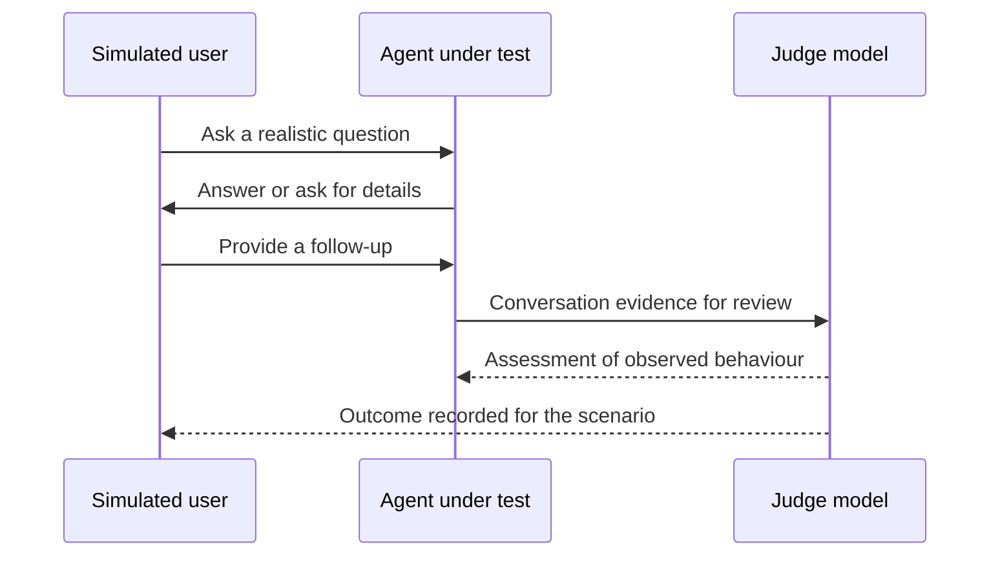

A convincing demonstration shows that an agent can succeed once. It does not show how often it succeeds, what happens when information is missing, or whether yesterday's improvement broke another task. **Evaluation**, often shortened to **eval**, means checking behaviour against a stated expectation using a repeatable method. Think of inspecting a new employee's work across a normal working week rather than judging their ability from a rehearsed interview.

A support agent might answer a straightforward refund question beautifully but invent an exception when a customer is upset. A sales agent might recommend a suitable service yet promise an unavailable discount. Both sound helpful. Neither meets the business requirement. Tests make those requirements visible before a customer discovers the gap, and provide evidence that the team can compare over time.

## Start with work people actually bring

A **test set** is a collection of situations you will use to check the agent. Build it from questions received by support, sales and internal teams, using authorised records with unnecessary personal information removed. Preserve the difficulty of the question, not the identity of the person who asked it. Rewrite private details into clearly fictional circumstances where needed, and review the rewritten case for accidental changes to its meaning.

Include common requests because they represent much of the workload. Also include uncommon but consequential situations: an unavailable account record, conflicting policy documents, a request outside the agent's authority, or a tool that cannot complete an action. A **tool** is a connected function the agent can ask to perform work, such as looking up an order. A fluent response cannot substitute for checking whether that work actually happened.



A customer asks about a published return policy. Check that the answer is correct and usable.


An employee asks for a procedure without naming their department. Check that the agent asks a useful follow-up question.


A user requests an unauthorised action or a lookup fails. Check that the agent refuses or escalates without pretending to succeed.



Do not let the test set become a collection of easy questions written by the person who wrote the instructions. Ask colleagues who understand the work to contribute cases. Include different wording, incomplete sentences and conversations that change direction. Keep a separate group of cases out of day-to-day prompt editing. This **held-out set** gives a less biased check of whether a change generalises beyond the examples its author already knows.

## Define success before running the test

An **expected outcome** describes observable behaviour, not an exact sentence the agent must copy. For a return request, it might require explaining the applicable policy, asking for missing purchase information and not promising approval before eligibility is checked. Record the information available to the agent and the source supporting the expected answer. If reviewers disagree about the policy, resolve that disagreement before asking a model to grade it.

Separate required facts, required actions and forbidden actions. Some requirements allow judgement: a reply should be understandable. Others can be checked directly: a booking must not be created without confirmation. An agent saying “I booked it” is not evidence of a booking. For actions, inspect a safe test system or an independent record of what occurred, not just the conversation transcript.



“The assistant should provide excellent support and make the customer happy.” Different reviewers can give opposite grades to the same reply.


“The assistant explains the policy, identifies missing information and offers the approved escalation path without promising an exception.” Each requirement can be checked.



A **rubric** is the checklist used to make these judgements consistently. Give reviewers examples of a pass, a failure and a borderline case. Track important requirements separately rather than hiding them inside one average score. A friendly tone must not cancel out a privacy violation. The unit on [measuring adherence and hallucination](../teaching-agents/measuring-adherence-and-hallucination.md) develops checks for following instructions and avoiding unsupported claims.

## Use simulation without mistaking it for reality

A **simulated user** is another model acting as a customer or employee in a test conversation. Give it a realistic goal and the information that person would know. It can ask follow-up questions and respond to the agent's choices, making it useful for testing journeys rather than isolated answers. It is still an imitation: real people may be less patient, more confused or more inventive than the simulation.

A **judge model** reads the conversation and evaluates it against the rubric. This can reduce repetitive review work, but the judge can misunderstand policy, reward confident language or miss a tool failure. Compare its decisions with human reviews, especially on borderline and high-impact cases. Ask for reasons tied to evidence in the conversation, then inspect disagreements. A judge's numerical score is an assessment, not a probability that the agent is safe.

The diagram shows the conceptual roles, not a required product message route. The test system gives the judge evidence; feedback need not enter the agent's live conversation. Keep judge-only criteria out of the simulated user's instructions when they would make the user lead the agent to the answer. Tests should reveal ability, not provide the solution indirectly.

## Make evaluation a repeatable release check

A **regression** is behaviour that used to work but stops working after a change. A new instruction can crowd out an old one; a replacement document can remove a useful exception. Keep the agent configuration, test cases and judging rules identifiable so that a comparison reflects an actual change rather than an unknown mixture of changes.



Run the current version and keep the results, case definitions and configuration. This is the reference point for later comparisons.


Update the prompt, knowledge or tool behaviour with a stated reason. Write down which cases you expect to improve.


Check the repaired case, related cases and critical safety cases. Run the wider regression set before release.


Inspect failures and changed judgements. Release only when agreed requirements hold, and retain the previous version for recovery.



Model responses can vary between runs even when the question stays the same. Repeat consequential or inconsistent scenarios and report the variation rather than selecting the best attempt. If a test fails because a connected system was unavailable, record that cause; do not quietly delete the result. Availability is part of the experience, although diagnosing it separately helps the right team respond.

Use test accounts and controlled tools so evaluation cannot send real messages, spend money or alter customer records unexpectedly. Agree on an execution budget before running large simulations. More cases and repeated conversations provide evidence, but they also consume resources. Begin with a manageable representative set, then expand it when real incidents reveal missing coverage.


No. Tests cover selected conditions, and both the world and the agent's dependencies can change. Passing is evidence for a particular version under particular conditions. Keep monitoring real use, adding newly discovered failure cases and reviewing severe outcomes with people who understand the work.


**Related on AIVAX:** [Agentic Tests](../../docs/inference/agentic-tests.md) use a simulated user and a judge to evaluate conversations with a configured AI gateway. Reusable test definitions produce separate runs. Consult the product guide for goals, judge-only validation criteria and result interpretation; do not assume a test score verifies external business actions by itself.

**What's next:** Choose the measurements that make those results useful in [Metrics: accuracy, latency, cost, satisfaction](metrics.md).


Which result provides the strongest evidence for releasing a changed support agent?

