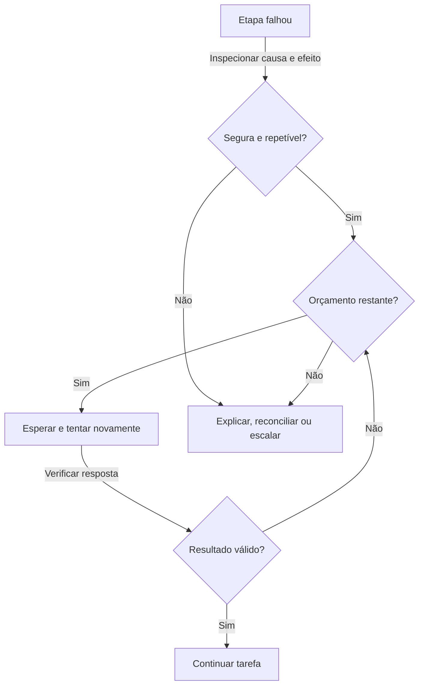

Um agente de suporte verifica um pedido e não recebe resposta utilizável do sistema de pedidos. O cliente ainda precisa de ajuda, mas o agente chegou a um limite: ele não conhece o status atual. Um agente confiável reconhece esse limite, escolhe um próximo passo seguro e informa ao cliente o que aconteceu. Confiabilidade não significa que nada falhe. Significa que as falhas permanecem compreensíveis e não se transformam silenciosamente em respostas falsas ou ações duplicadas.

O tratamento de erros começa antes da primeira falha. Decida quais operações podem ser repetidas, quais alternativas são aceitáveis e quando uma pessoa deve assumir. A recuperação correta depende tanto da causa quanto do efeito da ação tentada. Repetir uma busca de produto e repetir uma solicitação de pagamento não são decisões equivalentes.

## Identifique a falha antes de reagir

Uma **falha** ocorre quando uma etapa não pode fornecer o resultado exigido pela tarefa. Algumas falhas são **transientes**, ou seja, podem desaparecer rapidamente sem mudar a solicitação. Outras são persistentes: permissões ausentes ou uma referência de pedido inválida normalmente não são corrigidas aguardando. Uma resposta de modelo fluente porém não suportada é outra falha, mesmo que nenhum erro técnico apareça.



O sistema por trás de uma ferramenta está fora ou inacessível. Uma tentativa limitada pode ajudar se a operação for segura para repetir.


Um serviço está recebendo trabalho mais rápido do que permite. Reduza a velocidade, respeite a espera sugerida e evite adicionar mais solicitações simultâneas.


A resposta está faltando campos obrigatórios, usa o formato errado ou contradiz uma regra de negócio. Verifique antes que outra etapa dependa dela.


O período de espera expirou. O chamador pode não saber se a operação remota falhou, concluiu ou ainda está em execução.


O modelo forneceu parâmetros de ação não suportados ou adivinhou uma referência de registro. Rejeite a solicitação e obtenha informações válidas em vez de adivinhar novamente.



**Argumentos de ferramenta** são os valores fornecidos a uma ferramenta, como qual pedido consultar. Verifique sua estrutura e significado antes da execução. Uma referência de pedido pode ter o formato esperado mas ainda pertencer a outro cliente. Verificações de permissão e regras de negócio devem permanecer fora da discrição do modelo. Uma instrução para produzir argumentos válidos não substitui essas verificações.

Da mesma forma, uma resposta que parece válida pode conter fatos incorretos. **Validação** significa checar um resultado contra requisitos definidos, como campos obrigatórios, valores suportados e evidências. Uma verificação de formato pode confirmar que um valor é numérico; não pode afirmar que o valor corresponde à fatura. Escolha verificações que correspondam ao risco real em vez de tratar formatação correta como correção.

## Tente novamente com cuidado, com espaço de respiração

Uma **nova tentativa** repete uma operação após uma tentativa falhada. **Backoff** significa esperar mais entre as tentativas em vez de solicitar novamente imediatamente. Imagine uma linha telefônica ocupada: discar repetidamente aumenta a pressão sem tornar o destinatário disponível antes. Se o serviço especificar quando tentar novamente, siga essa orientação dentro do orçamento de tempo restante da sua tarefa.

Algumas aplicações adicionam **jitter**, uma pequena variação aleatória no período de espera. Isso impede que muitos trabalhadores tentem novamente exatamente no mesmo momento após uma interrupção compartilhada. O timing preciso pertence à política da aplicação, não a uma decisão improvisada do modelo. Mantenha um número máximo de tentativas, um prazo geral e um orçamento de gasto para que problemas temporários não criem trabalho indefinido.



Registre se o serviço está indisponível, se a solicitação é inválida ou se o resultado é incerto. Verifique se a operação altera algo fora da conversa.


Uma consulta somente leitura pode ser repetida com frequência. Um pagamento ou envio de mensagem precisa de proteção contra duplicatas ou de status confirmado antes de outra tentativa.


Respeite a orientação do serviço e aplique atrasos crescentes quando apropriado. Conte as tentativas contra os mesmos limites da tarefa que o trabalho comum.


Valide a resposta em vez de tratar qualquer retorno como sucesso. Continue apenas quando a evidência ou confirmação exigida existir.


Quando o orçamento de tentativas for esgotado, troque para um fallback permitido ou retorne um resultado parcial claro e rota de escalonamento.



Um tempo limite merece cuidado especial porque descreve a espera do chamador, não necessariamente o resultado remoto. Se o serviço de pagamento aceitou a transferência mas sua confirmação foi perdida, submeter uma nova transferência pode pagar duas vezes. Consulte o status ou use o mecanismo de prevenção de duplicatas do serviço antes de tentar novamente. Quando nenhum estiver disponível, marque o resultado como incerto e solicite reconciliação humana.

Não tente novamente uma permissão negada mudando credenciais ou escolhendo uma ferramenta menos protegida. Não continue alterando uma referência de cliente adivinhada até que algo retorne. Estes são problemas de acesso e informação, não de disponibilidade de serviço. Peça a informação autorizada que falta ou encaminhe o caso para alguém que possa resolvê‑lo.

## Fallbacks mudam o caminho, não as regras

Um **fallback** é um caminho alternativo usado quando o caminho preferido não pode ser concluído. Pode ser outro modelo compatível, uma fonte permitida de informação equivalente ou um serviço mais simples. Defina e teste a alternativa antecipadamente. Um modelo de fallback deve suportar as ferramentas necessárias, tipos de entrada e formato de saída, e atender aos mesmos requisitos de manipulação de dados e permissão.

Trocar de modelo não repara um banco de dados de pedidos quebrado. Nem o conhecimento geral de um modelo substitui uma consulta ao vivo de pedidos. Onde a alternativa tem capacidades mais fracas, restrinja a tarefa em vez de reduzir silenciosamente o padrão. Um fallback apenas para rascunho pode ajudar a escrever um tíquete de suporte, mas não pode afirmar que um reembolso foi emitido.

**Degradação graciosa** significa manter funcionalidade útil e honesta quando a funcionalidade completa está indisponível. O agente pode explicar etapas gerais de devolução enquanto deixa claro que não pôde verificar o pedido deste cliente. Separe a política geral dos fatos do caso atual. Se for permitido mostrar informações recuperadas anteriormente, rotule quando foram obtidas e não as apresente como uma verificação recente.



“Seu pedido está a caminho. Por favor, aguarde.”

A consulta falhou, portanto o status e o conselho não são suportados.


“Não consegui verificar seu pedido agora porque o serviço de pedidos está indisponível. Não alterei seu pedido. Você pode tentar novamente mais tarde, ou posso ajudar a preparar uma solicitação para a equipe de suporte.”



Só ofereça uma transferência ou nova tentativa posterior que a aplicação realmente possa fornecer. Declare se alguma alteração foi feita e se o resultado permanece incerto. Evite expor segredos técnicos ou culpar o cliente por um erro de serviço. Uma mensagem de falha clara dá à pessoa um próximo passo sem disfarçar a falta de evidência como garantia.

## Pare de chamar um serviço que continua falhando

Um **disjuntor** é uma pausa protetora após falhas repetidas. Como um disjuntor elétrico, impede esforço contínuo enquanto o problema persiste. Durante a pausa, novas solicitações recebem um resultado explícito de indisponibilidade ou uma alternativa aprovada em vez de chamar repetidamente o serviço falho. Após um período de espera, um teste limitado verifica se o serviço se recuperou.

Isso difere de um atraso de tentativa para uma única solicitação. Um disjuntor pode proteger muitas solicitações de desperdiçar os mesmos recursos. Sua política precisa de regras claras de abertura, teste e recuperação, além de monitoramento para que alguém perceba a interrupção. Não deve se tornar uma falha permanente silenciosa que ninguém investiga.


Uma tentativa limitada de correção pode ajudar com um campo ausente ou erro de formatação quando os fatos necessários já existem. Não pode fabricar evidência faltante com segurança. Explique a falha de validação, preserve os requisitos originais e pare quando o orçamento de correção for esgotado. Reescrever repetidamente não prova que o resultado final é verdadeiro.


## Deixe um registro que explique o resultado

Registre cada tentativa falhada e decisão de recuperação, não apenas a falha final. Um **log** é um evento registrado; um **trace** conecta eventos relacionados ao longo de toda a tarefa. Registre a etapa, categoria da falha, tempo decorrido, contagem de tentativas, fallback escolhido e resultado eventual. Proteja os logs com controles de acesso, remova segredos e evite copiar o conteúdo completo do cliente quando uma descrição curta e segura for suficiente.

Esses registros revelam se um sucesso aparente esconde erros repetidos e custos crescentes. [Logs, traces e monitoramento](../quality/logs-traces-and-monitoring.md) explicam como seguir as evidências. Atrasos de tentativa também afetam quanto tempo os usuários esperam; conecte a política de recuperação às expectativas cobertas em [Performance e latência](../production/performance-and-latency.md).

Próximo passo: estenda a recuperação além de uma conversa em [Agentes de longa duração e assíncronos](long-running-and-asynchronous-agents.md).

{{< quiz options="Enviar imediatamente um novo pagamento porque nenhuma confirmação chegou | Informar ao usuário que o pagamento falhou com certeza | Verificar o status do pagamento ou usar prevenção de duplicatas verificada antes de qualquer tentativa | Trocar para outro modelo e deixá‑lo decidir se o pagamento provavelmente foi bem‑sucedido" answer="3" explanation="Um tempo limite deixa o resultado incerto. O serviço pode já ter concluído o pagamento, portanto a reconciliação ou prevenção de duplicatas é necessária antes de outra tentativa." >}}
Uma solicitação de pagamento expira após ser enviada. Qual é o próximo passo mais seguro?

