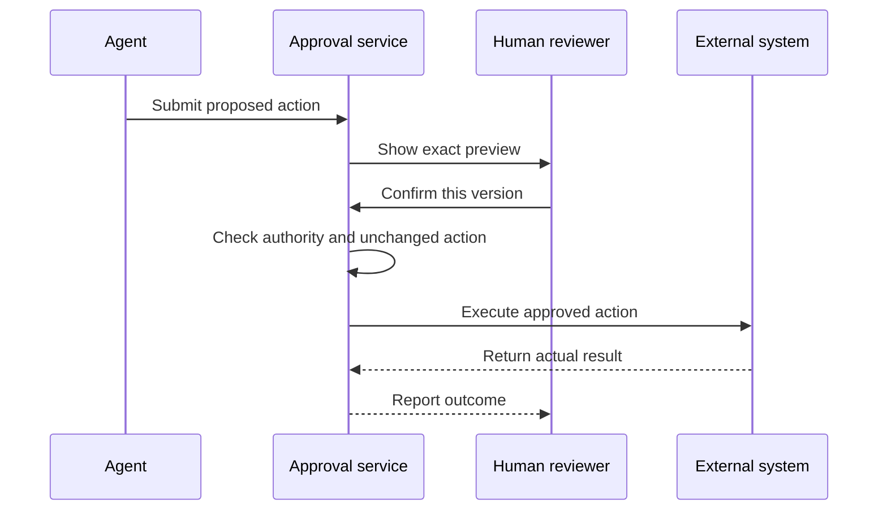

Um assistente pode preparar uma solicitação de pagamento sem estar autorizado a transferir dinheiro. Ele pode rascunhar uma resposta sensível sem estar autorizado a enviá-la. Essa separação é a base do trabalho **human-in-the-loop**: uma pessoa participa em um ponto de decisão definido, em vez de observar cada palavra que o agente produz. O objetivo é autonomia útil dentro de limites claros, não independência total nem interrupção constante.

## Escolha pontos de aprovação por consequência

**Aprovação** é uma decisão explícita por uma pessoa autorizada para permitir uma ação proposta específica. Uma solicitação de tarefa fornece alguma autoridade, mas não necessariamente toda a autoridade que o agente pode precisar. Pedir uma comparação de fornecedores não autoriza automaticamente a realização de um pedido. Pedir ajuda com uma reclamação não autoriza necessariamente um pedido público em nome da empresa.

Avalie o impacto, a reversibilidade e a visibilidade da ação. Pagamentos alteram a posição financeira. Exclusões podem remover informações que não podem ser recuperadas. Mensagens externas podem divulgar informações ou criar expectativas mesmo que o aplicativo ofereça um botão de exclusão posteriormente. Para essas ações, exija aprovação a menos que uma política organizacional estreita e explícita já tenha autorizado a classe exata de ação sob condições definidas.



Resumir um documento autorizado ou rascunhar uma resposta não enviada. Essas ações geralmente requerem menos interrupções, mas as regras de acesso e privacidade ainda se aplicam.


Atualizar um registro interno reversível sob uma política explícita. Verifique a propriedade, campos permitidos e opções de recuperação antes de permitir a execução automática.


Pagar, excluir, publicar ou enviar informações externamente. Apresente o efeito exato e obtenha aprovação de alguém com a autoridade necessária.



Essas são categorias de design, não regras legais universais. Ler um registro médico sensível pode ser de alto risco mesmo que nada seja alterado, enquanto um lembrete de rotina acordado pode já ter permissão para ser enviado. Decida a política com as pessoas responsáveis pelo processo. Evite que o modelo crie uma categoria de menor risco apenas porque uma tarefa seria mais fácil sem revisão.

Acesso técnico e aprovação são verificações diferentes. Uma conta de serviço pode ser capaz de enviar e-mails enquanto o agente ainda precisa solicitar permissão antes de enviar este. Por outro lado, um usuário que clica em Confirmar não deve conceder acesso aos registros de outro departamento. [Authentication and permissions](../tools-and-integrations/authentication-and-permissions.md) explica o lado de identidade e acesso desse limite.

## Faça a visualização corresponder à ação

Uma **visualização de aprovação** é uma descrição legível da mudança proposta exata. Para um e-mail, mostre a identidade do remetente, destinatários, assunto, corpo e anexos. Para exclusão, identifique os registros e as consequências da recuperação. Para pagamento, mostre o destinatário, valor, moeda e propósito. Inclua incertezas importantes antes da decisão, não em um recibo depois.



O agente coleta os fatos necessários e cria a ação proposta. Ele permanece como rascunho sem efeito externo.


Explique o alvo, conteúdo, consequência e qualquer questão não resolvida. Ofereça opções claras de Confirmar, Editar e Cancelar.


A aplicação verifica se a pessoa pode aprovar esta ação. Ela registra a decisão dela contra esta proposta específica.


Verifique novamente se a proposta está inalterada e ainda permitida. Um destinatário, valor ou anexo alterado requer uma nova decisão.


Mostre sucesso apenas após o sistema externo confirmá-lo. Caso contrário, relate uma falha ou um resultado incerto sem repetir silenciosamente a ação.



A aprovação deve estar vinculada a uma versão específica da proposta. Uma pessoa que aprovou um destinatário não aprovou um novo destinatário adicionado posteriormente. Defina um prazo de validade adequado ao processo, pois preços antigos, detalhes de conta ou permissões podem não ser mais válidos. Não trate silêncio, uma janela fechada ou uma resposta ambígua como consentimento.

A aplicação deve impor esse limite antes da ação externa, mesmo que o modelo peça para pular. Um prompt dizendo “sempre pergunte primeiro” é útil, mas insuficiente por si só. Também evite cliques repetidos ou solicitações repetidas do agente que executem a mesma aprovação novamente. Uma confirmação autoriza a ação pretendida uma vez; não é um passe reutilizável para tentativas futuras.

## Faça uma pergunta que a pessoa possa responder

A fadiga de aprovação ocorre quando as pessoas enfrentam tantas confirmações de baixo valor que deixam de lê-las. Perguntar sobre cada mudança de formatação inofensiva pode fazer com que um aviso de pagamento realmente importante seja mais fácil de ignorar. Reduza prompts desnecessários permitindo um trabalho de preparação claramente delimitado, então coloque uma pausa deliberada no limite da ação significativa.



“Tudo pronto. Continuar?”

A pessoa não pode ver o destinatário, o anexo ou se continuar enviará a mensagem.


“Enviar este rascunho para o contato do fornecedor abaixo, com a solicitação de cotação anexada? Nenhum pedido será feito.”

O rascunho completo e o anexo estão disponíveis para inspeção, com opções separadas de Enviar, Editar e Cancelar.



Ofereça à pessoa contexto suficiente para julgar, mas não enterre a decisão sob um longo transcrito interno. Um resumo útil indica o que o agente verificou, o que permanece incerto e o que acontecerá se aprovado. Destaque diferenças materiais de uma proposta revisada anteriormente. O revisor não deve precisar comparar dois rascunhos longos sem ajuda para descobrir que um anexo mudou.

## Aprovação não é o mesmo que escalonamento

**Escalonamento** transfere um problema para um humano que pode investigar ou assumir a responsabilidade. É apropriado quando o agente carece de julgamento, autoridade ou evidência necessários, quando o usuário solicita uma pessoa, ou quando as consequências excedem o processo automatizado. Uma aprovação pergunta “Posso fazer esta ação definida?” Um escalonamento diz “Este caso precisa de uma pessoa para decidir o que deve acontecer.”

Uma boa transferência inclui a solicitação do usuário, fatos verificados relevantes, ações já tentadas, status atual e o motivo do escalonamento. Inclua apenas as informações que a pessoa receptora está autorizada a ver. Informe ao usuário se o caso foi realmente transferido, para onde foi e como o contato futuro acontecerá. Não prometa uma resposta imediata a menos que esse compromisso de serviço exista.

Quando um humano assume a responsabilidade, o agente não deve continuar enviando respostas concorrentes ou alterando o mesmo caso sem uma regra de coordenação acordada. O cliente não deve precisar repetir informações apenas porque a responsabilidade mudou. [Transparency and human escalation](../safety/transparency-and-human-escalation.md) desenvolve este lado voltado ao cliente do processo.


Mantenha a ação pendente ou canela de acordo com a política. Mostre o estado de espera e uma rota alternativa autorizada, se existir. Um prazo não converte a falta de aprovação em permissão, e o agente não deve escolher silenciosamente outra pessoa sem verificar sua autoridade.


## Transforme o feedback em uma melhoria controlada

Um **ciclo de feedback** usa respostas humanas revisadas para melhorar o comportamento futuro. Registre por que uma proposta foi editada ou rejeitada: um fato incorreto, contexto ausente, tom inadequado ou violação de política. Esses motivos são mais úteis do que um simples polegar para baixo. Eles revelam se a solução é melhor conhecimento, instruções mais claras, mudança de permissão ou um ponto de aprovação diferente.

Não promova automaticamente a correção de uma pessoa para uma regra universal. Uma exceção especial para um cliente pode ser inadequada para todos os outros. Agrupe questões recorrentes, revise a mudança proposta e teste-a em casos representativos antes de aplicá-la amplamente. Mantenha registros de aprovação e feedback apenas pelo tempo necessário, com controles de acesso adequados, pois podem conter informações comerciais sensíveis.

**Relacionado:** No AIVAX, [AI workers](../../docs/inference/workers.md) permitem que um serviço externo influencie a execução do gateway. Eles podem apoiar verificações de políticas externas, mas uma experiência completa de aprovação humana ainda requer a visualização, registro de decisão e aplicação da sua aplicação no limite da ação.

O que vem a seguir: aprenda como preservar esses limites quando os sistemas falham em [Errors, retries and fallbacks](errors-retries-and-fallbacks.md).


Uma pessoa aprova um rascunho de e-mail, mas o agente adiciona outro destinatário posteriormente. O que deve acontecer antes de enviar?

