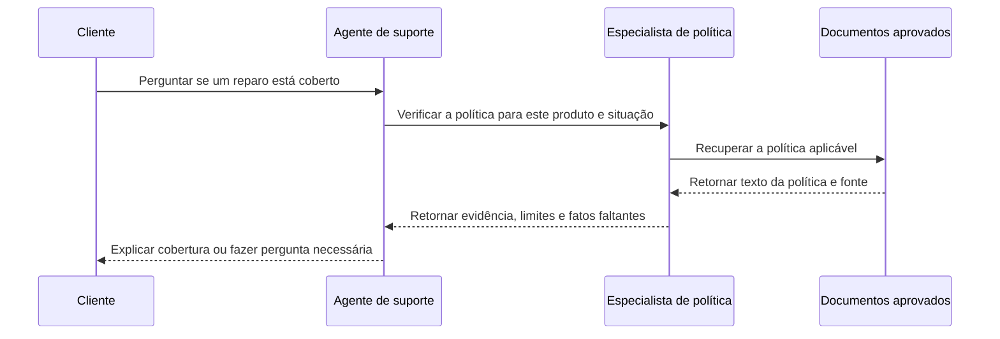

Um cliente pede a uma loja que explique uma falha de produto e corrija um erro de cobrança. Em uma equipe humana, a recepcionista pode envolver o suporte técnico e o setor de contas ao invés de responder tudo pessoalmente. Agentes podem dividir o trabalho de maneira similar, com instruções, conhecimentos e permissões diferentes para responsabilidades distintas.

**Comunicação entre agentes** significa que um agente passa uma solicitação, informação ou resultado para outro por meio de software. Não é leitura de mente. O agente receptor conhece apenas o que sua própria configuração e o contexto fornecido permitem. Uma mensagem clara e um proprietário explícito são tão importantes quanto quando colegas trocam um caso.

## Por que dividir o trabalho?

Um **agente especializado** é um agente configurado para uma tarefa mais restrita, como solucionar equipamentos, verificar políticas ou redigir uma proposta de vendas. A especialização pode ajudar quando esses trabalhos requerem material de origem ou permissões diferentes. Também pode impedir que as instruções para um papel se tornem uma enorme coleção de regras não relacionadas.

Por exemplo, um agente de triagem pode identificar se uma solicitação diz respeito ao uso do produto ou à cobrança. Essa triagem inicial é chamada de **triagem**. Um especialista de produto pode então consultar o manual adequado, enquanto um especialista de cobrança trabalha com informações de conta autorizadas. O agente de triagem não precisa de todas as capacidades apenas para escolher o próximo destino.

No entanto, agentes adicionais não melhoram automaticamente a qualidade. Dois agentes podem compartilhar o mesmo mal-entendido, repetir o mesmo trabalho ou discordar sem evidência. Antes de dividir uma tarefa, identifique um benefício concreto: um limite de permissão distinto, um corpo de conhecimento separado, revisão independente ou trabalho que pode prosseguir separadamente. Se um agente com ferramentas bem escolhidas pode fazer o trabalho claramente, mantenha esse design mais simples.



Frequentemente adequado quando a tarefa tem um único proprietário claro, uma base de conhecimento compartilhada e uma sequência curta de ações. Há menos mensagens para coordenar e menos lugares onde o contexto pode se perder.


Útil quando as responsabilidades realmente diferem ou partes independentes do trabalho podem ser executadas separadamente. O benefício deve justificar solicitações extras, espera, troca de contexto e coordenação.



## Entrega, delegação e orquestração

Esses termos descrevem diferentes formas de compartilhar responsabilidade. As equipes às vezes usam as palavras de forma flexível, então defina o que elas significam no seu design. As perguntas importantes são quem possui a resposta voltada ao usuário, quem pode tomar ações e se o agente original aguarda um resultado.



A responsabilidade passa para outro agente. Um agente de triagem encaminha um caso de cobrança para o especialista de cobrança, que continua a conversa dentro de sua própria autoridade.


O agente original pede a outro agente que execute uma subtarefa limitada e retorne um resultado. O agente original permanece responsável pela resposta geral.


Um coordenador gerencia várias etapas ou participantes: decidindo o que roda a seguir, coletando resultados, resolvendo dependências e determinando quando o trabalho está completo.



Uma entrega se as com transferir uma chamada. Delegação se as com pedir a um colega que verifique uma cláusula enquanto você continua falando com o cliente. Orquestração se parece com um coordenador de projeto organizando contribuições de vários departamentos. Um coordenador pode ser um software comum, um agente ou uma combinação; não precisa ser outro modelo tomando todas as decisões de agendamento.

Não confunda transferir a propriedade da conversa com transferir permissão. Um agente de triagem não pode conceder a um especialista acesso aos registros financeiros de um cliente apenas escrevendo “aprovado” em uma mensagem. Cada serviço receptor deve aplicar as permissões necessárias para seu próprio trabalho. A autoridade vem do sistema ao redor e da identidade de usuário verificada, não da persuasão da entrega.

## Observe uma delegação limitada

Considere um agente de suporte respondendo a uma pergunta de garantia. Ele pode pedir a um especialista de política que identifique a cláusula relevante e, usar essa evidência para explicar a resposta. O especialista não entra em contato com o cliente, aprova compensação ou inicia uma investigação não relacionada.

A mensagem de retorno deve distinguir uma descoberta de uma ação. “A política descreve cobertura sob essas condições” é uma descoberta. “O reparo foi aprovado” afirma uma decisão de negócio. Se nenhum processo autorizado o aprovou, a segunda afirmação está errada mesmo quando a leitura da política pelo especialista está correta.

Da mesma forma, o agente principal deve inspecionar a evidência retornada ao invés de tratar a linguagem confiante de outro agente como prova. A delegação muda quem executa o trabalho, não o padrão de evidência exigido. Uma resposta sem fonte pode precisar de verificação antes de se tornar uma promessa ao cliente.

## Compartilhe um resumo breve, não uma pilha de mensagens

**Contexto compartilhado** é a informação relevante disponibilizada aos participantes. Deve incluir o objetivo do usuário, fatos conhecidos, decisões já tomadas, informações faltantes e restrições ao trabalho solicitado. Uma entrega útil também indica qual participante agora possui a tarefa e o que o destinatário deve retornar.

Imagine encaminhar uma longa cadeia de e‑mails com “por favor, cuide”. O destinatário pode deixar passar a decisão no final ou interpretar erroneamente uma proposta antiga como instrução atual. Enviar toda a conversa para cada agente cria o mesmo problema, além de aumentar o processamento e divulgar mais informações do que o necessário.

Em vez disso, envie um resumo compacto com referências de origem quando necessário. Para o exemplo da garantia, inclua a categoria do produto, o problema relatado pelo cliente, o escopo da política e a pergunta a ser resolvida. Marque as alegações relatadas como alegações relatadas. “O cliente diz que o item chegou danificado” não é equivalente a “o dano na entrega foi verificado”.

Preserve a incerteza com o mesmo cuidado que os fatos. Se a identidade não foi verificada ou a data da compra está faltando, inclua isso explicitamente no resumo. Um resumo que elimina a incerteza pode transformar um caso incompleto em uma conclusão falsa. Resumos são úteis, mas sua correção ainda requer atenção.



## Defina limites para a colaboração

Um **loop** ocorre quando o sistema repete sem progresso útil. Um agente pode continuar pedindo esclarecimento ao outro, ou dois especialistas podem enviar o caso de volta um ao outro repetidamente. Previna isso definindo o que cada participante possui, como um resultado útil deve ser e quando o trabalho não resolvido deve retornar a uma pessoa.

Estabeleça limites práticos para tentativas, tempo decorrido e trabalho total. Esses limites pertencem à aplicação que controla os agentes, não apenas a uma frase que os instrui a ser eficientes. Uma solicitação de especialista falhada não deve reiniciar silenciosamente toda a equipe para sempre. O usuário precisa de um resultado claro, incluindo uma explicação veraz quando o processo não pode ser concluído.

O custo também inclui coordenação. Cada solicitação extra pode exigir o envio de contexto e a leitura de uma resposta; algumas chamadas também invocam ferramentas. Executar verificações independentes simultaneamente pode reduzir a espera, mas não torna esse trabalho gratuito. Meça se a divisão melhora o sucesso da tarefa o suficiente para justificar a despesa e complexidade extras.

Quando especialistas discordam, retorne às fontes subjacentes e às responsabilidades. Um voto não substitui autoridade. A política aprovada atualmente deve prevalecer sobre vários agentes repetindo uma regra desatualizada. Para decisões de alto impacto não resolvidas, defina um caminho de escalonamento humano ao invés de inventar um critério de desempate durante a conversa.

## Comece com um limite claro

Um design inicial sensato pode usar um agente de triagem que escolhe um especialista, ou um único assistente que delega a verificação de um documento. Teste solicitações ordinárias, solicitações ambíguas e casos que não pertencem a nenhum especialista. Confirme que o usuário não seja questionado repetidamente e que alguém permaneça responsável pela resposta final.

Registre quem recebeu cada subtarefa, o que foi retornado e por que a tarefa geral parou. Isso torna uma falha de múltiplos agentes explicável: talvez o roteamento estivesse errado, fatos relevantes foram omitidos ou um especialista não pôde acessar sua fonte. Sem esse histórico, a equipe pode parecer ocupada enquanto você não consegue dizer o que aconteceu.

A unidade de [arquiteturas multi‑agente](../advanced-agents/multi-agent-architectures.md) desenvolve esses padrões mais adiante. Aqui, a lição principal é mais simples: divida responsabilidades apenas quando o limite for útil e torne as mensagens, a propriedade e as regras de parada explícitas.

Próximo passo: transformar um procedimento de negócio repetível em [fluxos de trabalho como habilidades](workflows-as-skills.md), para que o agente siga um caminho definido ao invés de inventar um a cada vez.


Qual exemplo descreve delegação ao invés de entrega?

