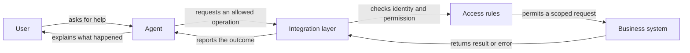

Um agente pode explicar sua política de reembolso a partir de um documento, mas ainda assim pode não saber se um reembolso foi emitido. Esse fato vive em outro sistema. Para ser útil nas operações diárias, o agente pode precisar de uma conexão controlada com o software onde o trabalho realmente acontece.

Exemplos comuns incluem um **CRM**, ou sistema de gestão de relacionamento com o cliente, que registra interações com clientes; um **ERP**, ou sistema de planejamento de recursos empresariais, que coordena operações como pedidos e estoque; e um **sistema de tickets**, que rastreia solicitações e suas resoluções. Outras equipes usam bancos de dados, que armazenam registros organizados, ou planilhas. A conexão deve seguir a tarefa de negócio, não a popularidade do software.

## Uma API é um balcão de serviço

Um **API**, abreviação de interface de programação de aplicações, é uma forma definida para um programa solicitar a outro programa informações ou uma ação. Imagine um balcão de serviço com um menu. Você pode pedir o status de um pedido fornecendo a referência necessária. O atendente devolve um tipo de resposta acordado. Você não pode alcançar atrás do balcão e reorganizar o sistema de arquivamento apenas porque pode fazer uma solicitação.

O menu especifica o que pode ser solicitado, quais detalhes devem acompanhar a solicitação e o que é devolvido. Uma solicitação pode significar “mostrar o status de entrega”, “criar um ticket de suporte” ou “atualizar o idioma preferido deste contato”. Uma API não necessariamente dá acesso a todos os recursos da aplicação. Suas operações disponíveis e regras de permissão definem o limite.

Isso torna a API diferente de um agente que simplesmente lê texto na tela. Uma página pode dizer que um pedido está concluído sem expor como consultar outro pedido de forma confiável. Uma interface definida dá ao software de conexão um acordo mais explícito sobre entradas, saídas e erros. Sua equipe de TI ainda precisa verificar o que o sistema específico suporta.

## Coloque uma camada de integração no meio

A **camada de integração** é o software comum que traduz entre a tarefa solicitada pelo agente e a API do sistema empresarial. É como um atendente treinado que entende tanto a linguagem do cliente quanto os formulários do escritório. O modelo propõe uma solicitação; a integração a verifica, chama o sistema apropriado e devolve um resultado utilizável.

A camada pode verificar se um pedido pertence ao cliente conectado, rejeitar uma atualização incompleta ou traduzir um erro técnico em um resultado claro. Essas verificações não devem depender apenas da lembrança de uma regra pelo modelo. Um cliente dizendo “Eu sou o proprietário da conta” não é prova suficiente, e uma solicitação convincente não pode sobrescrever as verificações de permissão do sistema.

Essa organização também separa responsabilidades. Os proprietários de negócios decidem quais resultados o agente pode buscar. O TI implementa acesso, validação e conexões. O agente interpreta a solicitação do usuário e explica os resultados. Dar a cada parte um trabalho claro facilita o diagnóstico de problemas em vez de permitir que o modelo improvise acesso irrestrito.

## Acesso de leitura e acesso de escrita têm consequências diferentes

**Acesso de leitura** permite recuperar informações sem alterar o registro subjacente. **Acesso de escrita** permite criar, atualizar ou excluir informações. Nenhum é automaticamente inofensivo: ler o endereço do cliente errado viola a privacidade, enquanto mudar o endereço errado pode redirecionar uma entrega.

Comece com o menor conjunto de operações que torne a tarefa útil. Um assistente que responde perguntas de entrega pode precisar do status do pedido, mas não de detalhes de pagamento ou permissão para cancelar pedidos. Um assistente que rascunha tickets pode preparar a descrição sem enviá‑la até que uma pessoa confirme. Essa abordagem é chamada de **privilégio mínimo**: forneça apenas a autoridade necessária para o trabalho.



Retorne apenas o registro e campos autorizados. Uma pergunta de status raramente requer todo o histórico do cliente.


Permita que o agente rascunhe uma atualização e mostre o que mudaria antes de salvar qualquer coisa.


Verifique a permissão e a confirmação necessária imediatamente antes de gravar. Registre o resultado real ao invés de presumir sucesso.



O acesso somente leitura costuma ser um primeiro estágio útil porque testa identificação, relevância e tratamento de erros sem permitir alterações nos registros. Não é um design final universal. Algumas tarefas realmente requerem ações, mas essas ações devem ser nomeadas e delimitadas: “adicionar uma nota a um ticket autorizado” é mais claro que “gerenciar o sistema de suporte”.

## Como é uma conexão limitada

Os exemplos a seguir descrevem designs possíveis, não recursos automaticamente presentes em todo CRM ou banco de dados. A mesma intenção de negócio pode ser implementada de forma diferente dependendo das interfaces públicas da aplicação e das políticas da sua organização.



Um assistente de vendas lê o nome da empresa e o estágio da conta do cliente autorizado para preparar um resumo da reunião. Ele rascunha uma nota de acompanhamento para revisão. Atualizar o proprietário da conta permanece uma operação separada com sua própria verificação de permissão.


Um assistente de suporte procura os tickets existentes do usuário antes de rascunhar outro. Antes do envio, ele confirma a descrição do problema e a fila de destino. A referência do ticket retornado comprova a criação; uma mensagem rascunhada não.


Um assistente interno solicita um resumo de vendas pré‑definido para um período de relatório permitido. Ele não recebe acesso irrestrito para executar comandos arbitrários no banco de dados ou expor cada registro de cliente subjacente.



Planilhas merecem o mesmo cuidado. Uma planilha pode parecer informal, mas mudar uma linha pode afetar folha de pagamento, compras ou um relatório usado para decisões. Defina quais planilhas, linhas e colunas estão no escopo. Decida o que deve acontecer se alguém editar o registro entre a leitura pelo agente e a proposta de alteração.

## O que TI e o negócio precisam preparar

Uma solicitação de integração útil descreve um cenário completo: quem está perguntando, qual registro é relevante, quais informações são necessárias e o que conta como sucesso. “Conectar o agente ao ERP” é muito amplo. “Permitir que a equipe de suporte autenticada leia o status de entrega de pedidos que eles têm permissão para tratar” fornece um ponto de partida testável.



Nomeie cada leitura ou alteração permitida, seu proprietário de negócio e o sistema que permanece autoritativo. Especifique as operações que o agente nunca deve executar.


Decida como o usuário que chama é identificado e como seus registros permitidos são determinados. Armazene credenciais de acesso fora dos prompts e documentos de origem.


Documente campos obrigatórios, opções válidas, evidências de sucesso e erros úteis. Forneça um ambiente de teste seguro com registros sintéticos.


Teste registros ausentes, acesso negado, nomes ambíguos, sistemas indisponíveis e solicitações interrompidas. Confirme que ações rejeitadas ou incertas não são apresentadas como concluídas.



Uma conexão também deve lidar com um caso incômodo: a solicitação expira depois que o sistema externo pode já ter concluído uma alteração. Repeti‑la cegamente pode criar um ticket ou pedido duplicado. A implementação precisa de um modo de verificar se a operação teve sucesso ou impedir duplicatas de forma segura. Do ponto de vista do usuário, “Ainda não consigo confirmar o resultado” é mais honesto do que prometer conclusão ou tentar novamente imediatamente.

Mantenha um registro de operações importantes: o que foi solicitado, qual ator autorizado solicitou e o que o sistema retornou. Isso é um **rastro de auditoria**, um histórico usado para investigar ações. Deve conter evidências suficientes para explicar o resultado sem copiar desnecessariamente informações sensíveis nos logs.

## Dois padrões de conexão que você encontrará

[Chamada de função](../tools-and-integrations/function-calling.md) permite que um modelo solicite uma operação nomeada com entradas definidas; software comum a executa. [Protocolo de Contexto de Modelo](../tools-and-integrations/model-context-protocol.md), ou MCP, é um protocolo compartilhado para expor capacidades a aplicações de IA compatíveis. Nenhum padrão elimina a necessidade de [autenticação e permissões](../tools-and-integrations/authentication-and-permissions.md): provar quem está chamando e decidir o que podem fazer.

No AIVAX, [funções de protocolo](../../docs/tools/protocol-functions.md) e [conexões MCP](../../docs/tools/mcp.md) fornecem maneiras documentadas de conectar ferramentas. Escolha uma abordagem baseada no sistema existente e nos requisitos operacionais, não porque um nome soe mais autônomo.

Próximo passo: explore [comunicação agente-a-agente](agent-to-agent-communication.md) e decida quando outro especialista é útil ao invés de outra conexão de software.


Qual é o ponto de partida mais seguro e útil para conectar um agente de suporte aos registros de clientes?

