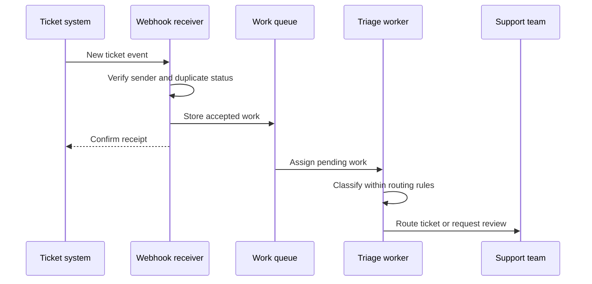

Um assistente não precisa esperar alguém abrir um chat. Um novo ticket de suporte pode disparar classificação, um pedido enviado pode disparar uma notificação ao cliente e um agendamento pode disparar um relatório matinal. Estes são **automações**: trabalho iniciado e coordenado por software de acordo com uma regra acordada.

A pergunta útil não é “Onde podemos adicionar um agente?” mas “O que aconteceu, o que deve acontecer a seguir e quem é o responsável se não acontecer?” Muitos passos precisam de regras de software comuns em vez de julgamento de modelo. Um agente é mais útil onde interpretar texto variado ou escolher entre opções permitidas exigiria uma pessoa.

## Conversa versus evento

Um **evento** é um registro de que algo aconteceu: um ticket foi criado, um pedido mudou de status ou um documento chegou. Um fluxo de trabalho **orientado a eventos** começa em resposta a essa ocorrência. Um **workflow** é o conjunto ordenado de etapas usado para concluir uma tarefa. Em um fluxo de trabalho conversacional, a mensagem de uma pessoa geralmente inicia o trabalho e a resposta retorna àquela conversa.



Um cliente pergunta: “Onde está meu pedido?” O assistente verifica o pedido e responde na mesma conversa. O cliente está presente e pode esclarecer uma solicitação ambígua.


O sistema de envio relata que um pedido foi despachado. Um workflow verifica as regras de notificação e envia uma atualização para o destino permitido. Nenhuma mensagem do cliente é necessária para iniciá‑lo.



As mesmas ferramentas de negócio podem atender ambos os padrões, mas os controles ao redor diferem. Uma tarefa orientada a eventos pode não ter ninguém aguardando para responder a uma pergunta. Ela precisa de um destino definido para sucesso, falha e incerteza. Se o sistema não puder determinar qual cliente notificar, deve parar ou encaminhar o caso para revisão, em vez de adivinhar a partir do texto livre do evento.

Os eventos também devem ser tratados como relatórios, não como verdade universal sobre o presente. Um evento “pedido despachado” pode chegar após um cancelamento ou correção posterior. Para trabalhos consequentes, verifique o estado atual do negócio quando necessário, em vez de presumir que o evento que chega é o fato mais recente.

## Um webhook é um endereço de callback

Um **webhook** permite que um sistema notifique outro enviando uma requisição para um endereço de recebimento acordado quando algo acontece. É como deixar um número de telefone em uma oficina de reparos: ao invés de ligar repetidamente para saber se o reparo foi concluído, a oficina liga para você quando há novidades. O sistema emissor inicia o contato.

A mensagem geralmente contém um tipo de evento, uma referência ao registro afetado e informações necessárias para interpretá‑la. Esse conteúdo é o **payload**: os dados transportados na requisição. A aplicação receptora verifica o remetente e o conteúdo, então decide qual trabalho iniciar. Um webhook é o mecanismo de notificação, não a automação completa.

Uma **queue** é uma lista de espera de itens de trabalho. Para uma notificação que inicia um processamento mais longo, o receptor pode armazenar com segurança o trabalho aceito em uma fila e confirmar o recebimento prontamente. Um **worker** nesse padrão geral é o processo que posteriormente pega um item e executa a tarefa. Isso impede que um modelo lento ou serviço externo mantenha a requisição de entrega inicial aberta.

Nem todo callback permite esse arranjo. Alguns hooks exigem uma decisão imediata antes que outra operação possa continuar. Seu contrato pode exigir uma resposta síncrona, significando que o chamador espera pelo resultado. Entenda se o chamador precisa de “mensagem recebida” ou “decisão concluída”; tratá‑los como equivalentes pode quebrar o fluxo de trabalho.

## Projetar uma pequena automação

Considere tickets de suporte entrantes. O sistema de tickets já sabe quando um ticket é criado; a contribuição útil do modelo é interpretar a descrição do cliente. A aplicação ao redor deve lidar com entrega, permissões e restrições de roteamento de forma determinística, ou seja, de acordo com regras fixas e que com julgamento de modelo.



Inicie quando um novo ticket for aceito. O resultado pretendido é uma equipe designada ou um estado de revisão explícito, não apenas um rótulo de categoria gerado.


Verifique a origem do evento e carregue apenas os campos do ticket necessários para a triagem. Mantenha anexos privados fora da entrada do modelo, a menos que sejam necessários e permitidos.


Faça o modelo escolher entre categorias aprovadas e explique brevemente a incerteza. O texto do cliente é evidência sobre o problema, não autoridade para mudar regras de roteamento.


Valide a categoria contra a lista permitida. Encaminhe casos sensíveis e solicitações vagas para a fila humana designada, em vez de inventar um novo destino.


Confirme que o sistema de tickets aceitou a atribuição. Registre falhas separadamente para que um operador possa distinguir trabalho pendente de trabalho concluído.



Uma notificação de envio pode exigir ainda menos envolvimento do modelo. Se a mensagem consiste em um status e um link de rastreamento aprovado, um modelo fixo pode ser mais claro e previsível do que um parágrafo gerado. Use um modelo quando a linguagem variada agrega valor, não para reiterar um fato que o software comum já pode comunicar com precisão.



Use interpretação de linguagem para identificar o problema, depois regras fixas para escolher um destino permitido. Mantenha uma rota de revisão para casos ambíguos ou sensíveis.


Confirme o status atual, permissão de comunicação e destino antes de enviar. Não invente promessas de entrega que o registro de envio não suporta.


Inicie em um horário planejado, reúna as entradas definidas e produza um relatório para o público acordado. Registre o período coberto para que uma execução repetida seja reconhecível.



## Esperar tentativas e duplicatas

Um **retry** é outra tentativa após uma tentativa anterior falhar ou seu resultado ser incerto. Suponha que o receptor aceite um webhook, mas a confirmação se perca na rede. O emissor não pode saber se o receptor o aceitou, então pode enviar o evento novamente. A entrega duplicada é uma possibilidade normal, não necessariamente um defeito do emissor.

**Idempotência** significa que repetir a mesma operação pretendida não cria um efeito comercial adicional. Pressionar repetidamente o botão de chamada de um elevador não deve solicitar vários elevadores separados. Para um fluxo de notificação, processar o mesmo evento de envio novamente não deve enviar outra mensagem idêntica ao cliente apenas porque a entrega foi tentada novamente.

Use uma referência de operação estável e um registro durável de processamento para reconhecer repetições. A verificação e a reivindicação de processar a operação precisam funcionar com segurança mesmo se duas cópias chegarem ao mesmo tempo. Mantenha a referência vinculada à operação pretendida: um envio realmente diferente ou uma ação recém‑aprovada não é duplicata apenas porque envolve o mesmo cliente.

Um evento registrado isoladamente não garante que todo efeito downstream esteja protegido. O processo pode parar depois que uma mensagem é enviada, mas antes de registrar o sucesso. Quando possível, o destino também deve suportar proteção contra duplicatas. Caso contrário, um resultado incerto pode exigir verificação do destino ou revisão humana antes de tentar novamente. Não prometa “exatamente uma vez” apenas porque existe uma verificação de duplicata.


Não. Uma falha de conexão temporária pode justificar uma tentativa limitada com atraso crescente entre as tentativas. Entrada inválida ou permissão ausente geralmente requer correção. Repetir a mesma requisição rejeitada pode desperdiçar recursos e ocultar o problema real. Defina um ponto de parada e uma rota visível para falhas.



Use o método de autenticação ou verificação de assinatura documentado pelo remetente. Uma assinatura é evidência calculada a partir da mensagem usando um segredo ou outro mecanismo criptográfico. Valide-a conforme especificado, proteja o endereço de recebimento e rejeite requisições malformadas. Um nome de evento familiar não é autenticação.


## Trabalho agendado também precisa de um responsável

Uma **tarefa agendada** inicia de acordo com um relógio ou calendário, e não com um evento de negócio recém‑recebido. Especifique o fuso horário, o período coberto e o que fazer se uma execução anterior ainda estiver em andamento. Um relatório diário não deve ser executado silenciosamente duas vezes porque o relógio mudou ou o processamento foi retomado após uma queda.

Decida como lidar com execuções perdidas: atualizar, pular ou solicitar a um operador. Mantenha um meio de pausar a automação sem excluir seu histórico. O responsável deve poder ver o que está pendente, o que falhou e o que foi concluído. Para padrões de recuperação, continue com [errors, retries and fallbacks](../advanced-agents/errors-retries-and-fallbacks.md) e [long-running and asynchronous agents](../advanced-agents/long-running-and-asynchronous-agents.md).

**Relacionado:** No AIVAX, [AI workers](../../docs/inference/workers.md) são hooks de gateway que podem controlar a execução e exigem respostas oportunas; eles não são intercambiáveis com uma fila de fundo. [Batch](../../docs/features/batch.md) processa itens independentes em segundo plano, enquanto [processing pipelines](../../docs/inference/pipelines.md) descrevem etapas ao redor da inferência. Escolha a funcionalidade cujo contrato de execução corresponda ao fluxo de trabalho.

Próximo passo: aprenda como agentes coordenam suas próprias etapas em [planning and reasoning loops](../advanced-agents/planning-and-reasoning-loops.md).

{{< quiz options="Executar sempre a ação novamente porque cada entrega é uma nova solicitação | Reconhecer a mesma operação, verificar seu resultado registrado e impedir um efeito comercial adicional | Perguntar ao modelo se o evento parece familiar | Ignorar todos os eventos futuros sobre o mesmo cliente" answer="2" explanation="Uma entrega repetida pode representar a mesma operação pretendida. A idempotência usa rastreamento durável da operação e proteção downstream apropriada, não a memória do modelo ou uma proibição geral de trabalhos posteriores." >}}
O que deve acontecer quando o mesmo evento de notificação de envio é entregue novamente?

